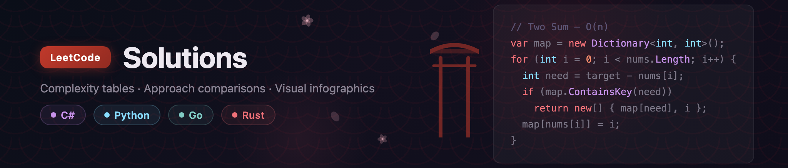

  

---

## Problem Lists

| [🔍 Interactive Tracker](tracker.html) | [📋 All Problems](lists/all-problems.md) | [🎯 By Difficulty](lists/by-difficulty.md) | [⚡ By Complexity](lists/by-complexity.md) | [🏗️ By Data Structure](lists/) |
|:---:|:---:|:---:|:---:|:---:|

---

## All Problems

> Problem titles link to the **solution notebook** (problems 1–20 and 723 are solved). Remaining titles link to the LeetCode problem page.

| # | Problem | Approach | Complexity | Level |
|:---:|---|---|:---:|:---:|
| 1 | [📓 Two Sum](leetcode/0001.ipynb) | One-Pass Hash Map | -1d4ed8?style=flat-square) · -1d4ed8?style=flat-square) |  |
| 2 | [📓 Add Two Numbers](leetcode/0002.ipynb) | Iterative Addition | )-1d4ed8?style=flat-square) · )-1d4ed8?style=flat-square) |  |
| 3 | [📓 Longest Substring Without Repeating Characters](leetcode/0003.ipynb) | Sliding Window with HashMap | -1d4ed8?style=flat-square) · )-1d4ed8?style=flat-square) |  |
| 4 | [📓 Median of Two Sorted Arrays](leetcode/0004.ipynb) | Binary Search on Partitions | ))-0e7490?style=flat-square) · -166534?style=flat-square) |  |
| 5 | [📓 Longest Palindromic Substring](leetcode/0005.ipynb) | Expand Around Center | -c2410c?style=flat-square) · -c2410c?style=flat-square) |  |
| 6 | [📓 Zigzag Conversion](leetcode/0006.ipynb) | Row-by-Row Simulation | -1d4ed8?style=flat-square) · -1d4ed8?style=flat-square) |  |
| 7 | [📓 Reverse Integer](leetcode/0007.ipynb) | Math Digit Extraction | -0e7490?style=flat-square) · -166534?style=flat-square) |  |
| 8 | [📓 String to Integer (atoi)](leetcode/0008.ipynb) | Linear Scanning | -1d4ed8?style=flat-square) · -166534?style=flat-square) |  |
| 9 | [📓 Palindrome Number](leetcode/0009.ipynb) | Reverse Half the Number | -0e7490?style=flat-square) · -166534?style=flat-square) |  |
| 10 | [📓 Regular Expression Matching](leetcode/0010.ipynb) | Bottom-Up DP | -c2410c?style=flat-square) · -c2410c?style=flat-square) |  |
| 11 | [📓 Container With Most Water](leetcode/0011.ipynb) | Two Pointers | -1d4ed8?style=flat-square) · -166534?style=flat-square) |  |
| 12 | [📓 Integer to Roman](leetcode/0012.ipynb) | Greedy Symbol Table | -166534?style=flat-square) · -166534?style=flat-square) |  |
| 13 | [📓 Roman to Integer](leetcode/0013.ipynb) | Left-to-Right Lookahead | -1d4ed8?style=flat-square) · -166534?style=flat-square) |  |
| 14 | [📓 Longest Common Prefix](leetcode/0014.ipynb) | Vertical Scanning | -c2410c?style=flat-square) · -166534?style=flat-square) |  |
| 15 | [📓 3Sum](leetcode/0015.ipynb) | Sorting + Two Pointers | -c2410c?style=flat-square) · -166534?style=flat-square) |  |
| 16 | [📓 3Sum Closest](leetcode/0016.ipynb) | Sorting + Two Pointers | -c2410c?style=flat-square) · -166534?style=flat-square) |  |
| 17 | [📓 Letter Combinations of a Phone Number](leetcode/0017.ipynb) | Backtracking | -7c2d12?style=flat-square) · -1d4ed8?style=flat-square) |  |
| 18 | [📓 4Sum](leetcode/0018.ipynb) | Sorting + Two Pointers | -9f1239?style=flat-square) · -166534?style=flat-square) |  |
| 19 | [📓 Remove Nth Node From End of List](leetcode/0019.ipynb) | One-Pass Two Pointers | -1d4ed8?style=flat-square) · -166534?style=flat-square) |  |
| 20 | [📓 Valid Parentheses](leetcode/0020.ipynb) | Stack | -1d4ed8?style=flat-square) · -1d4ed8?style=flat-square) |  |
| 21 | [Merge Two Sorted Lists](https://leetcode.com/problems/merge-two-sorted-lists/) | Linked List | -1d4ed8?style=flat-square) · -166534?style=flat-square) |  |
| 22 | [📓 Generate Parentheses](leetcode/0022.ipynb) | Backtracking (DFS) | /(sqrt(n)))-7c2d12?style=flat-square) · -1d4ed8?style=flat-square) |  |
| 39 | [📓 Combination Sum](leetcode/0039.ipynb) | Backtracking (DFS) | -1d4ed8?style=flat-square) · -1d4ed8?style=flat-square) |  |
| 40 | [📓 Combination Sum II](leetcode/0040.ipynb) | Backtracking (DFS) | -7c2d12?style=flat-square) · -1d4ed8?style=flat-square) |  |
| 23 | [Merge k Sorted Lists](https://leetcode.com/problems/merge-k-sorted-lists/) | Heap, Divide and Conquer | -6d28d9?style=flat-square) · -1d4ed8?style=flat-square) |  |
| 24 | [Swap Nodes in Pairs](https://leetcode.com/problems/swap-nodes-in-pairs/) | Linked List | -1d4ed8?style=flat-square) · -166534?style=flat-square) |  |
| 25 | [Reverse Nodes in k-Group](https://leetcode.com/problems/reverse-nodes-in-k-group/) | Linked List | -1d4ed8?style=flat-square) · -166534?style=flat-square) |  |
| 26 | [📓 Remove Duplicates from Sorted Array](leetcode/0026.ipynb) | Two Pointers | -1d4ed8?style=flat-square) · -166534?style=flat-square) |  |
| 27 | [📓 Remove Element](leetcode/0027.ipynb) | Two Pointers | -1d4ed8?style=flat-square) · -166534?style=flat-square) |  |
| 28 | [Implement strStr()](https://leetcode.com/problems/implement-strstr/) | String | -1d4ed8?style=flat-square) · -166534?style=flat-square) |  |
| 29 | [Divide Two Integers](https://leetcode.com/problems/divide-two-integers/) | Math | -0e7490?style=flat-square) · -166534?style=flat-square) |  |
| 30 | [Substring with Concatenation of All Words](https://leetcode.com/problems/substring-with-concatenation-of-all-words/) | Hash Map, Sliding Window | -c2410c?style=flat-square) · -1d4ed8?style=flat-square) |  |
| 31 | [📓 Next Permutation](leetcode/0031.ipynb) | Three-Step Reverse| -1d4ed8?style=flat-square) · -166534?style=flat-square) |  |
| 32 | [Longest Valid Parentheses](https://leetcode.com/problems/longest-valid-parentheses/) | Stack, Dynamic Programming | -1d4ed8?style=flat-square) · -1d4ed8?style=flat-square) |  |
| 33 | [📓 Search in Rotated Sorted Array](leetcode/0033.ipynb) | Binary Search with Pivot Detection | -0e7490?style=flat-square) · -166534?style=flat-square) |  |
| 34 | [📓 Find First and Last Position of Element in Sorted Array](leetcode/0034.ipynb) | Two Binary Searches | -0e7490?style=flat-square) · -166534?style=flat-square) |  |
| 35 | [📓 Search Insert Position](leetcode/0035.ipynb) | Binary Search | -0e7490?style=flat-square) · -166534?style=flat-square) |  |
| 36 | [Valid Sudoku](https://leetcode.com/problems/valid-sudoku/) | Hash Set | -c2410c?style=flat-square) · -c2410c?style=flat-square) |  |
| 37 | [📓 Sudoku Solver](leetcode/0037.ipynb) | Backtracking | -7c2d12?style=flat-square) · -1d4ed8?style=flat-square) |  |
| 38 | [Count and Say](https://leetcode.com/problems/count-and-say/) | String | -1d4ed8?style=flat-square) · -166534?style=flat-square) |  |
| 39 | [📓 Combination Sum](leetcode/0039.ipynb) | Backtracking (DFS) | -1d4ed8?style=flat-square) · -1d4ed8?style=flat-square) |  |
| 40 | [📓 Combination Sum II](leetcode/0040.ipynb) | Backtracking (DFS) | -7c2d12?style=flat-square) · -1d4ed8?style=flat-square) |  |
| 41 | [📓 First Missing Positive](leetcode/0041.ipynb) | In-place Index Negation| -1d4ed8?style=flat-square) · -166534?style=flat-square) |  |
| 42 | [Trapping Rain Water](https://leetcode.com/problems/trapping-rain-water/) | Two Pointers, Dynamic Programming | -1d4ed8?style=flat-square) · -166534?style=flat-square) |  |
| 43 | [Multiply Strings](https://leetcode.com/problems/multiply-strings/) | String | -c2410c?style=flat-square) · -1d4ed8?style=flat-square) |  |
| 44 | [📓 Wildcard Matching](leetcode/0044.ipynb) | 1D DP | -c2410c?style=flat-square) · -c2410c?style=flat-square) |  |
| 45 | [Jump Game II](https://leetcode.com/problems/jump-game-ii/) | Greedy | -1d4ed8?style=flat-square) · -166534?style=flat-square) |  |
| 46 | [📓 Permutations](leetcode/0046.ipynb) | Backtracking (Swap) | -7c2d12?style=flat-square) · -1d4ed8?style=flat-square) |  |
| 47 | [📓 Permutations II](leetcode/0047.ipynb) | Backtracking + Dedup | -7c2d12?style=flat-square) · -1d4ed8?style=flat-square) |  |
| 48 | [📓 Rotate Image](leetcode/0048.ipynb) | Transpose + Row Reverse| -c2410c?style=flat-square) · -166534?style=flat-square) |  |
| 49 | [Group Anagrams](https://leetcode.com/problems/group-anagrams/) | Hash Map | -1d4ed8?style=flat-square) · -1d4ed8?style=flat-square) |  |
| 50 | [Pow(x, n)](https://leetcode.com/problems/powx-n/) | Math | -0e7490?style=flat-square) · -166534?style=flat-square) |  |
| 51 | [📓 N-Queens](leetcode/0051.ipynb) | Backtracking (Bitmask) | -7c2d12?style=flat-square) · -1d4ed8?style=flat-square) |  |
| 52 | [📓 N-Queens II](leetcode/0052.ipynb) | Backtracking (Bitmask) | -7c2d12?style=flat-square) · -1d4ed8?style=flat-square) |  |
| 53 | [📓 Maximum Subarray](leetcode/0053.ipynb) | Kadane's Algorithm | -1d4ed8?style=flat-square) · -166534?style=flat-square) |  |
| 54 | [📓 Spiral Matrix](leetcode/0054.ipynb) | Boundary Shrinking| -c2410c?style=flat-square) · -166534?style=flat-square) |  |
| 55 | [Jump Game](https://leetcode.com/problems/jump-game/) | Greedy | -1d4ed8?style=flat-square) · -166534?style=flat-square) |  |
| 56 | [Merge Intervals](https://leetcode.com/problems/merge-intervals/) | Sorting | -6d28d9?style=flat-square) · -166534?style=flat-square) |  |
| 57 | [Insert Interval](https://leetcode.com/problems/insert-interval/) | Sorting | -1d4ed8?style=flat-square) · -166534?style=flat-square) |  |
| 58 | [Length of Last Word](https://leetcode.com/problems/length-of-last-word/) | String | -1d4ed8?style=flat-square) · -166534?style=flat-square) |  |
| 59 | [📓 Spiral Matrix II](leetcode/0059.ipynb) | Boundary Simulation| -c2410c?style=flat-square) · -166534?style=flat-square) |  |
| 60 | [📓 Permutation Sequence](leetcode/0060.ipynb) | Factorial Number System | -c2410c?style=flat-square) · -1d4ed8?style=flat-square) |  |
| 61 | [Rotate List](https://leetcode.com/problems/rotate-list/) | Linked List | -1d4ed8?style=flat-square) · -166534?style=flat-square) |  |
| 62 | [📓 Unique Paths](leetcode/0062.ipynb) | Math (Combinatorics) | -c2410c?style=flat-square) · -c2410c?style=flat-square) |  |
| 63 | [📓 Unique Paths II](leetcode/0063.ipynb) | 1D DP | -c2410c?style=flat-square) · -c2410c?style=flat-square) |  |
| 64 | [📓 Minimum Path Sum](leetcode/0064.ipynb) | 1D DP | -c2410c?style=flat-square) · -c2410c?style=flat-square) |  |
| 65 | [Valid Number](https://leetcode.com/problems/valid-number/) | Math, String | -1d4ed8?style=flat-square) · -166534?style=flat-square) |  |
| 66 | [📓 Plus One](leetcode/0066.ipynb) | Carry Simulation | -1d4ed8?style=flat-square) · -166534?style=flat-square) |  |
| 67 | [Add Binary](https://leetcode.com/problems/add-binary/) | String | )-1d4ed8?style=flat-square) · )-1d4ed8?style=flat-square) |  |
| 68 | [Text Justification](https://leetcode.com/problems/text-justification/) | String | -1d4ed8?style=flat-square) · -1d4ed8?style=flat-square) |  |
| 69 | [Sqrt(x)](https://leetcode.com/problems/sqrtx/) | Math | -0e7490?style=flat-square) · -166534?style=flat-square) |  |
| 70 | [📓 Climbing Stairs](leetcode/0070.ipynb) | Space-Optimized DP | -1d4ed8?style=flat-square) · -166534?style=flat-square) |  |
| 71 | [Simplify Path](https://leetcode.com/problems/simplify-path/) | Stack | -1d4ed8?style=flat-square) · -1d4ed8?style=flat-square) |  |
| 72 | [📓 Edit Distance](leetcode/0072.ipynb) | 1D DP | -c2410c?style=flat-square) · -c2410c?style=flat-square) |  |
| 73 | [📓 Set Matrix Zeroes](leetcode/0073.ipynb) | First Row/Col as Flags| -c2410c?style=flat-square) · -166534?style=flat-square) |  |
| 74 | [📓 Search a 2D Matrix](leetcode/0074.ipynb) | Binary Search on Flattened Index | )-c2410c?style=flat-square) · -166534?style=flat-square) |  |
| 75 | [Sort Colors](https://leetcode.com/problems/sort-colors/) | Sorting, Two Pointers | -1d4ed8?style=flat-square) · -166534?style=flat-square) |  |
| 76 | [Minimum Window Substring](https://leetcode.com/problems/minimum-window-substring/) | Hash Map, Sliding Window | -1d4ed8?style=flat-square) · -1d4ed8?style=flat-square) |  |
| 77 | [📓 Combinations](leetcode/0077.ipynb) | Backtracking |  * k)-7c2d12?style=flat-square) · -1d4ed8?style=flat-square) |  |
| 78 | [📓 Subsets](leetcode/0078.ipynb) | Backtracking | -7c2d12?style=flat-square) · -1d4ed8?style=flat-square) |  |
| 79 | [📓 Word Search](leetcode/0079.ipynb) | DFS + Backtracking | -7c2d12?style=flat-square) · -1d4ed8?style=flat-square) |  |
| 80 | [📓 Remove Duplicates from Sorted Array II](leetcode/0080.ipynb) | Two Pointers| -1d4ed8?style=flat-square) · -166534?style=flat-square) |  |
| 81 | [📓 Search in Rotated Sorted Array II](leetcode/0081.ipynb) | Binary Search with Duplicate Handling |  worst, O(log n) avg-0e7490?style=flat-square) · -166534?style=flat-square) |  |
| 82 | [Remove Duplicates from Sorted List II](https://leetcode.com/problems/remove-duplicates-from-sorted-list-ii/) | Linked List | -1d4ed8?style=flat-square) · -166534?style=flat-square) |  |
| 83 | [Remove Duplicates from Sorted List](https://leetcode.com/problems/remove-duplicates-from-sorted-list/) | Linked List | -1d4ed8?style=flat-square) · -166534?style=flat-square) |  |
| 84 | [Largest Rectangle in Histogram](https://leetcode.com/problems/largest-rectangle-in-histogram/) | Stack | -1d4ed8?style=flat-square) · -1d4ed8?style=flat-square) |  |
| 85 | [📓 Maximal Rectangle](leetcode/0085.ipynb) | Histogram Stack| -c2410c?style=flat-square) · -1d4ed8?style=flat-square) |  |
| 86 | [Partition List](https://leetcode.com/problems/partition-list/) | Linked List | -1d4ed8?style=flat-square) · -166534?style=flat-square) |  |
| 87 | [📓 Scramble String](leetcode/0087.ipynb) | Memoized Recursion | -1d4ed8?style=flat-square) · -1d4ed8?style=flat-square) |  |
| 88 | [📓 Merge Sorted Array](leetcode/0088.ipynb) | Three Pointers (Merge from End) | -1d4ed8?style=flat-square) · -166534?style=flat-square) |  |
| 89 | [📓 Gray Code](leetcode/0089.ipynb) | > 1) for all i in [0, 2^n) — O(1) per element.">Binary-Reflected XOR Formula | -7c2d12?style=flat-square) · -7c2d12?style=flat-square) |  |
| 90 | [📓 Subsets II](leetcode/0090.ipynb) | Backtracking + Dedup | -7c2d12?style=flat-square) · -1d4ed8?style=flat-square) |  |
| 91 | [📓 Decode Ways](leetcode/0091.ipynb) | Space-Optimized DP | -1d4ed8?style=flat-square) · -1d4ed8?style=flat-square) |  |
| 92 | [Reverse Linked List II](https://leetcode.com/problems/reverse-linked-list-ii/) | Linked List | -1d4ed8?style=flat-square) · -166534?style=flat-square) |  |
| 93 | [📓 Restore IP Addresses](leetcode/0093.ipynb) | Backtracking | -166534?style=flat-square) · -166534?style=flat-square) |  |
| 94 | [Binary Tree Inorder Traversal](https://leetcode.com/problems/binary-tree-inorder-traversal/) | Tree, Stack | -1d4ed8?style=flat-square) · -1d4ed8?style=flat-square) |  |
| 95 | [Unique Binary Search Trees II](https://leetcode.com/problems/unique-binary-search-trees-ii/) | Tree, Dynamic Programming | )-7c2d12?style=flat-square) · -1d4ed8?style=flat-square) |  |
| 96 | [📓 Unique Binary Search Trees](leetcode/0096.ipynb) | Catalan Number DP | -c2410c?style=flat-square) · -1d4ed8?style=flat-square) |  |
| 97 | [📓 Interleaving String](leetcode/0097.ipynb) | 1D DP | -c2410c?style=flat-square) · -c2410c?style=flat-square) |  |
| 98 | [Validate Binary Search Tree](https://leetcode.com/problems/validate-binary-search-tree/) | Tree, DFS | -1d4ed8?style=flat-square) · -1d4ed8?style=flat-square) |  |
| 99 | [Recover Binary Search Tree](https://leetcode.com/problems/recover-binary-search-tree/) | Tree, DFS | -1d4ed8?style=flat-square) · -1d4ed8?style=flat-square) |  |
| 100 | [Same Tree](https://leetcode.com/problems/same-tree/) | Tree, DFS | -1d4ed8?style=flat-square) · -1d4ed8?style=flat-square) |  |
| 101 | [Symmetric Tree](https://leetcode.com/problems/symmetric-tree/) | Tree, DFS | -1d4ed8?style=flat-square) · -1d4ed8?style=flat-square) |  |
| 102 | [Binary Tree Level Order Traversal](https://leetcode.com/problems/binary-tree-level-order-traversal/) | Tree, BFS | -1d4ed8?style=flat-square) · -1d4ed8?style=flat-square) |  |
| 103 | [Binary Tree Zigzag Level Order Traversal](https://leetcode.com/problems/binary-tree-zigzag-level-order-traversal/) | Tree, BFS | -1d4ed8?style=flat-square) · -1d4ed8?style=flat-square) |  |
| 104 | [Maximum Depth of Binary Tree](https://leetcode.com/problems/maximum-depth-of-binary-tree/) | Tree, DFS | -1d4ed8?style=flat-square) · -1d4ed8?style=flat-square) |  |
| 105 | [Construct Binary Tree from Preorder and Inorder Traversal](https://leetcode.com/problems/construct-binary-tree-from-preorder-and-inorder-traversal/) | Tree, Recursion | -1d4ed8?style=flat-square) · -1d4ed8?style=flat-square) |  |
| 106 | [Construct Binary Tree from Inorder and Postorder Traversal](https://leetcode.com/problems/construct-binary-tree-from-inorder-and-postorder-traversal/) | Tree, Recursion | -1d4ed8?style=flat-square) · -1d4ed8?style=flat-square) |  |
| 107 | [Binary Tree Level Order Traversal II](https://leetcode.com/problems/binary-tree-level-order-traversal-ii/) | Tree, BFS | -1d4ed8?style=flat-square) · -1d4ed8?style=flat-square) |  |
| 108 | [Convert Sorted Array to Binary Search Tree](https://leetcode.com/problems/convert-sorted-array-to-binary-search-tree/) | Tree, Recursion | -1d4ed8?style=flat-square) · -0e7490?style=flat-square) |  |
| 109 | [Convert Sorted List to Binary Search Tree](https://leetcode.com/problems/convert-sorted-list-to-binary-search-tree/) | Linked List, Tree | -1d4ed8?style=flat-square) · -0e7490?style=flat-square) |  |
| 110 | [Balanced Binary Tree](https://leetcode.com/problems/balanced-binary-tree/) | Tree, DFS | -1d4ed8?style=flat-square) · -1d4ed8?style=flat-square) |  |
| 111 | [Minimum Depth of Binary Tree](https://leetcode.com/problems/minimum-depth-of-binary-tree/) | Tree, DFS | -1d4ed8?style=flat-square) · -1d4ed8?style=flat-square) |  |
| 112 | [Path Sum](https://leetcode.com/problems/path-sum/) | Tree, DFS | -1d4ed8?style=flat-square) · -1d4ed8?style=flat-square) |  |
| 113 | [Path Sum II](https://leetcode.com/problems/path-sum-ii/) | Tree, DFS | -1d4ed8?style=flat-square) · -1d4ed8?style=flat-square) |  |
| 114 | [Flatten Binary Tree to Linked List](https://leetcode.com/problems/flatten-binary-tree-to-linked-list/) | Tree, DFS | -1d4ed8?style=flat-square) · -1d4ed8?style=flat-square) |  |
| 115 | [Distinct Subsequences](https://leetcode.com/problems/distinct-subsequences/) | Dynamic Programming | -c2410c?style=flat-square) · -c2410c?style=flat-square) |  |
| 116 | [Populating Next Right Pointers in Each Node](https://leetcode.com/problems/populating-next-right-pointers-in-each-node/) | Tree, BFS | -1d4ed8?style=flat-square) · -166534?style=flat-square) |  |
| 117 | [Populating Next Right Pointers in Each Node II](https://leetcode.com/problems/populating-next-right-pointers-in-each-node-ii/) | Tree, BFS | -1d4ed8?style=flat-square) · -166534?style=flat-square) |  |
| 118 | [📓 Pascal's Triangle](leetcode/0118.ipynb) | Row-by-Row Simulation | -c2410c?style=flat-square) · -c2410c?style=flat-square) |  |
| 119 | [📓 Pascal's Triangle II](leetcode/0119.ipynb) | Rolling Array | -1d4ed8?style=flat-square) · -1d4ed8?style=flat-square) |  |
| 120 | [Triangle](https://leetcode.com/problems/triangle/) | Dynamic Programming | -c2410c?style=flat-square) · -c2410c?style=flat-square) |  |
| 121 | [📓 Best Time to Buy and Sell Stock](leetcode/0121.ipynb) | Greedy (One Pass) | -1d4ed8?style=flat-square) · -166534?style=flat-square) |  |
| 122 | [Best Time to Buy and Sell Stock II](https://leetcode.com/problems/best-time-to-buy-and-sell-stock-ii/) | Greedy | -1d4ed8?style=flat-square) · -166534?style=flat-square) |  |
| 123 | [Best Time to Buy and Sell Stock III](https://leetcode.com/problems/best-time-to-buy-and-sell-stock-iii/) | Dynamic Programming | -1d4ed8?style=flat-square) · -166534?style=flat-square) |  |
| 124 | [Binary Tree Maximum Path Sum](https://leetcode.com/problems/binary-tree-maximum-path-sum/) | Tree, DFS | -1d4ed8?style=flat-square) · -1d4ed8?style=flat-square) |  |
| 125 | [Valid Palindrome](https://leetcode.com/problems/valid-palindrome/) | String | -1d4ed8?style=flat-square) · -166534?style=flat-square) |  |
| 126 | [Word Ladder II](https://leetcode.com/problems/word-ladder-ii/) | BFS, Graph | -c2410c?style=flat-square) · -1d4ed8?style=flat-square) |  |
| 127 | [Word Ladder](https://leetcode.com/problems/word-ladder/) | BFS, Graph | -c2410c?style=flat-square) · -1d4ed8?style=flat-square) |  |
| 128 | [Longest Consecutive Sequence](https://leetcode.com/problems/longest-consecutive-sequence/) | Hash Set | -1d4ed8?style=flat-square) · -1d4ed8?style=flat-square) |  |
| 129 | [Sum Root to Leaf Numbers](https://leetcode.com/problems/sum-root-to-leaf-numbers/) | Tree, DFS | -1d4ed8?style=flat-square) · -1d4ed8?style=flat-square) |  |
| 130 | [Surrounded Regions](https://leetcode.com/problems/surrounded-regions/) | DFS, BFS | -c2410c?style=flat-square) · -c2410c?style=flat-square) |  |
| 131 | [Palindrome Partitioning](https://leetcode.com/problems/palindrome-partitioning/) | Backtracking | -7c2d12?style=flat-square) · -1d4ed8?style=flat-square) |  |
| 132 | [Palindrome Partitioning II](https://leetcode.com/problems/palindrome-partitioning-ii/) | Dynamic Programming | -c2410c?style=flat-square) · -c2410c?style=flat-square) |  |
| 133 | [Clone Graph](https://leetcode.com/problems/clone-graph/) | Graph, DFS | -1d4ed8?style=flat-square) · -1d4ed8?style=flat-square) |  |
| 134 | [Gas Station](https://leetcode.com/problems/gas-station/) | Greedy | -1d4ed8?style=flat-square) · -166534?style=flat-square) |  |
| 135 | [Candy](https://leetcode.com/problems/candy/) | Greedy | -1d4ed8?style=flat-square) · -1d4ed8?style=flat-square) |  |
| 136 | [📓 Single Number](leetcode/0136.ipynb) | XOR | -1d4ed8?style=flat-square) · -166534?style=flat-square) |  |
| 137 | [📓 Single Number II](leetcode/0137.ipynb) | Bit-Count Mod 3 | -1d4ed8?style=flat-square) · -166534?style=flat-square) |  |
| 138 | [Copy List with Random Pointer](https://leetcode.com/problems/copy-list-with-random-pointer/) | Linked List | -1d4ed8?style=flat-square) · -1d4ed8?style=flat-square) |  |
| 139 | [Word Break](https://leetcode.com/problems/word-break/) | Dynamic Programming, Hash Set | -c2410c?style=flat-square) · -1d4ed8?style=flat-square) |  |
| 140 | [Word Break II](https://leetcode.com/problems/word-break-ii/) | Dynamic Programming, Backtracking | -9f1239?style=flat-square) · -1d4ed8?style=flat-square) |  |
| 141 | [Linked List Cycle](https://leetcode.com/problems/linked-list-cycle/) | Linked List | -1d4ed8?style=flat-square) · -166534?style=flat-square) |  |
| 142 | [Linked List Cycle II](https://leetcode.com/problems/linked-list-cycle-ii/) | Linked List, Floyd's Cycle Detection | -1d4ed8?style=flat-square) · -166534?style=flat-square) |  |
| 143 | [Reorder List](https://leetcode.com/problems/reorder-list/) | Linked List | -1d4ed8?style=flat-square) · -166534?style=flat-square) |  |
| 144 | [Binary Tree Preorder Traversal](https://leetcode.com/problems/binary-tree-preorder-traversal/) | Tree, DFS | -1d4ed8?style=flat-square) · -1d4ed8?style=flat-square) |  |
| 145 | [Binary Tree Postorder Traversal](https://leetcode.com/problems/binary-tree-postorder-traversal/) | Tree, DFS | -1d4ed8?style=flat-square) · -1d4ed8?style=flat-square) |  |
| 146 | [LRU Cache](https://leetcode.com/problems/lru-cache/) | Hash Map, Doubly Linked List | -166534?style=flat-square) · -475569?style=flat-square) |  |
| 147 | [Insertion Sort List](https://leetcode.com/problems/insertion-sort-list/) | Linked List | -c2410c?style=flat-square) · -166534?style=flat-square) |  |
| 148 | [Sort List](https://leetcode.com/problems/sort-list/) | Linked List, Merge Sort | -6d28d9?style=flat-square) · -166534?style=flat-square) |  |
| 149 | [Max Points on a Line](https://leetcode.com/problems/max-points-on-a-line/) | Geometry, Hash Map | -c2410c?style=flat-square) · -1d4ed8?style=flat-square) |  |
| 150 | [Evaluate Reverse Polish Notation](https://leetcode.com/problems/evaluate-reverse-polish-notation/) | Stack | -1d4ed8?style=flat-square) · -1d4ed8?style=flat-square) |  |
| 151 | [Reverse Words in a String](https://leetcode.com/problems/reverse-words-in-a-string/) | String | -1d4ed8?style=flat-square) · -166534?style=flat-square) |  |
| 152 | [Maximum Product Subarray](https://leetcode.com/problems/maximum-product-subarray/) | Dynamic Programming | -1d4ed8?style=flat-square) · -166534?style=flat-square) |  |
| 153 | [📓 Find Minimum in Rotated Sorted Array](leetcode/0153.ipynb) | Binary Search on Rotation Pivot | -0e7490?style=flat-square) · -166534?style=flat-square) |  |
| 154 | [📓 Find Minimum in Rotated Sorted Array II](leetcode/0154.ipynb) | Binary Search with Duplicate Shrinking |  worst, O(log n) avg-0e7490?style=flat-square) · -166534?style=flat-square) |  |
| 155 | [Min Stack](https://leetcode.com/problems/min-stack/) | Stack | -166534?style=flat-square) · -1d4ed8?style=flat-square) |  |
| 156 | [Binary Tree Upside Down](https://leetcode.com/problems/binary-tree-upside-down/) | Tree, Recursion | -1d4ed8?style=flat-square) · -1d4ed8?style=flat-square) |  |
| 157 | [Read N Characters Given Read4](https://leetcode.com/problems/read-n-characters-given-read4/) | String | -1d4ed8?style=flat-square) · -166534?style=flat-square) |  |
| 158 | [Read N Characters Given Read4 II - Call multiple times](https://leetcode.com/problems/read-n-characters-given-read4-ii-call-multiple-times/) | String | -1d4ed8?style=flat-square) · -166534?style=flat-square) |  |
| 159 | [Longest Substring with At Most Two Distinct Characters](https://leetcode.com/problems/longest-substring-with-at-most-two-distinct-characters/) | Sliding Window | -1d4ed8?style=flat-square) · -166534?style=flat-square) |  |
| 160 | [Intersection of Two Linked Lists](https://leetcode.com/problems/intersection-of-two-linked-lists/) | Linked List | -1d4ed8?style=flat-square) · -166534?style=flat-square) |  |
| 161 | [One Edit Distance](https://leetcode.com/problems/one-edit-distance/) | String | -c2410c?style=flat-square) · -166534?style=flat-square) |  |
| 162 | [📓 Find Peak Element](leetcode/0162.ipynb) | Binary Search on Gradient | -0e7490?style=flat-square) · -166534?style=flat-square) |  |
| 163 | [Missing Ranges](https://leetcode.com/problems/missing-ranges/) | Array | -1d4ed8?style=flat-square) · -166534?style=flat-square) |  |
| 164 | [Maximum Gap](https://leetcode.com/problems/maximum-gap/) | Sorting | -6d28d9?style=flat-square) · -1d4ed8?style=flat-square) |  |
| 165 | [Compare Version Numbers](https://leetcode.com/problems/compare-version-numbers/) | String | -1d4ed8?style=flat-square) · -166534?style=flat-square) |  |
| 166 | [Fraction to Recurring Decimal](https://leetcode.com/problems/fraction-to-recurring-decimal/) | Math, String | -1d4ed8?style=flat-square) · -1d4ed8?style=flat-square) |  |
| 167 | [Two Sum II - Input Array Is Sorted](https://leetcode.com/problems/two-sum-ii-input-array-is-sorted/) | Two Pointers | -1d4ed8?style=flat-square) · -166534?style=flat-square) |  |
| 168 | [Excel Sheet Column Title](https://leetcode.com/problems/excel-sheet-column-title/) | Math | -0e7490?style=flat-square) · -166534?style=flat-square) |  |
| 169 | [Majority Element](https://leetcode.com/problems/majority-element/) | Hash Map, Sorting | -1d4ed8?style=flat-square) · -1d4ed8?style=flat-square) |  |
| 170 | [Two Sum III - Data structure design](https://leetcode.com/problems/two-sum-iii-data-structure-design/) | Hash Map | -166534?style=flat-square) · -1d4ed8?style=flat-square) |  |
| 171 | [Excel Sheet Column Number](https://leetcode.com/problems/excel-sheet-column-number/) | Math | -1d4ed8?style=flat-square) · -166534?style=flat-square) |  |
| 172 | [Factorial Trailing Zeroes](https://leetcode.com/problems/factorial-trailing-zeroes/) | Math | -0e7490?style=flat-square) · -166534?style=flat-square) |  |
| 173 | [Binary Search Tree Iterator](https://leetcode.com/problems/binary-search-tree-iterator/) | Tree, Stack | -166534?style=flat-square) · -1d4ed8?style=flat-square) |  |
| 174 | [Dungeon Game](https://leetcode.com/problems/dungeon-game/) | Dynamic Programming | -c2410c?style=flat-square) · -c2410c?style=flat-square) |  |
| 175 | [Combine Two Tables](https://leetcode.com/problems/combine-two-tables/) | SQL | -166534?style=flat-square) · -166534?style=flat-square) |  |
| 176 | [Second Highest Salary](https://leetcode.com/problems/second-highest-salary/) | SQL | -166534?style=flat-square) · -166534?style=flat-square) |  |
| 177 | [Nth Highest Salary](https://leetcode.com/problems/nth-highest-salary/) | SQL | -166534?style=flat-square) · -166534?style=flat-square) |  |
| 178 | [Rank Scores](https://leetcode.com/problems/rank-scores/) | SQL | -166534?style=flat-square) · -166534?style=flat-square) |  |
| 179 | [Largest Number](https://leetcode.com/problems/largest-number/) | Sorting | -6d28d9?style=flat-square) · -1d4ed8?style=flat-square) |  |
| 180 | [Consecutive Numbers](https://leetcode.com/problems/consecutive-numbers/) | SQL | -166534?style=flat-square) · -166534?style=flat-square) |  |
| 181 | [Employees Earning More Than Their Managers](https://leetcode.com/problems/employees-earning-more-than-their-managers/) | SQL | -166534?style=flat-square) · -166534?style=flat-square) |  |
| 182 | [Duplicate Emails](https://leetcode.com/problems/duplicate-emails/) | SQL | -166534?style=flat-square) · -166534?style=flat-square) |  |
| 183 | [Customers Who Never Order](https://leetcode.com/problems/customers-who-never-order/) | SQL | -166534?style=flat-square) · -166534?style=flat-square) |  |
| 184 | [Department Highest Salary](https://leetcode.com/problems/department-highest-salary/) | SQL | -166534?style=flat-square) · -166534?style=flat-square) |  |
| 185 | [Department Top Three Salaries](https://leetcode.com/problems/department-top-three-salaries/) | SQL | -166534?style=flat-square) · -166534?style=flat-square) |  |
| 186 | [Reverse Words in a String II](https://leetcode.com/problems/reverse-words-in-a-string-ii/) | String | -1d4ed8?style=flat-square) · -166534?style=flat-square) |  |
| 187 | [Repeated DNA Sequences](https://leetcode.com/problems/repeated-dna-sequences/) | Hash Set | -1d4ed8?style=flat-square) · -1d4ed8?style=flat-square) |  |
| 188 | [Best Time to Buy and Sell Stock IV](https://leetcode.com/problems/best-time-to-buy-and-sell-stock-iv/) | Dynamic Programming | -1d4ed8?style=flat-square) · -1d4ed8?style=flat-square) |  |
| 189 | [📓 Rotate Array](leetcode/0189.ipynb) | Three Reversals | -1d4ed8?style=flat-square) · -166534?style=flat-square) |  |
| 190 | [📓 Reverse Bits](leetcode/0190.ipynb) | Bit-by-bit Reversal | -166534?style=flat-square) · -166534?style=flat-square) |  |
| 191 | [📓 Number of 1 Bits](leetcode/0191.ipynb) | Brian Kernighan's Algorithm | -1d4ed8?style=flat-square) · -166534?style=flat-square) |  |
| 192 | [Word Frequency](https://leetcode.com/problems/word-frequency/) | SQL | -166534?style=flat-square) · -166534?style=flat-square) |  |
| 193 | [Valid Phone Numbers](https://leetcode.com/problems/valid-phone-numbers/) | Regex | -166534?style=flat-square) · -166534?style=flat-square) |  |
| 194 | [Transpose File](https://leetcode.com/problems/transpose-file/) | File I/O | -166534?style=flat-square) · -166534?style=flat-square) |  |
| 195 | [Tenth Line](https://leetcode.com/problems/tenth-line/) | File I/O | -166534?style=flat-square) · -166534?style=flat-square) |  |
| 196 | [Delete Duplicate Emails](https://leetcode.com/problems/delete-duplicate-emails/) | SQL | -166534?style=flat-square) · -166534?style=flat-square) |  |
| 197 | [Rising Temperature](https://leetcode.com/problems/rising-temperature/) | SQL | -166534?style=flat-square) · -166534?style=flat-square) |  |
| 198 | [House Robber](https://leetcode.com/problems/house-robber/) | Dynamic Programming | -1d4ed8?style=flat-square) · -166534?style=flat-square) |  |
| 199 | [Binary Tree Right Side View](https://leetcode.com/problems/binary-tree-right-side-view/) | Tree, BFS | -1d4ed8?style=flat-square) · -1d4ed8?style=flat-square) |  |
| 200 | [Number of Islands](https://leetcode.com/problems/number-of-islands/) | DFS, BFS | -c2410c?style=flat-square) · -c2410c?style=flat-square) |  |
| 201 | [📓 Bitwise AND of Numbers Range](leetcode/0201.ipynb) | Common Prefix (Right Shift) | -166534?style=flat-square) · -166534?style=flat-square) |  |
| 202 | [Happy Number](https://leetcode.com/problems/happy-number/) | Hash Set, Cycle Detection | -0e7490?style=flat-square) · -0e7490?style=flat-square) |  |
| 203 | [Remove Linked List Elements](https://leetcode.com/problems/remove-linked-list-elements/) | Linked List | -1d4ed8?style=flat-square) · -166534?style=flat-square) |  |
| 204 | [Count Primes](https://leetcode.com/problems/count-primes/) | Sieve of Eratosthenes | -6d28d9?style=flat-square) · -1d4ed8?style=flat-square) |  |
| 205 | [Isomorphic Strings](https://leetcode.com/problems/isomorphic-strings/) | String, Hash Map | -1d4ed8?style=flat-square) · -1d4ed8?style=flat-square) |  |
| 206 | [Reverse Linked List](https://leetcode.com/problems/reverse-linked-list/) | Linked List | -1d4ed8?style=flat-square) · -166534?style=flat-square) |  |
| 207 | [Course Schedule](https://leetcode.com/problems/course-schedule/) | Graph, Topological Sort | -1d4ed8?style=flat-square) · -1d4ed8?style=flat-square) |  |
| 208 | [Implement Trie (Prefix Tree)](https://leetcode.com/problems/implement-trie-prefix-tree/) | Trie | -1d4ed8?style=flat-square) · -1d4ed8?style=flat-square) |  |
| 209 | [Minimum Size Subarray Sum](https://leetcode.com/problems/minimum-size-subarray-sum/) | Sliding Window | -1d4ed8?style=flat-square) · -166534?style=flat-square) |  |
| 210 | [Course Schedule II](https://leetcode.com/problems/course-schedule-ii/) | Graph, Topological Sort | -1d4ed8?style=flat-square) · -1d4ed8?style=flat-square) |  |
| 211 | [Design Add and Search Words Data Structure](https://leetcode.com/problems/design-add-and-search-words-data-structure/) | Trie | -1d4ed8?style=flat-square) · -1d4ed8?style=flat-square) |  |
| 212 | [Word Search II](https://leetcode.com/problems/word-search-ii/) | Trie, Backtracking | -7c2d12?style=flat-square) · -c2410c?style=flat-square) |  |
| 213 | [House Robber II](https://leetcode.com/problems/house-robber-ii/) | Dynamic Programming | -1d4ed8?style=flat-square) · -166534?style=flat-square) |  |
| 214 | [Shortest Palindrome](https://leetcode.com/problems/shortest-palindrome/) | String, KMP Algorithm | -1d4ed8?style=flat-square) · -1d4ed8?style=flat-square) |  |
| 215 | [Kth Largest Element in an Array](https://leetcode.com/problems/kth-largest-element-in-an-array/) | Heap | -6d28d9?style=flat-square) · -1d4ed8?style=flat-square) |  |
| 216 | [Combination Sum III](https://leetcode.com/problems/combination-sum-iii/) | Backtracking | -7c2d12?style=flat-square) · -1d4ed8?style=flat-square) |  |
| 217 | [Contains Duplicate](https://leetcode.com/problems/contains-duplicate/) | Hash Set | -1d4ed8?style=flat-square) · -1d4ed8?style=flat-square) |  |
| 218 | [The Skyline Problem](https://leetcode.com/problems/the-skyline-problem/) | Heap, Sweep Line | -6d28d9?style=flat-square) · -1d4ed8?style=flat-square) |  |
| 219 | [Contains Duplicate II](https://leetcode.com/problems/contains-duplicate-ii/) | Hash Set | -1d4ed8?style=flat-square) · -1d4ed8?style=flat-square) |  |
| 220 | [Contains Duplicate III](https://leetcode.com/problems/contains-duplicate-iii/) | Bucket Sort | -1d4ed8?style=flat-square) · -1d4ed8?style=flat-square) |  |
| 221 | [Maximal Square](https://leetcode.com/problems/maximal-square/) | Dynamic Programming | -c2410c?style=flat-square) · -c2410c?style=flat-square) |  |
| 222 | [Count Complete Tree Nodes](https://leetcode.com/problems/count-complete-tree-nodes/) | Tree | -0e7490?style=flat-square) · -0e7490?style=flat-square) |  |
| 223 | [Rectangle Area](https://leetcode.com/problems/rectangle-area/) | Geometry | -166534?style=flat-square) · -166534?style=flat-square) |  |
| 224 | [Basic Calculator](https://leetcode.com/problems/basic-calculator/) | Stack | -1d4ed8?style=flat-square) · -1d4ed8?style=flat-square) |  |
| 225 | [Implement Stack using Queues](https://leetcode.com/problems/implement-stack-using-queues/) | Queue, Stack | -166534?style=flat-square) · -1d4ed8?style=flat-square) |  |
| 226 | [Invert Binary Tree](https://leetcode.com/problems/invert-binary-tree/) | Tree | -1d4ed8?style=flat-square) · -1d4ed8?style=flat-square) |  |
| 227 | [Basic Calculator II](https://leetcode.com/problems/basic-calculator-ii/) | Stack | -1d4ed8?style=flat-square) · -1d4ed8?style=flat-square) |  |
| 228 | [📓 Summary Ranges](leetcode/0228.ipynb) | Linear Scan | -1d4ed8?style=flat-square) · -166534?style=flat-square) |  |
| 229 | [Majority Element II](https://leetcode.com/problems/majority-element-ii/) | Boyer-Moore Voting Algorithm | -1d4ed8?style=flat-square) · -166534?style=flat-square) |  |
| 230 | [Kth Smallest Element in a BST](https://leetcode.com/problems/kth-smallest-element-in-a-bst/) | Tree, Inorder Traversal | -1d4ed8?style=flat-square) · -1d4ed8?style=flat-square) |  |
| 231 | [Power of Two](https://leetcode.com/problems/power-of-two/) | Math | -166534?style=flat-square) · -166534?style=flat-square) |  |
| 232 | [Implement Queue using Stacks](https://leetcode.com/problems/implement-queue-using-stacks/) | Stack | -166534?style=flat-square) · -1d4ed8?style=flat-square) |  |
| 233 | [Number of Digit One](https://leetcode.com/problems/number-of-digit-one/) | Math | -0e7490?style=flat-square) · -166534?style=flat-square) |  |
| 234 | [Palindrome Linked List](https://leetcode.com/problems/palindrome-linked-list/) | Linked List, Stack | -1d4ed8?style=flat-square) · -1d4ed8?style=flat-square) |  |
| 235 | [Lowest Common Ancestor of a Binary Search Tree](https://leetcode.com/problems/lowest-common-ancestor-of-a-binary-search-tree/) | Tree, Binary Search | -1d4ed8?style=flat-square) · -166534?style=flat-square) |  |
| 236 | [Lowest Common Ancestor of a Binary Tree](https://leetcode.com/problems/lowest-common-ancestor-of-a-binary-tree/) | Tree, DFS | -1d4ed8?style=flat-square) · -1d4ed8?style=flat-square) |  |
| 237 | [Delete Node in a Linked List](https://leetcode.com/problems/delete-node-in-a-linked-list/) | Linked List | -166534?style=flat-square) · -166534?style=flat-square) |  |
| 238 | [Product of Array Except Self](https://leetcode.com/problems/product-of-array-except-self/) | Array | -1d4ed8?style=flat-square) · -166534?style=flat-square) |  |
| 239 | [Sliding Window Maximum](https://leetcode.com/problems/sliding-window-maximum/) | Deque | -1d4ed8?style=flat-square) · -1d4ed8?style=flat-square) |  |
| 240 | [📓 Search a 2D Matrix II](leetcode/0240.ipynb) | Staircase Search | -1d4ed8?style=flat-square) · -166534?style=flat-square) |  |
| 241 | [Different Ways to Add Parentheses](https://leetcode.com/problems/different-ways-to-add-parentheses/) | Recursion | -7c2d12?style=flat-square) · -1d4ed8?style=flat-square) |  |
| 242 | [Valid Anagram](https://leetcode.com/problems/valid-anagram/) | Hash Map | -1d4ed8?style=flat-square) · -1d4ed8?style=flat-square) |  |
| 243 | [📓 Shortest Word Distance](leetcode/0243.ipynb) | One-Pass Linear Scan | -1d4ed8?style=flat-square) · -166534?style=flat-square) |  |
| 244 | [Shortest Word Distance II](https://leetcode.com/problems/shortest-word-distance-ii/) | Hash Map | -166534?style=flat-square) · -1d4ed8?style=flat-square) |  |
| 245 | [Shortest Word Distance III](https://leetcode.com/problems/shortest-word-distance-iii/) | Array, Hash Map | -1d4ed8?style=flat-square) · -166534?style=flat-square) |  |
| 246 | [Strobogrammatic Number](https://leetcode.com/problems/strobogrammatic-number/) | String | -1d4ed8?style=flat-square) · -166534?style=flat-square) |  |
| 247 | [Strobogrammatic Number II](https://leetcode.com/problems/strobogrammatic-number-ii/) | String | -1d4ed8?style=flat-square) · -166534?style=flat-square) |  |
| 248 | [Strobogrammatic Number III](https://leetcode.com/problems/strobogrammatic-number-iii/) | String | -1d4ed8?style=flat-square) · -166534?style=flat-square) |  |
| 249 | [Group Shifted Strings](https://leetcode.com/problems/group-shifted-strings/) | Hash Map | -475569?style=flat-square) · -475569?style=flat-square) |  |
| 250 | [Count Univalue Subtrees](https://leetcode.com/problems/count-univalue-subtrees/) | Tree, DFS | -1d4ed8?style=flat-square) · -1d4ed8?style=flat-square) |  |
| 251 | [Flatten 2D Vector](https://leetcode.com/problems/flatten-2d-vector/) | Array, Iterator | -166534?style=flat-square) · -166534?style=flat-square) |  |
| 252 | [Meeting Rooms](https://leetcode.com/problems/meeting-rooms/) | Greedy | -6d28d9?style=flat-square) · -166534?style=flat-square) |  |
| 253 | [Meeting Rooms II](https://leetcode.com/problems/meeting-rooms-ii/) | Greedy, Heap | -6d28d9?style=flat-square) · -1d4ed8?style=flat-square) |  |
| 254 | [Factor Combinations](https://leetcode.com/problems/factor-combinations/) | Backtracking | -6d28d9?style=flat-square) · -1d4ed8?style=flat-square) |  |
| 255 | [Verify Preorder Serialization of a Binary Tree](https://leetcode.com/problems/verify-preorder-serialization-of-a-binary-tree/) | Stack | -1d4ed8?style=flat-square) · -1d4ed8?style=flat-square) |  |
| 256 | [Paint House](https://leetcode.com/problems/paint-house/) | Dynamic Programming | -1d4ed8?style=flat-square) · -166534?style=flat-square) |  |
| 257 | [Binary Tree Paths](https://leetcode.com/problems/binary-tree-paths/) | Tree, DFS | -1d4ed8?style=flat-square) · -1d4ed8?style=flat-square) |  |
| 258 | [Add Digits](https://leetcode.com/problems/add-digits/) | Math | -166534?style=flat-square) · -166534?style=flat-square) |  |
| 259 | [3Sum Smaller](https://leetcode.com/problems/3sum-smaller/) | Sorting, Two Pointers | -c2410c?style=flat-square) · -166534?style=flat-square) |  |
| 260 | [📓 Single Number III](leetcode/0260.ipynb) | XOR Partition by Lowest Differing Bit | -1d4ed8?style=flat-square) · -166534?style=flat-square) |  |
| 261 | [Graph Valid Tree](https://leetcode.com/problems/graph-valid-tree/) | Union Find, DFS | -1d4ed8?style=flat-square) · -1d4ed8?style=flat-square) |  |
| 262 | [Trips and Users](https://leetcode.com/problems/trips-and-users/) | SQL | -166534?style=flat-square) · -166534?style=flat-square) |  |
| 263 | [Ugly Number](https://leetcode.com/problems/ugly-number/) | Math | -0e7490?style=flat-square) · -166534?style=flat-square) |  |
| 264 | [Ugly Number II](https://leetcode.com/problems/ugly-number-ii/) | Dynamic Programming, Min-Heap | -6d28d9?style=flat-square) · -1d4ed8?style=flat-square) |  |
| 265 | [Paint House II](https://leetcode.com/problems/paint-house-ii/) | Dynamic Programming | -475569?style=flat-square) · -1d4ed8?style=flat-square) |  |
| 266 | [Palindrome Permutation](https://leetcode.com/problems/palindrome-permutation/) | Hash Map | -1d4ed8?style=flat-square) · -1d4ed8?style=flat-square) |  |
| 267 | [Palindrome Permutation II](https://leetcode.com/problems/palindrome-permutation-ii/) | Backtracking | -7c2d12?style=flat-square) · -1d4ed8?style=flat-square) |  |
| 268 | [📓 Missing Number](leetcode/0268.ipynb) | XOR with Indices | -1d4ed8?style=flat-square) · -166534?style=flat-square) |  |
| 269 | [Alien Dictionary](https://leetcode.com/problems/alien-dictionary/) | Graph, Topological Sort | -1d4ed8?style=flat-square) · -1d4ed8?style=flat-square) |  |
| 270 | [Closest Binary Search Tree Value](https://leetcode.com/problems/closest-binary-search-tree-value/) | Tree, Binary Search | -1d4ed8?style=flat-square) · -166534?style=flat-square) |  |
| 271 | [Encode and Decode Strings](https://leetcode.com/problems/encode-and-decode-strings/) | String | -1d4ed8?style=flat-square) · -1d4ed8?style=flat-square) |  |
| 272 | [Closest Binary Search Tree Value II](https://leetcode.com/problems/closest-binary-search-tree-value-ii/) | Tree, BFS | -1d4ed8?style=flat-square) · -1d4ed8?style=flat-square) |  |
| 273 | [Integer to English Words](https://leetcode.com/problems/integer-to-english-words/) | Math | -1d4ed8?style=flat-square) · -166534?style=flat-square) |  |
| 274 | [H-Index](https://leetcode.com/problems/h-index/) | Sorting | -6d28d9?style=flat-square) · -166534?style=flat-square) |  |
| 275 | [📓 H-Index II](leetcode/0275.ipynb) | Binary Search on Answer | -0e7490?style=flat-square) · -166534?style=flat-square) |  |
| 276 | [Paint Fence](https://leetcode.com/problems/paint-fence/) | Dynamic Programming | -1d4ed8?style=flat-square) · -166534?style=flat-square) |  |
| 277 | [Find the Celebrity](https://leetcode.com/problems/find-the-celebrity/) | Graph, Two Pointers | -1d4ed8?style=flat-square) · -166534?style=flat-square) |  |
| 278 | [📓 First Bad Version](leetcode/0278.ipynb) | Binary Search | -0e7490?style=flat-square) · -166534?style=flat-square) |  |
| 279 | [Perfect Squares](https://leetcode.com/problems/perfect-squares/) | Dynamic Programming | -1d4ed8?style=flat-square) · -1d4ed8?style=flat-square) |  |
| 280 | [Wiggle Sort](https://leetcode.com/problems/wiggle-sort/) | Sorting, Two Pointers | -6d28d9?style=flat-square) · -166534?style=flat-square) |  |
| 281 | [Zigzag Iterator](https://leetcode.com/problems/zigzag-iterator/) | Iterator | -166534?style=flat-square) · -1d4ed8?style=flat-square) |  |
| 282 | [Expression Add Operators](https://leetcode.com/problems/expression-add-operators/) | Backtracking | -7c2d12?style=flat-square) · -1d4ed8?style=flat-square) |  |
| 283 | [📓 Move Zeroes](leetcode/0283.ipynb) | Two Pointers (Write + Fill) | -1d4ed8?style=flat-square) · -166534?style=flat-square) |  |
| 284 | [Peeking Iterator](https://leetcode.com/problems/peeking-iterator/) | Iterator | -166534?style=flat-square) · -166534?style=flat-square) |  |
| 285 | [Inorder Successor in BST](https://leetcode.com/problems/inorder-successor-in-bst/) | Tree | -1d4ed8?style=flat-square) · -166534?style=flat-square) |  |
| 286 | [📓 Walls and Gates](leetcode/0286.ipynb) | BFS (Queue) | -c2410c?style=flat-square) · -c2410c?style=flat-square) |  |
| 287 | [Find the Duplicate Number](https://leetcode.com/problems/find-the-duplicate-number/) | Array, Floyd's Tortoise and Hare | -1d4ed8?style=flat-square) · -166534?style=flat-square) |  |
| 288 | [Unique Word Abbreviation](https://leetcode.com/problems/unique-word-abbreviation/) | Hash Map | -1d4ed8?style=flat-square) · -1d4ed8?style=flat-square) |  |
| 289 | [Game of Life](https://leetcode.com/problems/game-of-life/) | Array | -c2410c?style=flat-square) · -166534?style=flat-square) |  |
| 290 | [Word Pattern](https://leetcode.com/problems/word-pattern/) | Hash Map | -1d4ed8?style=flat-square) · -1d4ed8?style=flat-square) |  |
| 291 | [Word Pattern II](https://leetcode.com/problems/word-pattern-ii/) | Backtracking | -7c2d12?style=flat-square) · -1d4ed8?style=flat-square) |  |
| 292 | [Nim Game](https://leetcode.com/problems/nim-game/) | Game Theory | -166534?style=flat-square) · -166534?style=flat-square) |  |
| 293 | [📓 Flip Game](leetcode/0293.ipynb) | Single Scan | -475569?style=flat-square) ·  per result-1d4ed8?style=flat-square) |  |
| 784 | [📓 Letter Case Permutation](leetcode/0784.ipynb) | Backtracking (DFS) | -7c2d12?style=flat-square) · -1d4ed8?style=flat-square) |  |
| 22 | [📓 Generate Parentheses](leetcode/0022.ipynb) | Backtracking (DFS) | /(sqrt(n)))-7c2d12?style=flat-square) · -1d4ed8?style=flat-square) |  |
| 39 | [📓 Combination Sum](leetcode/0039.ipynb) | Backtracking (DFS) | -1d4ed8?style=flat-square) · -1d4ed8?style=flat-square) |  |
| 40 | [📓 Combination Sum II](leetcode/0040.ipynb) | Backtracking (DFS) | -7c2d12?style=flat-square) · -1d4ed8?style=flat-square) |  |
| 294 | [Flip Game II](https://leetcode.com/problems/flip-game-ii/) | Backtracking | -1d4ed8?style=flat-square) · -1d4ed8?style=flat-square) |  |
| 295 | [Find Median from Data Stream](https://leetcode.com/problems/find-median-from-data-stream/) | Heap | -0e7490?style=flat-square) · -1d4ed8?style=flat-square) |  |
| 296 | [Best Meeting Point](https://leetcode.com/problems/best-meeting-point/) | Manhatten Distance | -c2410c?style=flat-square) · -166534?style=flat-square) |  |
| 297 | [Serialize and Deserialize Binary Tree](https://leetcode.com/problems/serialize-and-deserialize-binary-tree/) | Tree, DFS | -1d4ed8?style=flat-square) · -1d4ed8?style=flat-square) |  |
| 298 | [Binary Tree Longest Consecutive Sequence](https://leetcode.com/problems/binary-tree-longest-consecutive-sequence/) | Tree, DFS | -1d4ed8?style=flat-square) · -1d4ed8?style=flat-square) |  |
| 299 | [Bulls and Cows](https://leetcode.com/problems/bulls-and-cows/) | Hash Map | -1d4ed8?style=flat-square) · -1d4ed8?style=flat-square) |  |
| 300 | [Longest Increasing Subsequence](https://leetcode.com/problems/longest-increasing-subsequence/) | Dynamic Programming | -c2410c?style=flat-square) · -1d4ed8?style=flat-square) |  |
| 301 | [Remove Invalid Parentheses](https://leetcode.com/problems/remove-invalid-parentheses/) | BFS, Backtracking | -7c2d12?style=flat-square) · -1d4ed8?style=flat-square) |  |
| 302 | [Smallest Rectangle Enclosing Black Pixels](https://leetcode.com/problems/smallest-rectangle-enclosing-black-pixels/) | Array | -1d4ed8?style=flat-square) · -166534?style=flat-square) |  |
| 303 | [Range Sum Query - Immutable](https://leetcode.com/problems/range-sum-query-immutable/) | Prefix Sum Array | -166534?style=flat-square) · -1d4ed8?style=flat-square) |  |
| 304 | [📓 Range Sum Query 2D - Immutable](leetcode/0304.ipynb) | 2D Prefix Sum |  query, O(m%C2%B7n) build-c2410c?style=flat-square) · -c2410c?style=flat-square) |  |
| 305 | [Number of Islands II](https://leetcode.com/problems/number-of-islands-ii/) | Union Find | -6d28d9?style=flat-square) · -1d4ed8?style=flat-square) |  |
| 306 | [Additive Number](https://leetcode.com/problems/additive-number/) | String, Backtracking | -9f1239?style=flat-square) · -166534?style=flat-square) |  |
| 307 | [Range Sum Query - Mutable](https://leetcode.com/problems/range-sum-query-mutable/) | Segment Tree | -0e7490?style=flat-square) · -1d4ed8?style=flat-square) |  |
| 308 | [📓 Range Sum Query 2D - Mutable](leetcode/0308.ipynb) | 2D Binary Indexed Tree |  update %26 query-0e7490?style=flat-square) · -c2410c?style=flat-square) |  |
| 309 | [Best Time to Buy and Sell Stock with Cooldown](https://leetcode.com/problems/best-time-to-buy-and-sell-stock-with-cooldown/) | Dynamic Programming | -1d4ed8?style=flat-square) · -1d4ed8?style=flat-square) |  |
| 310 | [Minimum Height Trees](https://leetcode.com/problems/minimum-height-trees/) | Graph, BFS | -1d4ed8?style=flat-square) · -1d4ed8?style=flat-square) |  |
| 311 | [Sparse Matrix Multiplication](https://leetcode.com/problems/sparse-matrix-multiplication/) | Array | -c2410c?style=flat-square) · -c2410c?style=flat-square) |  |
| 312 | [Burst Balloons](https://leetcode.com/problems/burst-balloons/) | Dynamic Programming | -9f1239?style=flat-square) · -c2410c?style=flat-square) |  |
| 313 | [Super Ugly Number](https://leetcode.com/problems/super-ugly-number/) | Min-Heap | -0e7490?style=flat-square) · -1d4ed8?style=flat-square) |  |
| 314 | [Binary Tree Vertical Order Traversal](https://leetcode.com/problems/binary-tree-vertical-order-traversal/) | Tree, BFS | -6d28d9?style=flat-square) · -1d4ed8?style=flat-square) |  |
| 315 | [📓 Count of Smaller Numbers After Self](leetcode/0315.ipynb) | Binary Indexed Tree | -6d28d9?style=flat-square) · -1d4ed8?style=flat-square) |  |
| 316 | [Remove Duplicate Letters](https://leetcode.com/problems/remove-duplicate-letters/) | Stack, Greedy | -1d4ed8?style=flat-square) · -1d4ed8?style=flat-square) |  |
| 317 | [Shortest Distance from All Buildings](https://leetcode.com/problems/shortest-distance-from-all-buildings/) | BFS | -c2410c?style=flat-square) · -c2410c?style=flat-square) |  |
| 318 | [📓 Maximum Product of Word Lengths](leetcode/0318.ipynb) | Bitmask per Word | -c2410c?style=flat-square) · -1d4ed8?style=flat-square) |  |
| 319 | [Bulb Switcher](https://leetcode.com/problems/bulb-switcher/) | Math | -166534?style=flat-square) · -166534?style=flat-square) |  |
| 320 | [Generalized Abbreviation](https://leetcode.com/problems/generalized-abbreviation/) | Backtracking | -7c2d12?style=flat-square) · -1d4ed8?style=flat-square) |  |
| 321 | [Create Maximum Number](https://leetcode.com/problems/create-maximum-number/) | Greedy, Stack | -1d4ed8?style=flat-square) · -1d4ed8?style=flat-square) |  |
| 322 | [Coin Change](https://leetcode.com/problems/coin-change/) | Dynamic Programming | -1d4ed8?style=flat-square) · -475569?style=flat-square) |  |
| 323 | [Number of Connected Components in an Undirected Graph](https://leetcode.com/problems/number-of-connected-components-in-an-undirected-graph/) | Graph, DFS/BFS | -1d4ed8?style=flat-square) · -1d4ed8?style=flat-square) |  |
| 324 | [Wiggle Sort II](https://leetcode.com/problems/wiggle-sort-ii/) | Sorting, Two Pointers | -6d28d9?style=flat-square) · -1d4ed8?style=flat-square) |  |
| 325 | [Maximum Size Subarray Sum Equals k](https://leetcode.com/problems/maximum-size-subarray-sum-equals-k/) | Hash Map | -1d4ed8?style=flat-square) · -1d4ed8?style=flat-square) |  |
| 326 | [Power of Three](https://leetcode.com/problems/power-of-three/) | Math | -0e7490?style=flat-square) · -166534?style=flat-square) |  |
| 327 | [📓 Count of Range Sum](leetcode/0327.ipynb) | Binary Search, Merge Sort | -6d28d9?style=flat-square) · -1d4ed8?style=flat-square) |  |
| 328 | [Odd Even Linked List](https://leetcode.com/problems/odd-even-linked-list/) | Linked List | -1d4ed8?style=flat-square) · -166534?style=flat-square) |  |
| 329 | [Longest Increasing Path in a Matrix](https://leetcode.com/problems/longest-increasing-path-in-a-matrix/) | DFS, Topological Sort | -c2410c?style=flat-square) · -c2410c?style=flat-square) |  |
| 330 | [Patching Array](https://leetcode.com/problems/patching-array/) | Greedy | -0e7490?style=flat-square) · -166534?style=flat-square) |  |
| 331 | [Verify Preorder Serialization of a Binary Tree](https://leetcode.com/problems/verify-preorder-serialization-of-a-binary-tree/) | Stack | -1d4ed8?style=flat-square) · -1d4ed8?style=flat-square) |  |
| 332 | [Reconstruct Itinerary](https://leetcode.com/problems/reconstruct-itinerary/) | Graph, DFS | -0e7490?style=flat-square) · -1d4ed8?style=flat-square) |  |
| 333 | [Largest BST Subtree](https://leetcode.com/problems/largest-bst-subtree/) | Tree, DFS | -1d4ed8?style=flat-square) · -1d4ed8?style=flat-square) |  |
| 334 | [Increasing Triplet Subsequence](https://leetcode.com/problems/increasing-triplet-subsequence/) | Greedy, Dynamic Programming | -1d4ed8?style=flat-square) · -166534?style=flat-square) |  |
| 335 | [Self Crossing](https://leetcode.com/problems/self-crossing/) | Geometry | -1d4ed8?style=flat-square) · -166534?style=flat-square) |  |
| 336 | [Palindrome Pairs](https://leetcode.com/problems/palindrome-pairs/) | Trie, Hash Map | -c2410c?style=flat-square) · -1d4ed8?style=flat-square) |  |
| 337 | [House Robber III](https://leetcode.com/problems/house-robber-iii/) | Tree, Dynamic Programming | -1d4ed8?style=flat-square) · -1d4ed8?style=flat-square) |  |
| 338 | [Counting Bits](https://leetcode.com/problems/counting-bits/) | Dynamic Programming | -1d4ed8?style=flat-square) · -1d4ed8?style=flat-square) |  |
| 339 | [Nested List Weight Sum](https://leetcode.com/problems/nested-list-weight-sum/) | DFS, Recursion | -1d4ed8?style=flat-square) · -1d4ed8?style=flat-square) |  |
| 340 | [Longest Substring with At Most K Distinct Characters](https://leetcode.com/problems/longest-substring-with-at-most-k-distinct-characters/) | Sliding Window | -1d4ed8?style=flat-square) · -1d4ed8?style=flat-square) |  |
| 341 | [Flatten Nested List Iterator](https://leetcode.com/problems/flatten-nested-list-iterator/) | Stack, Recursion | -1d4ed8?style=flat-square) · -1d4ed8?style=flat-square) |  |
| 342 | [Power of Four](https://leetcode.com/problems/power-of-four/) | Math | -166534?style=flat-square) · -166534?style=flat-square) |  |
| 343 | [Integer Break](https://leetcode.com/problems/integer-break/) | Dynamic Programming | -1d4ed8?style=flat-square) · -1d4ed8?style=flat-square) |  |
| 344 | [Reverse String](https://leetcode.com/problems/reverse-string/) | Two Pointers | -1d4ed8?style=flat-square) · -166534?style=flat-square) |  |
| 345 | [Reverse Vowels of a String](https://leetcode.com/problems/reverse-vowels-of-a-string/) | Two Pointers | -1d4ed8?style=flat-square) · -166534?style=flat-square) |  |
| 346 | [Moving Average from Data Stream](https://leetcode.com/problems/moving-average-from-data-stream/) | Queue | -166534?style=flat-square) · -1d4ed8?style=flat-square) |  |
| 347 | [Top K Frequent Elements](https://leetcode.com/problems/top-k-frequent-elements/) | Heap, Hash Map | -6d28d9?style=flat-square) · -1d4ed8?style=flat-square) |  |
| 348 | [Design Tic-Tac-Toe](https://leetcode.com/problems/design-tic-tac-toe/) | Array | -166534?style=flat-square) · -166534?style=flat-square) |  |
| 349 | [Intersection of Two Arrays](https://leetcode.com/problems/intersection-of-two-arrays/) | Hash Set | -1d4ed8?style=flat-square) · -1d4ed8?style=flat-square) |  |
| 350 | [Intersection of Two Arrays II](https://leetcode.com/problems/intersection-of-two-arrays-ii/) | Hash Map | -1d4ed8?style=flat-square) · -1d4ed8?style=flat-square) |  |
| 351 | [Android Unlock Patterns](https://leetcode.com/problems/android-unlock-patterns/) | Backtracking | -1d4ed8?style=flat-square) · -166534?style=flat-square) |  |
| 352 | [Data Stream as Disjoint Intervals](https://leetcode.com/problems/data-stream-as-disjoint-intervals/) | TreeMap | -0e7490?style=flat-square) · -1d4ed8?style=flat-square) |  |
| 353 | [Design Snake Game](https://leetcode.com/problems/design-snake-game/) | Queue | -166534?style=flat-square) · -1d4ed8?style=flat-square) |  |
| 354 | [Russian Doll Envelopes](https://leetcode.com/problems/russian-doll-envelopes/) | Sorting, Binary Search | -6d28d9?style=flat-square) · -1d4ed8?style=flat-square) |  |
| 355 | [Design Twitter](https://leetcode.com/problems/design-twitter/) | Hash Map, Linked List | -166534?style=flat-square) · -1d4ed8?style=flat-square) |  |
| 356 | [Line Reflection](https://leetcode.com/problems/line-reflection/) | Hash Set | -1d4ed8?style=flat-square) · -1d4ed8?style=flat-square) |  |
| 357 | [Count Numbers with Unique Digits](https://leetcode.com/problems/count-numbers-with-unique-digits/) | Math | -1d4ed8?style=flat-square) · -166534?style=flat-square) |  |
| 358 | [Rearrange String k Distance Apart](https://leetcode.com/problems/rearrange-string-k-distance-apart/) | Greedy, Heap | -6d28d9?style=flat-square) · -1d4ed8?style=flat-square) |  |
| 359 | [Logger Rate Limiter](https://leetcode.com/problems/logger-rate-limiter/) | Hash Map | -166534?style=flat-square) · -1d4ed8?style=flat-square) |  |
| 360 | [Sort Transformed Array](https://leetcode.com/problems/sort-transformed-array/) | Sorting | -6d28d9?style=flat-square) · -1d4ed8?style=flat-square) |  |
| 361 | [Bomb Enemy](https://leetcode.com/problems/bomb-enemy/) | Grid, DFS | -c2410c?style=flat-square) · -c2410c?style=flat-square) |  |
| 362 | [📓 Design Hit Counter](leetcode/1204.ipynb) | Circular Buffer| -166534?style=flat-square) · -1d4ed8?style=flat-square) |  |
| 363 | [Max Sum of Rectangle No Larger Than K](https://leetcode.com/problems/max-sum-of-rectangle-no-larger-than-k/) | Segment Tree, Binary Search | -c2410c?style=flat-square) · -1d4ed8?style=flat-square) |  |
| 364 | [Nested List Weight Sum II](https://leetcode.com/problems/nested-list-weight-sum-ii/) | DFS, Recursion | -1d4ed8?style=flat-square) · -1d4ed8?style=flat-square) |  |
| 365 | [Water and Jug Problem](https://leetcode.com/problems/water-and-jug-problem/) | Math, BFS | )-475569?style=flat-square) · )-475569?style=flat-square) |  |
| 366 | [Find Leaves of Binary Tree](https://leetcode.com/problems/find-leaves-of-binary-tree/) | Tree, DFS | -1d4ed8?style=flat-square) · -1d4ed8?style=flat-square) |  |
| 367 | [📓 Valid Perfect Square](leetcode/0367.ipynb) | Binary Search | -0e7490?style=flat-square) · -166534?style=flat-square) |  |
| 368 | [Largest Divisible Subset](https://leetcode.com/problems/largest-divisible-subset/) | Dynamic Programming | -c2410c?style=flat-square) · -1d4ed8?style=flat-square) |  |
| 369 | [Plus One Linked List](https://leetcode.com/problems/plus-one-linked-list/) | Linked List | -1d4ed8?style=flat-square) · -166534?style=flat-square) |  |
| 370 | [Range Addition](https://leetcode.com/problems/range-addition/) | Difference Array | -1d4ed8?style=flat-square) · -1d4ed8?style=flat-square) |  |
| 371 | [📓 Sum of Two Integers](leetcode/0371.ipynb) | Bit Manipulation (carry simulation) | -166534?style=flat-square) · -166534?style=flat-square) |  |
| 372 | [Super Pow](https://leetcode.com/problems/super-pow/) | Divide and Conquer | -0e7490?style=flat-square) · -166534?style=flat-square) |  |
| 373 | [Find K Pairs with Smallest Sums](https://leetcode.com/problems/find-k-pairs-with-smallest-sums/) | Min-Heap | -0e7490?style=flat-square) · -1d4ed8?style=flat-square) |  |
| 374 | [📓 Guess Number Higher or Lower](leetcode/0374.ipynb) | Binary Search | -0e7490?style=flat-square) · -166534?style=flat-square) |  |
| 375 | [Guess Number Higher or Lower II](https://leetcode.com/problems/guess-number-higher-or-lower-ii/) | Dynamic Programming | -c2410c?style=flat-square) · -c2410c?style=flat-square) |  |
| 376 | [Wiggle Subsequence](https://leetcode.com/problems/wiggle-subsequence/) | Dynamic Programming | -1d4ed8?style=flat-square) · -1d4ed8?style=flat-square) |  |
| 377 | [Combination Sum IV](https://leetcode.com/problems/combination-sum-iv/) | Dynamic Programming | -1d4ed8?style=flat-square) · -475569?style=flat-square) |  |
| 378 | [Kth Smallest Element in a Sorted Matrix](https://leetcode.com/problems/kth-smallest-element-in-a-sorted-matrix/) | Heap | -0e7490?style=flat-square) · -1d4ed8?style=flat-square) |  |
| 379 | [Design Phone Directory](https://leetcode.com/problems/design-phone-directory/) | Linked List | -166534?style=flat-square) · -1d4ed8?style=flat-square) |  |
| 380 | [Insert Delete GetRandom O(1)](https://leetcode.com/problems/insert-delete-getrandom-o1/) | Hash Map, Array | -166534?style=flat-square) · -1d4ed8?style=flat-square) |  |
| 381 | [Insert Delete GetRandom O(1) - Duplicates allowed](https://leetcode.com/problems/insert-delete-getrandom-o1-duplicates-allowed/) | Hash Map, Array | -166534?style=flat-square) · -1d4ed8?style=flat-square) |  |
| 382 | [Linked List Random Node](https://leetcode.com/problems/linked-list-random-node/) | Reservoir Sampling | -1d4ed8?style=flat-square) · -166534?style=flat-square) |  |
| 383 | [Ransom Note](https://leetcode.com/problems/ransom-note/) | Hash Map | -1d4ed8?style=flat-square) · -1d4ed8?style=flat-square) |  |
| 384 | [Shuffle an Array](https://leetcode.com/problems/shuffle-an-array/) | Random, Array | -1d4ed8?style=flat-square) · -1d4ed8?style=flat-square) |  |
| 385 | [Mini Parser](https://leetcode.com/problems/mini-parser/) | Stack | -1d4ed8?style=flat-square) · -1d4ed8?style=flat-square) |  |
| 386 | [Lexicographical Numbers](https://leetcode.com/problems/lexicographical-numbers/) | DFS | -1d4ed8?style=flat-square) · -166534?style=flat-square) |  |
| 387 | [First Unique Character in a String](https://leetcode.com/problems/first-unique-character-in-a-string/) | Hash Map | -1d4ed8?style=flat-square) · -1d4ed8?style=flat-square) |  |
| 388 | [Longest Absolute File Path](https://leetcode.com/problems/longest-absolute-file-path/) | Stack | -1d4ed8?style=flat-square) · -1d4ed8?style=flat-square) |  |
| 389 | [Find the Difference](https://leetcode.com/problems/find-the-difference/) | Hash Map | -1d4ed8?style=flat-square) · -1d4ed8?style=flat-square) |  |
| 390 | [Elimination Game](https://leetcode.com/problems/elimination-game/) | Math | -1d4ed8?style=flat-square) · -166534?style=flat-square) |  |
| 391 | [Perfect Rectangle](https://leetcode.com/problems/perfect-rectangle/) | Sweep Line | -6d28d9?style=flat-square) · -1d4ed8?style=flat-square) |  |
| 392 | [Is Subsequence](https://leetcode.com/problems/is-subsequence/) | Two Pointers | -1d4ed8?style=flat-square) · -166534?style=flat-square) |  |
| 393 | [📓 UTF-8 Validation](leetcode/0393.ipynb) | Bit-Masking In-Place | -1d4ed8?style=flat-square) · -166534?style=flat-square) |  |
| 394 | [Decode String](https://leetcode.com/problems/decode-string/) | Stack | -1d4ed8?style=flat-square) · -1d4ed8?style=flat-square) |  |
| 395 | [Longest Substring with At Least K Repeating Characters](https://leetcode.com/problems/longest-substring-with-at-least-k-repeating-characters/) | Divide and Conquer | -6d28d9?style=flat-square) · -1d4ed8?style=flat-square) |  |
| 396 | [Rotate Function](https://leetcode.com/problems/rotate-function/) | Math | -1d4ed8?style=flat-square) · -166534?style=flat-square) |  |
| 397 | [Integer Replacement](https://leetcode.com/problems/integer-replacement/) | Greedy | -0e7490?style=flat-square) · -166534?style=flat-square) |  |
| 398 | [Random Pick Index](https://leetcode.com/problems/random-pick-index/) | Reservoir Sampling | -166534?style=flat-square) · -1d4ed8?style=flat-square) |  |
| 399 | [Evaluate Division](https://leetcode.com/problems/evaluate-division/) | Graph, DFS | -1d4ed8?style=flat-square) · -1d4ed8?style=flat-square) |  |
| 400 | [Nth Digit](https://leetcode.com/problems/nth-digit/) | Math | -0e7490?style=flat-square) · -166534?style=flat-square) |  |
| 401 | [📓 Binary Watch](leetcode/0401.ipynb) | Bit Manipulation (enumerate all times) | -166534?style=flat-square) · -166534?style=flat-square) |  |
| 402 | [Remove K Digits](https://leetcode.com/problems/remove-k-digits/) | Stack | -1d4ed8?style=flat-square) · -1d4ed8?style=flat-square) |  |
| 403 | [Frog Jump](https://leetcode.com/problems/frog-jump/) | Dynamic Programming | -c2410c?style=flat-square) · -1d4ed8?style=flat-square) |  |
| 404 | [Sum of Left Leaves](https://leetcode.com/problems/sum-of-left-leaves/) | Tree | -1d4ed8?style=flat-square) · -1d4ed8?style=flat-square) |  |
| 405 | [Convert a Number to Hexadecimal](https://leetcode.com/problems/convert-a-number-to-hexadecimal/) | Math | -166534?style=flat-square) · -166534?style=flat-square) |  |
| 406 | [Queue Reconstruction by Height](https://leetcode.com/problems/queue-reconstruction-by-height/) | Greedy | -c2410c?style=flat-square) · -1d4ed8?style=flat-square) |  |
| 407 | [Trapping Rain Water II](https://leetcode.com/problems/trapping-rain-water-ii/) | Min-Heap, BFS | )-c2410c?style=flat-square) · -c2410c?style=flat-square) |  |
| 408 | [Valid Word Abbreviation](https://leetcode.com/problems/valid-word-abbreviation/) | String | -1d4ed8?style=flat-square) · -166534?style=flat-square) |  |
| 409 | [Longest Palindrome](https://leetcode.com/problems/longest-palindrome/) | Hash Map | -1d4ed8?style=flat-square) · -1d4ed8?style=flat-square) |  |
| 410 | [📓 Split Array Largest Sum](leetcode/0410.ipynb) | Binary Search, Dynamic Programming | -6d28d9?style=flat-square) · -1d4ed8?style=flat-square) |  |
| 411 | [Minimum Unique Word Abbreviation](https://leetcode.com/problems/minimum-unique-word-abbreviation/) | Greedy | -c2410c?style=flat-square) · -1d4ed8?style=flat-square) |  |
| 412 | [Fizz Buzz](https://leetcode.com/problems/fizz-buzz/) | Math | -1d4ed8?style=flat-square) · -166534?style=flat-square) |  |
| 413 | [Arithmetic Slices](https://leetcode.com/problems/arithmetic-slices/) | Dynamic Programming | -1d4ed8?style=flat-square) · -166534?style=flat-square) |  |
| 414 | [Third Maximum Number](https://leetcode.com/problems/third-maximum-number/) | Sorting | -6d28d9?style=flat-square) · -166534?style=flat-square) |  |
| 415 | [Add Strings](https://leetcode.com/problems/add-strings/) | String | -1d4ed8?style=flat-square) · -166534?style=flat-square) |  |
| 416 | [Partition Equal Subset Sum](https://leetcode.com/problems/partition-equal-subset-sum/) | Dynamic Programming | -1d4ed8?style=flat-square) · -475569?style=flat-square) |  |
| 417 | [Pacific Atlantic Water Flow](https://leetcode.com/problems/pacific-atlantic-water-flow/) | DFS | -c2410c?style=flat-square) · -c2410c?style=flat-square) |  |
| 418 | [Sentence Screen Fitting](https://leetcode.com/problems/sentence-screen-fitting/) | Dynamic Programming | -c2410c?style=flat-square) · -166534?style=flat-square) |  |
| 419 | [Battleships in a Board](https://leetcode.com/problems/battleships-in-a-board/) | Array | -c2410c?style=flat-square) · -166534?style=flat-square) |  |
| 420 | [Strong Password Checker](https://leetcode.com/problems/strong-password-checker/) | Greedy | -1d4ed8?style=flat-square) · -166534?style=flat-square) |  |
| 421 | [Maximum XOR of Two Numbers in an Array](https://leetcode.com/problems/maximum-xor-of-two-numbers-in-an-array/) | Trie | -1d4ed8?style=flat-square) · -1d4ed8?style=flat-square) |  |
| 422 | [Valid Word Square](https://leetcode.com/problems/valid-word-square/) | Matrix | -c2410c?style=flat-square) · -166534?style=flat-square) |  |
| 423 | [Reconstruct Original Digits from English](https://leetcode.com/problems/reconstruct-original-digits-from-english/) | Hash Map | -1d4ed8?style=flat-square) · -166534?style=flat-square) |  |
| 424 | [Longest Repeating Character Replacement](https://leetcode.com/problems/longest-repeating-character-replacement/) | Sliding Window | -1d4ed8?style=flat-square) · -166534?style=flat-square) |  |
| 425 | [Word Squares](https://leetcode.com/problems/word-squares/) | Backtracking | -1d4ed8?style=flat-square) · -c2410c?style=flat-square) |  |
| 426 | [Convert Binary Search Tree to Sorted Doubly Linked List](https://leetcode.com/problems/convert-binary-search-tree-to-sorted-doubly-linked-list/) | Tree, In-order Traversal | -1d4ed8?style=flat-square) · -1d4ed8?style=flat-square) |  |
| 427 | [Construct Quad Tree](https://leetcode.com/problems/construct-quad-tree/) | Divide and Conquer, Recursion | -1d4ed8?style=flat-square) · -1d4ed8?style=flat-square) |  |
| 428 | [Serialize and Deserialize N-ary Tree](https://leetcode.com/problems/serialize-and-deserialize-n-ary-tree/) | Tree, BFS/DFS | -1d4ed8?style=flat-square) · -1d4ed8?style=flat-square) |  |
| 429 | [📓 N-ary Tree Level Order Traversal](leetcode/0429.ipynb) | BFS (Queue) | -1d4ed8?style=flat-square) · -1d4ed8?style=flat-square) |  |
| 430 | [Flatten a Multilevel Doubly Linked List](https://leetcode.com/problems/flatten-a-multilevel-doubly-linked-list/) | Linked List | -1d4ed8?style=flat-square) · -166534?style=flat-square) |  |
| 431 | [Encode N-ary Tree to Binary Tree](https://leetcode.com/problems/encode-n-ary-tree-to-binary-tree/) | Tree | -1d4ed8?style=flat-square) · -1d4ed8?style=flat-square) |  |
| 432 | [All O`one Data Structure](https://leetcode.com/problems/all-oone-data-structure/) | Doubly Linked List, Hash Map | -166534?style=flat-square) · -1d4ed8?style=flat-square) |  |
| 433 | [📓 Minimum Genetic Mutation](leetcode/0433.ipynb) | BFS (Queue) | -c2410c?style=flat-square) · -1d4ed8?style=flat-square) |  |
| 434 | [Number of Segments in a String](https://leetcode.com/problems/number-of-segments-in-a-string/) | String | -1d4ed8?style=flat-square) · -166534?style=flat-square) |  |
| 435 | [Non-overlapping Intervals](https://leetcode.com/problems/non-overlapping-intervals/) | Greedy | -6d28d9?style=flat-square) · -166534?style=flat-square) |  |
| 436 | [📓 Find Right Interval](leetcode/0436.ipynb) | Binary Search on Sorted Starts | -6d28d9?style=flat-square) · -1d4ed8?style=flat-square) |  |
| 437 | [Path Sum III](https://leetcode.com/problems/path-sum-iii/) | Tree, DFS | -1d4ed8?style=flat-square) · -1d4ed8?style=flat-square) |  |
| 438 | [Find All Anagrams in a String](https://leetcode.com/problems/find-all-anagrams-in-a-string/) | Sliding Window | -1d4ed8?style=flat-square) · -166534?style=flat-square) |  |
| 439 | [Ternary Expression Parser](https://leetcode.com/problems/ternary-expression-parser/) | Stack | -1d4ed8?style=flat-square) · -1d4ed8?style=flat-square) |  |
| 440 | [K-th Smallest in Lexicographical Order](https://leetcode.com/problems/k-th-smallest-in-lexicographical-order/) | Backtracking | -1d4ed8?style=flat-square) · -166534?style=flat-square) |  |
| 441 | [📓 Arranging Coins](leetcode/0441.ipynb) | Binary Search | -0e7490?style=flat-square) · -166534?style=flat-square) |  |
| 442 | [Find All Duplicates in an Array](https://leetcode.com/problems/find-all-duplicates-in-an-array/) | Array, Hash Set | -1d4ed8?style=flat-square) · -1d4ed8?style=flat-square) |  |
| 443 | [String Compression](https://leetcode.com/problems/string-compression/) | Array | -1d4ed8?style=flat-square) · -166534?style=flat-square) |  |
| 444 | [Sequence Reconstruction](https://leetcode.com/problems/sequence-reconstruction/) | Topological Sort | -1d4ed8?style=flat-square) · -1d4ed8?style=flat-square) |  |
| 445 | [Add Two Numbers II](https://leetcode.com/problems/add-two-numbers-ii/) | Linked List, Stack | )-1d4ed8?style=flat-square) · )-1d4ed8?style=flat-square) |  |
| 446 | [Arithmetic Slices II - Subsequence](https://leetcode.com/problems/arithmetic-slices-ii-subsequence/) | Dynamic Programming | -c2410c?style=flat-square) · -c2410c?style=flat-square) |  |
| 447 | [Number of Boomerangs](https://leetcode.com/problems/number-of-boomerangs/) | Hash Map | -c2410c?style=flat-square) · -1d4ed8?style=flat-square) |  |
| 448 | [📓 Find All Numbers Disappeared in an Array](leetcode/0448.ipynb) | In-place Negation | Time: O(n), Space: O(1) | Easy |
| 449 | [Serialize and Deserialize BST](https://leetcode.com/problems/serialize-and-deserialize-bst/) | Tree, BFS/DFS | -1d4ed8?style=flat-square) · -1d4ed8?style=flat-square) |  |
| 450 | [Delete Node in a BST](https://leetcode.com/problems/delete-node-in-a-bst/) | Tree | -1d4ed8?style=flat-square) · -1d4ed8?style=flat-square) |  |
| 451 | [Sort Characters By Frequency](https://leetcode.com/problems/sort-characters-by-frequency/) | Hash Map, Heap | -6d28d9?style=flat-square) · -1d4ed8?style=flat-square) |  |
| 452 | [Minimum Number of Arrows to Burst Balloons](https://leetcode.com/problems/minimum-number-of-arrows-to-burst-balloons/) | Greedy, Sorting | -6d28d9?style=flat-square) · -166534?style=flat-square) |  |
| 453 | [Minimum Moves to Equal Array Elements](https://leetcode.com/problems/minimum-moves-to-equal-array-elements/) | Math | -1d4ed8?style=flat-square) · -166534?style=flat-square) |  |
| 454 | [4Sum II](https://leetcode.com/problems/4sum-ii/) | Hash Map | -c2410c?style=flat-square) · -c2410c?style=flat-square) |  |
| 455 | [Assign Cookies](https://leetcode.com/problems/assign-cookies/) | Greedy | -6d28d9?style=flat-square) · -166534?style=flat-square) |  |
| 456 | [132 Pattern](https://leetcode.com/problems/132-pattern/) | Stack | -1d4ed8?style=flat-square) · -1d4ed8?style=flat-square) |  |
| 457 | [Circular Array Loop](https://leetcode.com/problems/circular-array-loop/) | Floyd's Cycle Detection | -1d4ed8?style=flat-square) · -166534?style=flat-square) |  |
| 458 | [Poor Pigs](https://leetcode.com/problems/poor-pigs/) | Math | -166534?style=flat-square) · -166534?style=flat-square) |  |
| 459 | [Repeated Substring Pattern](https://leetcode.com/problems/repeated-substring-pattern/) | String | -1d4ed8?style=flat-square) · -166534?style=flat-square) |  |
| 460 | [LFU Cache](https://leetcode.com/problems/lfu-cache/) | Hash Map, Double Linked List | -166534?style=flat-square) · -1d4ed8?style=flat-square) |  |
| 461 | [📓 Hamming Distance](leetcode/0461.ipynb) | XOR + Popcount | -166534?style=flat-square) · -166534?style=flat-square) |  |
| 462 | [Minimum Moves to Equal Array Elements II](https://leetcode.com/problems/minimum-moves-to-equal-array-elements-ii/) | Math | -1d4ed8?style=flat-square) · -166534?style=flat-square) |  |
| 463 | [📓 Island Perimeter](leetcode/0463.ipynb) | Single Pass (Count + Shared Edges) | -c2410c?style=flat-square) · -166534?style=flat-square) |  |
| 464 | [Can I Win](https://leetcode.com/problems/can-i-win/) | Dynamic Programming | -7c2d12?style=flat-square) · -7c2d12?style=flat-square) |  |
| 465 | [Optimal Account Balancing](https://leetcode.com/problems/optimal-account-balancing/) | DFS, Backtracking | -7c2d12?style=flat-square) · -1d4ed8?style=flat-square) |  |
| 466 | [Count The Repetitions](https://leetcode.com/problems/count-the-repetitions/) | Dynamic Programming | -c2410c?style=flat-square) · -1d4ed8?style=flat-square) |  |
| 467 | [Unique Substrings in Wraparound String](https://leetcode.com/problems/unique-substrings-in-wraparound-string/) | String, Dynamic Programming | -1d4ed8?style=flat-square) · -166534?style=flat-square) |  |
| 468 | [Validate IP Address](https://leetcode.com/problems/validate-ip-address/) | String | -166534?style=flat-square) · -166534?style=flat-square) |  |
| 469 | [Convex Polygon](https://leetcode.com/problems/convex-polygon/) | Geometry | -1d4ed8?style=flat-square) · -166534?style=flat-square) |  |
| 470 | [Implement Rand10() Using Rand7()](https://leetcode.com/problems/implement-rand10-using-rand7/) | Random, Math | -166534?style=flat-square) · -166534?style=flat-square) |  |
| 471 | [Encode String with Shortest Length](https://leetcode.com/problems/encode-string-with-shortest-length/) | Dynamic Programming | -9f1239?style=flat-square) · -c2410c?style=flat-square) |  |
| 472 | [Concatenated Words](https://leetcode.com/problems/concatenated-words/) | Trie, Hash Set | -c2410c?style=flat-square) · -c2410c?style=flat-square) |  |
| 473 | [Matchsticks to Square](https://leetcode.com/problems/matchsticks-to-square/) | Backtracking, Dynamic Programming | -7c2d12?style=flat-square) · -1d4ed8?style=flat-square) |  |
| 474 | [Ones and Zeroes](https://leetcode.com/problems/ones-and-zeroes/) | Dynamic Programming | -c2410c?style=flat-square) · -c2410c?style=flat-square) |  |
| 475 | [📓 Heaters](leetcode/0475.ipynb) | Binary Search | -6d28d9?style=flat-square) · -166534?style=flat-square) |  |
| 476 | [📓 Number Complement](leetcode/0476.ipynb) | Bit Mask Flip | -0e7490?style=flat-square) · -166534?style=flat-square) |  |
| 477 | [📓 Total Hamming Distance](leetcode/0477.ipynb) | Per-Bit Population Count | -1d4ed8?style=flat-square) · -166534?style=flat-square) |  |
| 478 | [Generate Random Point in a Circle](https://leetcode.com/problems/generate-random-point-in-a-circle/) | Geometry, Math | -166534?style=flat-square) · -166534?style=flat-square) |  |
| 479 | [Largest Palindrome Product](https://leetcode.com/problems/largest-palindrome-product/) | Math | -c2410c?style=flat-square) · -166534?style=flat-square) |  |
| 480 | [Sliding Window Median](https://leetcode.com/problems/sliding-window-median/) | Heap | -6d28d9?style=flat-square) · -1d4ed8?style=flat-square) |  |
| 481 | [Magical String](https://leetcode.com/problems/magical-string/) | Math | -1d4ed8?style=flat-square) · -1d4ed8?style=flat-square) |  |
| 482 | [License Key Formatting](https://leetcode.com/problems/license-key-formatting/) | String | -1d4ed8?style=flat-square) · -166534?style=flat-square) |  |
| 483 | [Smallest Good Base](https://leetcode.com/problems/smallest-good-base/) | Math | -0e7490?style=flat-square) · -166534?style=flat-square) |  |
| 484 | [Find Permutation](https://leetcode.com/problems/find-permutation/) | Greedy | -1d4ed8?style=flat-square) · -166534?style=flat-square) |  |
| 485 | [📓 Max Consecutive Ones](leetcode/0485.ipynb) | Single Pass | -1d4ed8?style=flat-square) · -166534?style=flat-square) |  |
| 486 | [Predict the Winner](https://leetcode.com/problems/predict-the-winner/) | Dynamic Programming | -c2410c?style=flat-square) · -c2410c?style=flat-square) |  |
| 487 | [Max Consecutive Ones II](https://leetcode.com/problems/max-consecutive-ones-ii/) | Sliding Window | -1d4ed8?style=flat-square) · -166534?style=flat-square) |  |
| 488 | [Zuma Game](https://leetcode.com/problems/zuma-game/) | Backtracking | -7c2d12?style=flat-square) · -1d4ed8?style=flat-square) |  |
| 489 | [Robot Room Cleaner](https://leetcode.com/problems/robot-room-cleaner/) | Backtracking | -7c2d12?style=flat-square) · -1d4ed8?style=flat-square) |  |
| 490 | [The Maze](https://leetcode.com/problems/the-maze/) | BFS, DFS | -c2410c?style=flat-square) · -c2410c?style=flat-square) |  |
| 491 | [Increasing Subsequences](https://leetcode.com/problems/increasing-subsequences/) | Backtracking | -7c2d12?style=flat-square) · -1d4ed8?style=flat-square) |  |
| 492 | [Construct the Rectangle](https://leetcode.com/problems/construct-the-rectangle/) | Math | )-1d4ed8?style=flat-square) · -166534?style=flat-square) |  |
| 493 | [📓 Reverse Pairs](leetcode/0493.ipynb) | Binary Indexed Tree | -6d28d9?style=flat-square) · -1d4ed8?style=flat-square) |  |
| 494 | [Target Sum](https://leetcode.com/problems/target-sum/) | Dynamic Programming | -1d4ed8?style=flat-square) · -1d4ed8?style=flat-square) |  |
| 495 | [Teemo Attacking](https://leetcode.com/problems/teemo-attacking/) | Sliding Window | -1d4ed8?style=flat-square) · -166534?style=flat-square) |  |
| 496 | [Next Greater Element I](https://leetcode.com/problems/next-greater-element-i/) | Stack | -1d4ed8?style=flat-square) · -1d4ed8?style=flat-square) |  |
| 497 | [Random Point in Non-overlapping Rectangles](https://leetcode.com/problems/random-point-in-non-overlapping-rectangles/) | Random | -166534?style=flat-square) · -1d4ed8?style=flat-square) |  |
| 498 | [Diagonal Traverse](https://leetcode.com/problems/diagonal-traverse/) | Array | -c2410c?style=flat-square) · -166534?style=flat-square) |  |
| 499 | [The Maze III](https://leetcode.com/problems/the-maze-iii/) | BFS | -c2410c?style=flat-square) · -c2410c?style=flat-square) |  |
| 500 | [Keyboard Row](https://leetcode.com/problems/keyboard-row/) | String | -1d4ed8?style=flat-square) · -166534?style=flat-square) |  |
| 501 |[Find Mode in Binary Search Tree](https://leetcode.com/problems/find-mode-in-binary-search-tree/)|Tree,Depth-First Search|O(N) Time,O(H) Space|Easy|
| 502 |[IPO](https://leetcode.com/problems/ipo/)|Heap,Greedy|O(N log N) Time|Hard|
| 503 |[Next Greater Element II](https://leetcode.com/problems/next-greater-element-ii/)|Stack|O(N) Time, O(N) Space|Medium|
| 504 |[Base 7](https://leetcode.com/problems/base-7/)|Math|O(log N) Time|Easy|
| 505 |[The Maze II](https://leetcode.com/problems/the-maze-ii/)|Breadth-First Search|O(MN) Time, O(MN) Space|Medium|
| 506 |[Relative Ranks](https://leetcode.com/problems/relative-ranks/)|Sorting|O(N log N) Time|Easy|
| 507 |[Perfect Number](https://leetcode.com/problems/perfect-number/)|Math|O(√N) Time|Easy|
| 508 |[Most Frequent Subtree Sum](https://leetcode.com/problems/most-frequent-subtree-sum/)|Tree,HashMap|O(N) Time, O(N) Space|Medium|
| 509 |[Fibonacci Number](https://leetcode.com/problems/fibonacci-number/)|Recursion,Dynamic Programming|O(N) Time, O(1) Space|Easy|
| 510 | [📓 Inorder Successor in BST II](leetcode/0510.ipynb) | Binary Search Tree (BST) | -1d4ed8?style=flat-square) · -166534?style=flat-square) |  |
| 511 | [Game Play Analysis I](https://leetcode.com/problems/game-play-analysis-i/) | Hash Map| -1d4ed8?style=flat-square) · -1d4ed8?style=flat-square) |  |
| 512 | [Game Play Analysis II](https://leetcode.com/problems/game-play-analysis-ii/) | Hash Map| -1d4ed8?style=flat-square) · -1d4ed8?style=flat-square) |  |
| 513 | [📓 Find Bottom Left Tree Value](leetcode/0513.ipynb) | BFS Level Order | -1d4ed8?style=flat-square) · -1d4ed8?style=flat-square) |  |
| 514 | [Freedom Trail](https://leetcode.com/problems/freedom-trail/)| Dynamic Programming, Binary Search | -c2410c?style=flat-square) · -c2410c?style=flat-square) |  |
| 515 | [📓 Find Largest Value in Each Tree Row](leetcode/0515.ipynb) | BFS Level Order | -1d4ed8?style=flat-square) · -1d4ed8?style=flat-square) |  |
| 516 | [Longest Palindromic Subsequence](https://leetcode.com/problems/longest-palindromic-subsequence/) | Dynamic Programming | -c2410c?style=flat-square) · -c2410c?style=flat-square) |  |
| 517 | [Super Washing Machines](https://leetcode.com/problems/super-washing-machines/) | Dynamic Programming | -c2410c?style=flat-square) · -1d4ed8?style=flat-square) |  |
| 518 | [Coin Change 2](https://leetcode.com/problems/coin-change-2/)| Dynamic Programming | -1d4ed8?style=flat-square) · -1d4ed8?style=flat-square) |  |
| 519 | [📓 Random Flip Matrix](leetcode/0519.ipynb) | Binary Search Tree (BST) | -0e7490?style=flat-square) · -1d4ed8?style=flat-square) |  |
| 520 | [Detect Capital](https://leetcode.com/problems/detect-capital/)| String| -1d4ed8?style=flat-square) · -166534?style=flat-square) |  |
| 521 | [Longest Uncommon Subsequence I](https://leetcode.com/problems/longest-uncommon-subsequence-i/) | String| -1d4ed8?style=flat-square) · -166534?style=flat-square) |  |
| 522 | [Longest Uncommon Subsequence II](https://leetcode.com/problems/longest-uncommon-subsequence-ii/) | String| -c2410c?style=flat-square) · -c2410c?style=flat-square) |  |
| 523 | [Continuous Subarray Sum](https://leetcode.com/problems/continuous-subarray-sum/) | Array, Hash Map | -1d4ed8?style=flat-square) · -1d4ed8?style=flat-square) |  |
| 524 | [Longest Word in Dictionary through Deleting](https://leetcode.com/problems/longest-word-in-dictionary-through-deleting/) | Dynamic Programming | -c2410c?style=flat-square) · -c2410c?style=flat-square) |  |
| 525 | [Contiguous Array](https://leetcode.com/problems/contiguous-array/) | Hash Map| -1d4ed8?style=flat-square) · -1d4ed8?style=flat-square) |  |
| 526 | [Beautiful Arrangement](https://leetcode.com/problems/beautiful-arrangement/) | Backtracking, Dynamic Programming| -7c2d12?style=flat-square) · -1d4ed8?style=flat-square) |  |
| 527 | [Word Abbreviation](https://leetcode.com/problems/word-abbreviation/) | String| -1d4ed8?style=flat-square) · -1d4ed8?style=flat-square) |  |
| 528 | [📓 Random Pick with Weight](leetcode/0528.ipynb) | Binary Search Tree (BST) | -0e7490?style=flat-square) · -1d4ed8?style=flat-square) |  |
| 529 | [Minesweeper](https://leetcode.com/problems/minesweeper/)| Array, Depth-First Search (DFS)| -1d4ed8?style=flat-square) · -1d4ed8?style=flat-square) |  |
| 530 | [📓 Minimum Absolute Difference in BST](leetcode/0530.ipynb) | Binary Search Tree (BST) | -1d4ed8?style=flat-square) · -1d4ed8?style=flat-square) |  |
| 531 | [Lonely Pixel I](https://leetcode.com/problems/lonely-pixel-i/)| Array, Hash Map | -c2410c?style=flat-square) · -1d4ed8?style=flat-square) |  |
| 532 | [K-diff Pairs in an Array](https://leetcode.com/problems/k-diff-pairs-in-an-array/) | Array, Hash Map | -1d4ed8?style=flat-square) · -1d4ed8?style=flat-square) |  |
| 533 | [Lonely Pixel II](https://leetcode.com/problems/lonely-pixel-ii/)| Array, Hash Map | -c2410c?style=flat-square) · -1d4ed8?style=flat-square) |  |
| 534 | [Game Play Analysis III](https://leetcode.com/problems/game-play-analysis-iii/) | Hash Map| -1d4ed8?style=flat-square) · -1d4ed8?style=flat-square) |  |
| 535 | [Encode and Decode TinyURL](https://leetcode.com/problems/encode-and-decode-tinyurl/) | Hash Map| -166534?style=flat-square) · -1d4ed8?style=flat-square) |  |
| 536 | [📓 Construct Binary Tree from String](leetcode/0536.ipynb) | Recursive Parsing | -1d4ed8?style=flat-square) · -1d4ed8?style=flat-square) |  |
| 537 | [Complex Number Multiplication](https://leetcode.com/problems/complex-number-multiplication/) | String| -166534?style=flat-square) · -166534?style=flat-square) |  |
| 538 | [📓 Convert BST to Greater Tree](leetcode/0538.ipynb) | Binary Search Tree (BST) | -1d4ed8?style=flat-square) · -1d4ed8?style=flat-square) |  |
| 539 | [Minimum Time Difference](https://leetcode.com/problems/minimum-time-difference/) | Array, Hash Map | -1d4ed8?style=flat-square) · -1d4ed8?style=flat-square) |  |
| 540 | [📓 Single Element in a Sorted Array](leetcode/0540.ipynb) | Binary Search on Parity | -0e7490?style=flat-square) · -166534?style=flat-square) |  |
| 541 | [Reverse String II](https://leetcode.com/problems/reverse-string-ii/) | String| -1d4ed8?style=flat-square) · -1d4ed8?style=flat-square) |  |
| 542 | [01 Matrix](https://leetcode.com/problems/01-matrix/)| Dynamic Programming, BFS| -c2410c?style=flat-square) · -c2410c?style=flat-square) |  |
| 543 | [📓 Diameter of Binary Tree](leetcode/0543.ipynb) | Binary Tree | -1d4ed8?style=flat-square) · -1d4ed8?style=flat-square) |  |
| 544 | [Output Contest Matches](https://leetcode.com/problems/output-contest-matches/) | String| -6d28d9?style=flat-square) · -1d4ed8?style=flat-square) |  |
| 545 | [📓 Boundary of Binary Tree](leetcode/0545.ipynb) | DFS Three-pass Boundary | -1d4ed8?style=flat-square) · -1d4ed8?style=flat-square) |  |
| 546 | [Remove Boxes](https://leetcode.com/problems/remove-boxes/)| Dynamic Programming | -9f1239?style=flat-square) · -9f1239?style=flat-square) |  |
| 547 | [Friend Circles](https://leetcode.com/problems/friend-circles/)| Depth-First Search (DFS), Union-Find | -c2410c?style=flat-square) · -1d4ed8?style=flat-square) |  |
| 548 | [Split Array with Equal Sum](https://leetcode.com/problems/split-array-with-equal-sum/) | Dynamic Programming, Prefix Sum| -c2410c?style=flat-square) · -1d4ed8?style=flat-square) |  |
| 549 | [📓 Binary Tree Longest Consecutive Sequence II](leetcode/0549.ipynb) | DFS Post-order | -1d4ed8?style=flat-square) · -1d4ed8?style=flat-square) |  |
| 550 | [Game Play Analysis IV](https://leetcode.com/problems/game-play-analysis-iv/) | Hash Map| -1d4ed8?style=flat-square) · -1d4ed8?style=flat-square) |  |
| 551 | [Student Attendance Record I](https://leetcode.com/problems/student-attendance-record-i/) | String| -1d4ed8?style=flat-square) · -166534?style=flat-square) |  |
| 552 | [Student Attendance Record II](https://leetcode.com/problems/student-attendance-record-ii/) | Dynamic Programming | -1d4ed8?style=flat-square) · -1d4ed8?style=flat-square) |  |
| 553 | [Optimal Division](https://leetcode.com/problems/optimal-division/) | Math| -1d4ed8?style=flat-square) · -1d4ed8?style=flat-square) |  |
| 554 | [Brick Wall](https://leetcode.com/problems/brick-wall/)| Hash Map| -1d4ed8?style=flat-square) · -1d4ed8?style=flat-square) |  |
| 555 | [Split Concatenated Strings](https://leetcode.com/problems/split-concatenated-strings/) | String| -1d4ed8?style=flat-square) · -1d4ed8?style=flat-square) |  |
| 556 | [Next Greater Element III](https://leetcode.com/problems/next-greater-element-iii/) | Array | -1d4ed8?style=flat-square) · -1d4ed8?style=flat-square) |  |
| 557 | [Reverse Words in a String III](https://leetcode.com/problems/reverse-words-in-a-string-iii/) | String| -1d4ed8?style=flat-square) · -1d4ed8?style=flat-square) |  |
| 558 | [Quadrangle Area](https://leetcode.com/problems/quadrangle-area/) | Math| -166534?style=flat-square) · -166534?style=flat-square) |  |
| 559 | [Maximum Depth of N-ary Tree](https://leetcode.com/problems/maximum-depth-of-n-ary-tree/) | Tree (DFS)| -1d4ed8?style=flat-square) · -1d4ed8?style=flat-square) |  |
| 560 | [Subarray Sum Equals K](https://leetcode.com/problems/subarray-sum-equals-k/) | Array, Hash Map | -1d4ed8?style=flat-square) · -1d4ed8?style=flat-square) |  |
| 561 | [Array Partition I](https://leetcode.com/problems/array-partition-i/) | Array | -6d28d9?style=flat-square) · -166534?style=flat-square) |  |
| 562 | [Longest Line of Consecutive One in Matrix](https://leetcode.com/problems/longest-line-of-consecutive-one-in-matrix/) | Matrix| -c2410c?style=flat-square) · -166534?style=flat-square) |  |
| 563 | [📓 Binary Tree Tilt](leetcode/0563.ipynb) | Binary Tree (DFS) | -1d4ed8?style=flat-square) · -1d4ed8?style=flat-square) |  |
| 564 | [Find the Closest Palindrome](https://leetcode.com/problems/find-the-closest-palindrome/) | Math| -1d4ed8?style=flat-square) · -166534?style=flat-square) |  |
| 565 | [Array Nesting](https://leetcode.com/problems/array-nesting/)| Array | -1d4ed8?style=flat-square) · -1d4ed8?style=flat-square) |  |
| 566 | [Reshape the Matrix](https://leetcode.com/problems/reshape-the-matrix/) | Matrix| -c2410c?style=flat-square) · -c2410c?style=flat-square) |  |
| 567 | [Permutation in String](https://leetcode.com/problems/permutation-in-string/) | Array, Hash Map | -1d4ed8?style=flat-square) · -1d4ed8?style=flat-square) |  |
| 568 | [Maximum Vacation Days](https://leetcode.com/problems/maximum-vacation-days/) | Dynamic Programming | -c2410c?style=flat-square) · -c2410c?style=flat-square) |  |
| 569 | [Median Employee Salary](https://leetcode.com/problems/median-employee-salary/) | Array, Heap | -6d28d9?style=flat-square) · -1d4ed8?style=flat-square) |  |
| 570 | [Managers with at Least 5 Direct Reports](https://leetcode.com/problems/managers-with-at-least-5-direct-reports/) | SQL | -1d4ed8?style=flat-square) · -166534?style=flat-square) |  |
| 571 | [Find Median Given Frequency of Numbers](https://leetcode.com/problems/find-median-given-frequency-of-numbers/) | Heap, Sorting | -6d28d9?style=flat-square) · -1d4ed8?style=flat-square) |  |
| 572 | [Subtree of Another Tree](https://leetcode.com/problems/subtree-of-another-tree/) | Tree, DFS| -1d4ed8?style=flat-square) · -1d4ed8?style=flat-square) |  |
| 573 | [Squirrel Simulation](https://leetcode.com/problems/squirrel-simulation/) | Array, Dynamic Programming | -1d4ed8?style=flat-square) · -1d4ed8?style=flat-square) |  |
| 574 | [Winning Candidate](https://leetcode.com/problems/winning-candidate/) | Hash Map| -1d4ed8?style=flat-square) · -1d4ed8?style=flat-square) |  |
| 575 | [Distribute Candies](https://leetcode.com/problems/distribute-candies/) | Hash Set| -1d4ed8?style=flat-square) · -1d4ed8?style=flat-square) |  |
| 576 | [Out of Boundary Paths](https://leetcode.com/problems/out-of-boundary-paths/) | Dynamic Programming, DFS| -c2410c?style=flat-square) · -c2410c?style=flat-square) |  |
| 577 | [Employee Bonus](https://leetcode.com/problems/employee-bonus/)| SQL | -1d4ed8?style=flat-square) · -166534?style=flat-square) |  |
| 578 | [Get Highest Answer Rate Question](https://leetcode.com/problems/get-highest-answer-rate-question/) | SQL | -1d4ed8?style=flat-square) · -166534?style=flat-square) |  |
| 579 | [Find Cumulative Salary of an Employee](https://leetcode.com/problems/find-cumulative-salary-of-an-employee/) | SQL | -1d4ed8?style=flat-square) · -166534?style=flat-square) |  |
| 580 | [Game Winner](https://leetcode.com/problems/game-winner/)| Game Theory, Array| -1d4ed8?style=flat-square) · -1d4ed8?style=flat-square) |  |
| 581 | [Shortest Unsorted Continuous Subarray](https://leetcode.com/problems/shortest-unsorted-continuous-subarray/) | Array | -1d4ed8?style=flat-square) · -166534?style=flat-square) |  |
| 582 | [Kill Process](https://leetcode.com/problems/kill-process/)| Tree, DFS, BFS| -1d4ed8?style=flat-square) · -1d4ed8?style=flat-square) |  |
| 583 | [Delete Operation for Two Strings](https://leetcode.com/problems/delete-operation-for-two-strings/) | Dynamic Programming | -c2410c?style=flat-square) · -c2410c?style=flat-square) |  |
| 584 | [Find Customer Referee](https://leetcode.com/problems/find-customer-referee/) | SQL | -1d4ed8?style=flat-square) · -166534?style=flat-square) |  |
| 585 | [Investments in 2016](https://leetcode.com/problems/investments-in-2016/) | SQL | -1d4ed8?style=flat-square) · -166534?style=flat-square) |  |
| 586 | [Customer Placing the Largest Number of Orders](https://leetcode.com/problems/customer-placing-the-largest-number-of-orders/) | SQL | -1d4ed8?style=flat-square) · -166534?style=flat-square) |  |
| 587 | [Erect the Fence](https://leetcode.com/problems/erect-the-fence/) | Geometry| -6d28d9?style=flat-square) · -1d4ed8?style=flat-square) |  |
| 588 | [Design In-Memory File System](https://leetcode.com/problems/design-in-memory-file-system/) | Hash Map| -1d4ed8?style=flat-square) · -1d4ed8?style=flat-square) |  |
| 589 | [N-ary Tree Preorder Traversal](https://leetcode.com/problems/n-ary-tree-preorder-traversal/) | Tree (Preorder) | -1d4ed8?style=flat-square) · -1d4ed8?style=flat-square) |  |
| 590 | [N-ary Tree Postorder Traversal](https://leetcode.com/problems/n-ary-tree-postorder-traversal/) | Tree (Postorder)| -1d4ed8?style=flat-square) · -1d4ed8?style=flat-square) |  |
| 591 | [Tag Validator](https://leetcode.com/problems/tag-validator/)| Stack | -1d4ed8?style=flat-square) · -1d4ed8?style=flat-square) |  |
| 592 | [Fraction Addition and Subtraction](https://leetcode.com/problems/fraction-addition-and-subtraction/) | Math, String| -1d4ed8?style=flat-square) · -166534?style=flat-square) |  |
| 593 | [Valid Square](https://leetcode.com/problems/valid-square/)| Geometry| -166534?style=flat-square) · -166534?style=flat-square) |  |
| 594 | [Longest Harmonious Subsequence](https://leetcode.com/problems/longest-harmonious-subsequence/) | Hash Map| -1d4ed8?style=flat-square) · -1d4ed8?style=flat-square) |  |
| 595 | [Big Countries](https://leetcode.com/problems/big-countries/)| SQL | -1d4ed8?style=flat-square) · -166534?style=flat-square) |  |
| 596 | [Classes More Than 5 Students](https://leetcode.com/problems/classes-more-than-5-students/) | SQL | -1d4ed8?style=flat-square) · -166534?style=flat-square) |  |
| 597 | [Friend Requests I: Overall Acceptance Rate](https://leetcode.com/problems/friend-requests-i-overall-acceptance-rate/) | SQL | -1d4ed8?style=flat-square) · -166534?style=flat-square) |  |
| 598 | [Range Addition II](https://leetcode.com/problems/range-addition-ii/) | Array | -166534?style=flat-square) · -166534?style=flat-square) |  |
| 599 | [Minimum Index of a Repeated Element](https://leetcode.com/problems/minimum-index-of-a-repeated-element/) | Hash Map| -1d4ed8?style=flat-square) · -1d4ed8?style=flat-square) |  |
| 600 | [Non-negative Integers without Consecutive Ones](https://leetcode.com/problems/non-negative-integers-without-consecutive-ones/) | Dynamic Programming | -0e7490?style=flat-square) · -0e7490?style=flat-square) |  |
| 601 | [Human Traffic of Stadium](https://leetcode.com/problems/human-traffic-of-stadium/) | Interval, Prefix Sum| -1d4ed8?style=flat-square) · -166534?style=flat-square) |  |
| 602 | [Friend Requests II: The Final Count](https://leetcode.com/problems/friend-requests-ii-the-final-count/) | Union-Find, Hash Map| -1d4ed8?style=flat-square) · -1d4ed8?style=flat-square) |  |
| 603 | [Consecutive Available Seats](https://leetcode.com/problems/consecutive-available-seats/) | Array | -1d4ed8?style=flat-square) · -166534?style=flat-square) |  |
| 604 | [Design Compressed String Iterator](https://leetcode.com/problems/design-compressed-string-iterator/) | String, Iterator| -166534?style=flat-square) · -166534?style=flat-square) |  |
| 605 | [Can Place Flowers](https://leetcode.com/problems/can-place-flowers/) | Array | -1d4ed8?style=flat-square) · -166534?style=flat-square) |  |
| 606 | [📓 Construct String from Binary Tree](leetcode/0606.ipynb) | DFS Pre-order with Parentheses | -1d4ed8?style=flat-square) · -1d4ed8?style=flat-square) |  |
| 607 | [Sales Person](https://leetcode.com/problems/sales-person/) | SQL | -1d4ed8?style=flat-square) · -166534?style=flat-square) |  |
| 608 | [Tree Node](https://leetcode.com/problems/tree-node/) | Tree, Hash Map| -1d4ed8?style=flat-square) · -1d4ed8?style=flat-square) |  |
| 609 | [Find Duplicate File in System](https://leetcode.com/problems/find-duplicate-file-in-system/) | Hash Map, String| -1d4ed8?style=flat-square) · -1d4ed8?style=flat-square) |  |
| 610 | [Combination Sum III](https://leetcode.com/problems/combination-sum-iii/) | Backtracking| -7c2d12?style=flat-square) · -1d4ed8?style=flat-square) |  |
| 611 | [Valid Triangle Number](https://leetcode.com/problems/valid-triangle-number/) | Sorting, Two Pointer| -c2410c?style=flat-square) · -166534?style=flat-square) |  |
| 612 | [Student Attendance Record III](https://leetcode.com/problems/student-attendance-record-iii/) | Dynamic Programming | -1d4ed8?style=flat-square) · -1d4ed8?style=flat-square) |  |
| 1091 | [📓 Shortest Path in Binary Matrix](leetcode/1091.ipynb) | BFS (Queue) | -c2410c?style=flat-square) · -c2410c?style=flat-square) |  |
| 614 | [Binary Tree Longest Consecutive Sequence III](https://leetcode.com/problems/binary-tree-longest-consecutive-sequence-iii/) | Tree, DFS | -1d4ed8?style=flat-square) · -1d4ed8?style=flat-square) |  |
| 615 | [Average Salary: Excluding the Minimum and Maximum Salary](https://leetcode.com/problems/average-salary-excluding-the-minimum-and-maximum-salary/) | Array | -1d4ed8?style=flat-square) · -166534?style=flat-square) |  |
| 616 | [Add Bold Tag in String](https://leetcode.com/problems/add-bold-tag-in-string/) | String, Dynamic Programming | -1d4ed8?style=flat-square) · -1d4ed8?style=flat-square) |  |
| 617 | [📓 Merge Two Binary Trees](leetcode/0617.ipynb) | Binary Tree | -1d4ed8?style=flat-square) · -1d4ed8?style=flat-square) |  |
| 618 | [Students Reporting Results](https://leetcode.com/problems/students-reporting-results/) | SQL | -1d4ed8?style=flat-square) · -166534?style=flat-square) |  |
| 619 | [Binary Tree Longest Consecutive Sequence IV](https://leetcode.com/problems/binary-tree-longest-consecutive-sequence-iv/) | Tree, DFS | -1d4ed8?style=flat-square) · -1d4ed8?style=flat-square) |  |
| 620 | [Not Boring Movies](https://leetcode.com/problems/not-boring-movies/) | SQL | -1d4ed8?style=flat-square) · -166534?style=flat-square) |  |
| 621 | [Task Scheduler](https://leetcode.com/problems/task-scheduler/) | Greedy, Heap, Hash Map| -6d28d9?style=flat-square) · -1d4ed8?style=flat-square) |  |
| 622 | [Design Circular Queue](https://leetcode.com/problems/design-circular-queue/) | Array, Queue| -166534?style=flat-square) · -1d4ed8?style=flat-square) |  |
| 623 | [📓 Add One Row to Tree](leetcode/0623.ipynb) | Binary Tree | -1d4ed8?style=flat-square) · -1d4ed8?style=flat-square) |  |
| 624 | [Maximum Distance in Arrays](https://leetcode.com/problems/maximum-distance-in-arrays/) | Array | -1d4ed8?style=flat-square) · -166534?style=flat-square) |  |
| 625 | [Minimum Factorization](https://leetcode.com/problems/minimum-factorization/) | Math | )-1d4ed8?style=flat-square) · -166534?style=flat-square) |  |
| 626 | [Exchange Seats](https://leetcode.com/problems/exchange-seats/) | SQL | -1d4ed8?style=flat-square) · -166534?style=flat-square) |  |
| 627 | [Swap Salary](https://leetcode.com/problems/swap-salary/) | SQL | -166534?style=flat-square) · -166534?style=flat-square) |  |
| 628 | [Maximum Product of Three Numbers](https://leetcode.com/problems/maximum-product-of-three-numbers/) | Array | -6d28d9?style=flat-square) · -166534?style=flat-square) |  |
| 629 | [K Inverse Pairs Array](https://leetcode.com/problems/k-inverse-pairs-array/) | Dynamic Programming | -1d4ed8?style=flat-square) · -1d4ed8?style=flat-square) |  |
| 630 | [Course Schedule III](https://leetcode.com/problems/course-schedule-iii/) | Greedy, Heap| -6d28d9?style=flat-square) · -1d4ed8?style=flat-square) |  |
| 631 | [Design Excel Sum Formula](https://leetcode.com/problems/design-excel-sum-formula/) | SQL | -1d4ed8?style=flat-square) · -166534?style=flat-square) |  |
| 632 | [Smallest Range Covering Elements from K Lists](https://leetcode.com/problems/smallest-range-covering-elements-from-k-lists/) | Heap, Merge | -6d28d9?style=flat-square) · -1d4ed8?style=flat-square) |  |
| 633 | [Sum of Square Numbers](https://leetcode.com/problems/sum-of-square-numbers/) | Math, Two Pointer | )-1d4ed8?style=flat-square) · -166534?style=flat-square) |  |
| 634 | [Find the Derangement of an Array](https://leetcode.com/problems/find-the-derangement-of-an-array/) | Dynamic Programming | -1d4ed8?style=flat-square) · -166534?style=flat-square) |  |
| 635 | [Design Log Storage System](https://leetcode.com/problems/design-log-storage-system/) | Hash Map | -166534?style=flat-square) · -1d4ed8?style=flat-square) |  |
| 636 | [Exclusive Time of Functions](https://leetcode.com/problems/exclusive-time-of-functions/) | Stack | -1d4ed8?style=flat-square) · -1d4ed8?style=flat-square) |  |
| 637 | [📓 Average of Levels in Binary Tree](leetcode/0637.ipynb) | Binary Tree (BFS) | -1d4ed8?style=flat-square) · -1d4ed8?style=flat-square) |  |
| 638 | [Shopping Offers](https://leetcode.com/problems/shopping-offers/) | Dynamic Programming | -c2410c?style=flat-square) · -c2410c?style=flat-square) |  |
| 639 | [Decode Ways II](https://leetcode.com/problems/decode-ways-ii/) | Dynamic Programming | -1d4ed8?style=flat-square) · -166534?style=flat-square) |  |
| 640 | [Solve the Equation](https://leetcode.com/problems/solve-the-equation/) | Math | -1d4ed8?style=flat-square) · -166534?style=flat-square) |  |
| 641 | [Design Circular Deque](https://leetcode.com/problems/design-circular-deque/) | Array, Deque| -166534?style=flat-square) · -1d4ed8?style=flat-square) |  |
| 642 | [Design Search Autocomplete System](https://leetcode.com/problems/design-search-autocomplete-system/) | Trie, String, Heap| -1d4ed8?style=flat-square) · -1d4ed8?style=flat-square) |  |
| 643 | [Maximum Average Subarray I](https://leetcode.com/problems/maximum-average-subarray-i/) | Array | -1d4ed8?style=flat-square) · -166534?style=flat-square) |  |
| 644 | [Maximum Average Subarray II](https://leetcode.com/problems/maximum-average-subarray-ii/) | Dynamic Programming | -6d28d9?style=flat-square) · -166534?style=flat-square) |  |
| 645 | [Set Mismatch](https://leetcode.com/problems/set-mismatch/) | Array, Hash Set | -1d4ed8?style=flat-square) · -1d4ed8?style=flat-square) |  |
| 646 | [Maximum Length of Pair Chain](https://leetcode.com/problems/maximum-length-of-pair-chain/) | Greedy, Sorting | -6d28d9?style=flat-square) · -166534?style=flat-square) |  |
| 647 | [Palindromic Substrings](https://leetcode.com/problems/palindromic-substrings/) | Dynamic Programming | -c2410c?style=flat-square) · -c2410c?style=flat-square) |  |
| 648 | [Replace Words](https://leetcode.com/problems/replace-words/) | Trie, String| -1d4ed8?style=flat-square) · -1d4ed8?style=flat-square) |  |
| 649 | [Dota2 Senate](https://leetcode.com/problems/dota2-senate/) | Queue, String | -1d4ed8?style=flat-square) · -1d4ed8?style=flat-square) |  |
| 650 | [2 Keys Keyboard](https://leetcode.com/problems/2-keys-keyboard/) | Dynamic Programming | -1d4ed8?style=flat-square) · -1d4ed8?style=flat-square) |  |
| 651 | [4 Keys Keyboard](https://leetcode.com/problems/4-keys-keyboard/) | Dynamic Programming | -c2410c?style=flat-square) · -1d4ed8?style=flat-square) |  |
| 652 | [Find Duplicate Subtrees](https://leetcode.com/problems/find-duplicate-subtrees/) | Tree, Hash Map| -1d4ed8?style=flat-square) · -1d4ed8?style=flat-square) |  |
| 653 | [Two Sum IV - Input is a BST](https://leetcode.com/problems/two-sum-iv-input-is-a-bst/) | Tree, Hash Set| -1d4ed8?style=flat-square) · -1d4ed8?style=flat-square) |  |
| 654 | [Maximum Binary Tree](https://leetcode.com/problems/maximum-binary-tree/) | Tree | -1d4ed8?style=flat-square) · -1d4ed8?style=flat-square) |  |
| 655 | [Print Binary Tree](https://leetcode.com/problems/print-binary-tree/) | Tree | -1d4ed8?style=flat-square) · -1d4ed8?style=flat-square) |  |
| 656 | [Coin Path](https://leetcode.com/problems/coin-path/) | Dynamic Programming | -c2410c?style=flat-square) · -1d4ed8?style=flat-square) |  |
| 657 | [Judge Route Circle](https://leetcode.com/problems/judge-route-circle/) | String | -1d4ed8?style=flat-square) · -166534?style=flat-square) |  |
| 658 | [Find K Closest Elements](https://leetcode.com/problems/find-k-closest-elements/) | Two Pointer, Binary Search| -0e7490?style=flat-square) · -1d4ed8?style=flat-square) |  |
| 659 | [Split Array into Consecutive Subsequences](https://leetcode.com/problems/split-array-into-consecutive-subsequences/) | Greedy, Hash Map | -1d4ed8?style=flat-square) · -1d4ed8?style=flat-square) |  |
| 660 | [Remove 9](https://leetcode.com/problems/remove-9/) | Math | -0e7490?style=flat-square) · -166534?style=flat-square) |  |
| 661 | [Image Smoothening](https://leetcode.com/problems/image-smoothening/) | Array | -475569?style=flat-square) · -166534?style=flat-square) |  |
| 662 | [Maximum Width of Binary Tree](https://leetcode.com/problems/maximum-width-of-binary-tree/) | Tree, BFS | -1d4ed8?style=flat-square) · -1d4ed8?style=flat-square) |  |
| 663 | [Equal Tree Partition](https://leetcode.com/problems/equal-tree-partition/) | Tree | -1d4ed8?style=flat-square) · -1d4ed8?style=flat-square) |  |
| 664 | [Strange Printer](https://leetcode.com/problems/strange-printer/) | Dynamic Programming | -9f1239?style=flat-square) · -c2410c?style=flat-square) |  |
| 665 | [Non-decreasing Array](https://leetcode.com/problems/non-decreasing-array/) | Array | -1d4ed8?style=flat-square) · -166534?style=flat-square) |  |
| 666 | [Path Sum IV](https://leetcode.com/problems/path-sum-iv/) | Tree | -1d4ed8?style=flat-square) · -1d4ed8?style=flat-square) |  |
| 667 | [Beautiful Arrangement II](https://leetcode.com/problems/beautiful-arrangement-ii/) | Greedy, Array | -1d4ed8?style=flat-square) · -166534?style=flat-square) |  |
| 668 | [📓 Kth Smallest Number in Multiplication Table](leetcode/0668.ipynb) | Binary Search | -6d28d9?style=flat-square) · -166534?style=flat-square) |  |
| 669 | [Trim a Binary Search Tree](https://leetcode.com/problems/trim-a-binary-search-tree/) | Tree | -1d4ed8?style=flat-square) · -1d4ed8?style=flat-square) |  |
| 670 | [Maximum Swap](https://leetcode.com/problems/maximum-swap/) | Array, Greedy | -1d4ed8?style=flat-square) · -1d4ed8?style=flat-square) |  |
| 671 | [Second Minimum Node In a Binary Tree](https://leetcode.com/problems/second-minimum-node-in-a-binary-tree/) | Tree | -1d4ed8?style=flat-square) · -1d4ed8?style=flat-square) |  |
| 672 | [Bulb Switcher II](https://leetcode.com/problems/bulb-switcher-ii/) | Math | -166534?style=flat-square) · -166534?style=flat-square) |  |
| 673 | [Number of Longest Increasing Subsequence](https://leetcode.com/problems/number-of-longest-increasing-subsequence/) | DP, Segment Tree| -c2410c?style=flat-square) · -1d4ed8?style=flat-square) |  |
| 674 | [Longest Continuous Increasing Subsequence](https://leetcode.com/problems/longest-continuous-increasing-subsequence/) | Array | -1d4ed8?style=flat-square) · -166534?style=flat-square) |  |
| 675 | [Cut Off Trees for Golf Event](https://leetcode.com/problems/cut-off-trees-for-golf-event/) | BFS, Graph, Priority Queue| -6d28d9?style=flat-square) · -1d4ed8?style=flat-square) |  |
| 676 | [Implement Magic Dictionary](https://leetcode.com/problems/implement-magic-dictionary/) | Trie, Hash Map| -1d4ed8?style=flat-square) · -1d4ed8?style=flat-square) |  |
| 677 | [Map Sum Pairs](https://leetcode.com/problems/map-sum-pairs/) | Trie | -166534?style=flat-square) · -1d4ed8?style=flat-square) |  |
| 678 | [Valid Parenthesis String](https://leetcode.com/problems/valid-parenthesis-string/) | Stack, String | -1d4ed8?style=flat-square) · -1d4ed8?style=flat-square) |  |
| 679 | [24 Game](https://leetcode.com/problems/24-game/) | Backtracking| -7c2d12?style=flat-square) · -166534?style=flat-square) |  |
| 680 | [Valid Palindrome II](https://leetcode.com/problems/valid-palindrome-ii/) | String | -1d4ed8?style=flat-square) · -166534?style=flat-square) |  |
| 681 | [Next Closest Time](https://leetcode.com/problems/next-closest-time/)   | Math | -166534?style=flat-square) · -166534?style=flat-square) |  |
| 682 | [Baseball Game](https://leetcode.com/problems/baseball-game/)   | Stack| -1d4ed8?style=flat-square) · -1d4ed8?style=flat-square) |  |
| 683 | [K Empty Slots](https://leetcode.com/problems/k-empty-slots/)   | Array, Sliding Window| -1d4ed8?style=flat-square) · -166534?style=flat-square) |  |
| 684 | [Redundant Connection](https://leetcode.com/problems/redundant-connection/)   | Union-Find   | -1d4ed8?style=flat-square) · -1d4ed8?style=flat-square) |  |
| 685 | [Redundant Connection II](https://leetcode.com/problems/redundant-connection-ii/) | Union-Find   | -1d4ed8?style=flat-square) · -1d4ed8?style=flat-square) |  |
| 686 | [Repeated String Match](https://leetcode.com/problems/repeated-string-match/) | String | -1d4ed8?style=flat-square) · -166534?style=flat-square) |  |
| 687 | [Longest Univalue Path](https://leetcode.com/problems/longest-univalue-path/) | Tree | -1d4ed8?style=flat-square) · -1d4ed8?style=flat-square) |  |
| 688 | [Knight Probability in Chessboard](https://leetcode.com/problems/knight-probability-in-chessboard/) | DP, Chessboard| -c2410c?style=flat-square) · -c2410c?style=flat-square) |  |
| 689 | [Maximum Sum of 3 Non-Overlapping Subarrays](https://leetcode.com/problems/maximum-sum-of-3-non-overlapping-subarrays/) | DP  | -1d4ed8?style=flat-square) · -1d4ed8?style=flat-square) |  |
| 690 | [Employee Importance](https://leetcode.com/problems/employee-importance/) | Tree, Hash Map| -1d4ed8?style=flat-square) · -1d4ed8?style=flat-square) |  |
| 691 | [Sticker to Spell Word](https://leetcode.com/problems/sticker-to-spell-word/) | DP, Hash Map| -c2410c?style=flat-square) · -1d4ed8?style=flat-square) |  |
| 692 | [Top K Frequent Words](https://leetcode.com/problems/top-k-frequent-words/)   | Hash Map, Heap| -6d28d9?style=flat-square) · -1d4ed8?style=flat-square) |  |
| 693 | [Binary Number with Alternating Bits](https://leetcode.com/problems/binary-number-with-alternating-bits/) | Math | -166534?style=flat-square) · -166534?style=flat-square) |  |
| 694 | [Number of Distinct Islands](https://leetcode.com/problems/number-of-distinct-islands/) | DFS, Hash Set | -1d4ed8?style=flat-square) · -1d4ed8?style=flat-square) |  |
| 695 | [Max Area of Island](https://leetcode.com/problems/max-area-of-island/) | DFS | -1d4ed8?style=flat-square) · -1d4ed8?style=flat-square) |  |
| 696 | [Count Binary Substrings](https://leetcode.com/problems/count-binary-substrings/) | String, Counting  | -1d4ed8?style=flat-square) · -166534?style=flat-square) |  |
| 697 | [Degree of an Array](https://leetcode.com/problems/degree-of-an-array/) | Hash Map| -1d4ed8?style=flat-square) · -1d4ed8?style=flat-square) |  |
| 698 | [Partition to K Equal Sum Subsets](https://leetcode.com/problems/partition-to-k-equal-sum-subsets/) | Backtracking, DP  | -7c2d12?style=flat-square) · -1d4ed8?style=flat-square) |  |
| 699 | [Falling Squares](https://leetcode.com/problems/falling-squares/) | Segment Tree | -6d28d9?style=flat-square) · -1d4ed8?style=flat-square) |  |
| 700 | [📓 Search in a Binary Search Tree](leetcode/0700.ipynb) | Iterative (BST property) | -1d4ed8?style=flat-square) · -166534?style=flat-square) |  |
| 701 | [📓 Insert into a Binary Search Tree](leetcode/0701.ipynb) |  node.">Binary Search Tree | -1d4ed8?style=flat-square) · -166534?style=flat-square) |  |
| 702 | [📓 Search in a Sorted Array of Unknown Size](leetcode/0702.ipynb) | Exponential Search + Binary Search | -0e7490?style=flat-square) · -166534?style=flat-square) |  |
| 703 | [Kth Largest Element in a Stream](https://leetcode.com/problems/kth-largest-element-in-a-stream/) | Heap | -0e7490?style=flat-square) · -1d4ed8?style=flat-square) |  |
| 704 | [📓 Binary Search](leetcode/0704.ipynb) | Binary Search | -0e7490?style=flat-square) · -166534?style=flat-square) |  |
| 705 | [Design HashSet](https://leetcode.com/problems/design-hashset/) | Hash Set | -166534?style=flat-square) · -1d4ed8?style=flat-square) |  |
| 706 | [Design HashMap](https://leetcode.com/problems/design-hashmap/) | Hash Map| -166534?style=flat-square) · -1d4ed8?style=flat-square) |  |
| 707 | [Design Linked List](https://leetcode.com/problems/design-linked-list/) | Linked List | -166534?style=flat-square) · -1d4ed8?style=flat-square) |  |
| 708 | [Insert into a Sorted Circular Linked List](https://leetcode.com/problems/insert-into-a-sorted-circular-linked-list/) | Linked List | -1d4ed8?style=flat-square) · -166534?style=flat-square) |  |
| 709 | [To Lower Case](https://leetcode.com/problems/to-lower-case/)   | String | -1d4ed8?style=flat-square) · -166534?style=flat-square) |  |
| 710 | [Random Pick with Blacklist](https://leetcode.com/problems/random-pick-with-blacklist/) | Array, Hash Map   | -166534?style=flat-square) · -1d4ed8?style=flat-square) |  |
| 711 | [Number of Distinct Islands II](https://leetcode.com/problems/number-of-distinct-islands-ii/) | DFS, Union-Find   | -1d4ed8?style=flat-square) · -1d4ed8?style=flat-square) |  |
| 712 | [Minimum ASCII Delete Sum for Two Strings](https://leetcode.com/problems/minimum-ascii-delete-sum-for-two-strings/) | Dynamic Programming| -c2410c?style=flat-square) · -c2410c?style=flat-square) |  |
| 713 | [Subarray Product Less Than K](https://leetcode.com/problems/subarray-product-less-than-k/) | Two Pointer, Sliding Window| -1d4ed8?style=flat-square) · -166534?style=flat-square) |  |
| 714 | [Best Time to Buy and Sell Stock with Transaction Fee](https://leetcode.com/problems/best-time-to-buy-and-sell-stock-with-transaction-fee/) | Dynamic Programming| -1d4ed8?style=flat-square) · -166534?style=flat-square) |  |
| 715 | [Range Module](https://leetcode.com/problems/range-module/) | Interval | -1d4ed8?style=flat-square) · -1d4ed8?style=flat-square) |  |
| 716 | [Max Stack](https://leetcode.com/problems/max-stack/) | Stack| -166534?style=flat-square) · -1d4ed8?style=flat-square) |  |
| 717 | [1-bit and 2-bit Characters](https://leetcode.com/problems/1-bit-and-2-bit-characters/) | Array | -1d4ed8?style=flat-square) · -166534?style=flat-square) |  |
| 718 | [Maximum Length of Repeated Subarray](https://leetcode.com/problems/maximum-length-of-repeated-subarray/) | Dynamic Programming| -c2410c?style=flat-square) · -c2410c?style=flat-square) |  |
| 719 | [📓 Find K-th Smallest Pair Distance](leetcode/0719.ipynb) | Binary Search, Two Pointer | -6d28d9?style=flat-square) · -166534?style=flat-square) |  |
| 720 | [Longest Word in Dictionary](https://leetcode.com/problems/longest-word-in-dictionary/) | Trie | -1d4ed8?style=flat-square) · -1d4ed8?style=flat-square) |  |
| 721 | [Accounts Merge](https://leetcode.com/problems/accounts-merge/) | Graph, DFS  | -1d4ed8?style=flat-square) · -1d4ed8?style=flat-square) |  |
| 722 | [Remove Comments](https://leetcode.com/problems/remove-comments/) | String | -1d4ed8?style=flat-square) · -166534?style=flat-square) |  |
| 723 | [Candy Crush](https://leetcode.com/problems/candy-crush/) | 2D Array, Simulation| -c2410c?style=flat-square) · -166534?style=flat-square) |  |
| 724 | [Find Pivot Index](https://leetcode.com/problems/find-pivot-index/) | Array | -1d4ed8?style=flat-square) · -166534?style=flat-square) |  |
| 725 | [Split Linked List in Parts](https://leetcode.com/problems/split-linked-list-in-parts/) | Linked List | -1d4ed8?style=flat-square) · -166534?style=flat-square) |  |
| 726 | [Number of Atoms](https://leetcode.com/problems/number-of-atoms/) | Hash Map, Stack   | -1d4ed8?style=flat-square) · -1d4ed8?style=flat-square) |  |
| 727 | [Minimum Window Subsequence](https://leetcode.com/problems/minimum-window-subsequence/) | Sliding Window, Two Pointer| -1d4ed8?style=flat-square) · -166534?style=flat-square) |  |
| 728 | [Self Dividing Numbers](https://leetcode.com/problems/self-dividing-numbers/) | Math | -1d4ed8?style=flat-square) · -166534?style=flat-square) |  |
| 729 | [📓 My Calendar I](leetcode/0729.ipynb) |  node.">Binary Search Tree | -0e7490?style=flat-square) · -1d4ed8?style=flat-square) |  |
| 730 | [Count Different Palindromes](https://leetcode.com/problems/count-different-palindromes/) | DP   | -c2410c?style=flat-square) · -c2410c?style=flat-square) |  |
| 731 | [📓 My Calendar II](leetcode/0731.ipynb) |  node.">Binary Search Tree | -0e7490?style=flat-square) · -1d4ed8?style=flat-square) |  |
| 732 | [My Calendar III](https://leetcode.com/problems/my-calendar-iii/) | Segment Tree | -0e7490?style=flat-square) · -1d4ed8?style=flat-square) |  |
| 733 | [Flood Fill](https://leetcode.com/problems/flood-fill/)   | DFS, BFS| -1d4ed8?style=flat-square) · -1d4ed8?style=flat-square) |  |
| 734 | [Sentence Similarity](https://leetcode.com/problems/sentence-similarity/) | Graph, Hash Map   | -1d4ed8?style=flat-square) · -1d4ed8?style=flat-square) |  |
| 735 | [Asteroid Collision](https://leetcode.com/problems/asteroid-collision/) | Stack| -1d4ed8?style=flat-square) · -1d4ed8?style=flat-square) |  |
| 736 | [Parse Lisp Expression](https://leetcode.com/problems/parse-lisp-expression/) | Stack| -1d4ed8?style=flat-square) · -1d4ed8?style=flat-square) |  |
| 737 | [Sentence Similarity II](https://leetcode.com/problems/sentence-similarity-ii/) | Graph, Union-Find | -1d4ed8?style=flat-square) · -1d4ed8?style=flat-square) |  |
| 738 | [Monotone Increasing Digits](https://leetcode.com/problems/monotone-increasing-digits/) | Math | -1d4ed8?style=flat-square) · -166534?style=flat-square) |  |
| 739 | [Daily Temperature](https://leetcode.com/problems/daily-temperature/)   | Stack| -1d4ed8?style=flat-square) · -1d4ed8?style=flat-square) |  |
| 740 | [Delete and Earn](https://leetcode.com/problems/delete-and-earn/) | Dynamic Programming| -1d4ed8?style=flat-square) · -1d4ed8?style=flat-square) |  |
| 741 | [Cherry Pickup](https://leetcode.com/problems/cherry-pickup/)   | Dynamic Programming, DP Table| -c2410c?style=flat-square) · -c2410c?style=flat-square) |  |
| 742 | [Closest Leaf in a Binary Tree](https://leetcode.com/problems/closest-leaf-in-a-binary-tree/) | Tree, BFS, DFS | -1d4ed8?style=flat-square) · -1d4ed8?style=flat-square) |  |
| 743 | [Network Delay Time](https://leetcode.com/problems/network-delay-time/) | Graph, Dijkstra   | -0e7490?style=flat-square) · -1d4ed8?style=flat-square) |  |
| 744 | [📓 Find Smallest Letter Greater Than Target](leetcode/0744.ipynb) | Binary Search | -0e7490?style=flat-square) · -166534?style=flat-square) |  |
| 745 | [Prefix and Suffix Search](https://leetcode.com/problems/prefix-and-suffix-search/) | Trie | -1d4ed8?style=flat-square) · -1d4ed8?style=flat-square) |  |
| 746 | [Min Cost Climbing Stairs](https://leetcode.com/problems/min-cost-climbing-stairs/) | DP  | -1d4ed8?style=flat-square) · -1d4ed8?style=flat-square) |  |
| 747 | [Largest Number At Least Twice of Others](https://leetcode.com/problems/largest-number-at-least-twice-of-others/) | Array | -1d4ed8?style=flat-square) · -166534?style=flat-square) |  |
| 748 | [Shortest Completing Word](https://leetcode.com/problems/shortest-completing-word/) | String, Hash Map  | -1d4ed8?style=flat-square) · -1d4ed8?style=flat-square) |  |
| 749 | [Contain Virus](https://leetcode.com/problems/contain-virus/)   | Graph, BFS   | -c2410c?style=flat-square) · -c2410c?style=flat-square) |  |
| 750 | [Number of Corner Rectangles](https://leetcode.com/problems/number-of-corner-rectangles/) | Hash Map| -c2410c?style=flat-square) · -1d4ed8?style=flat-square) |  |
| 751 | [IP to CIDR](https://leetcode.com/problems/ip-to-cidr/)   | Math | -166534?style=flat-square) · -166534?style=flat-square) |  |
| 752 | [📓 Open the Lock](leetcode/0752.ipynb) | BFS (Queue) | -475569?style=flat-square) · -475569?style=flat-square) |  |
| 753 | [Cracking the Safe](https://leetcode.com/problems/cracking-the-safe/)   | Graph, BFS  | -c2410c?style=flat-square) · -1d4ed8?style=flat-square) |  |
| 754 | [Reach a Number](https://leetcode.com/problems/reach-a-number/) | Math | )-1d4ed8?style=flat-square) · -166534?style=flat-square) |  |
| 755 | [Pour Water](https://leetcode.com/problems/pour-water/)   | Simulation   | -c2410c?style=flat-square) · -166534?style=flat-square) |  |
| 756 | [Pyramid Transition Matrix](https://leetcode.com/problems/pyramid-transition-matrix/) | DP  | -9f1239?style=flat-square) · -c2410c?style=flat-square) |  |
| 757 | [Set Intersection Size At Least Two](https://leetcode.com/problems/set-intersection-size-at-least-two/) | Greedy, Sorting   | -6d28d9?style=flat-square) · -1d4ed8?style=flat-square) |  |
| 758 | [Bold Words in String](https://leetcode.com/problems/bold-words-in-string/)   | String, Hash Set  | -1d4ed8?style=flat-square) · -1d4ed8?style=flat-square) |  |
| 759 | [Employee Free Time](https://leetcode.com/problems/employee-free-time/) | Interval, Priority Queue   | -6d28d9?style=flat-square) · -1d4ed8?style=flat-square) |  |
| 760 | [Find Anagram Mappings](https://leetcode.com/problems/find-anagram-mappings/) | Hash Map| -1d4ed8?style=flat-square) · -1d4ed8?style=flat-square) |  |
| 761 | [Special Binary String](https://leetcode.com/problems/special-binary-string/) | String, Recursion | -1d4ed8?style=flat-square) · -1d4ed8?style=flat-square) |  |
| 762 | [📓 Prime Number of Set Bits in Binary Representation](leetcode/0762.ipynb) | Bit Manipulation + Prime Mask | -1d4ed8?style=flat-square) · -166534?style=flat-square) |  |
| 763 | [Partition Labels](https://leetcode.com/problems/partition-labels/) | Greedy, Hash Map  | -1d4ed8?style=flat-square) · -1d4ed8?style=flat-square) |  |
| 764 | [Largest Plus Sign](https://leetcode.com/problems/largest-plus-sign/)   | DP, 2D Array| -c2410c?style=flat-square) · -c2410c?style=flat-square) |  |
| 765 | [Couples Holding Hands](https://leetcode.com/problems/couples-holding-hands/) | Greedy, Union-Find| -6d28d9?style=flat-square) · -1d4ed8?style=flat-square) |  |
| 766 | [Toeplitz Matrix](https://leetcode.com/problems/toeplitz-matrix/) | Array | -c2410c?style=flat-square) · -166534?style=flat-square) |  |
| 767 | [Reorganize String](https://leetcode.com/problems/reorganize-string/)   | Greedy, Priority Queue| -6d28d9?style=flat-square) · -1d4ed8?style=flat-square) |  |
| 768 | [Max Chunks To Make Sorted II](https://leetcode.com/problems/max-chunks-to-make-sorted-ii/) | Greedy, Stack | -1d4ed8?style=flat-square) · -1d4ed8?style=flat-square) |  |
| 769 | [Max Chunks To Make Sorted](https://leetcode.com/problems/max-chunks-to-make-sorted/) | Greedy| -1d4ed8?style=flat-square) · -166534?style=flat-square) |  |
| 770 | [Basic Calculator IV](https://leetcode.com/problems/basic-calculator-iv/) | Stack, Recursion  | -1d4ed8?style=flat-square) · -1d4ed8?style=flat-square) |  |
| 771 | [Jewels and Stones](https://leetcode.com/problems/jewels-and-stones/)   | Hash Map| -1d4ed8?style=flat-square) · -1d4ed8?style=flat-square) |  |
| 772 | [Basic Calculator III](https://leetcode.com/problems/basic-calculator-iii/)   | Stack, Recursion  | -1d4ed8?style=flat-square) · -1d4ed8?style=flat-square) |  |
| 773 | [Sliding Puzzle](https://leetcode.com/problems/sliding-puzzle/) | BFS | -c2410c?style=flat-square) · -c2410c?style=flat-square) |  |
| 774 | [📓 Minimize Max Distance to Gas Station](leetcode/0774.ipynb) | Binary Search | -6d28d9?style=flat-square) · -166534?style=flat-square) |  |
| 775 | [Global and Local Inversions](https://leetcode.com/problems/global-and-local-inversions/) | Array, Sorting| -6d28d9?style=flat-square) · -1d4ed8?style=flat-square) |  |
| 776 | [Split BST](https://leetcode.com/problems/split-bst/) | Tree | -1d4ed8?style=flat-square) · -1d4ed8?style=flat-square) |  |
| 777 | [Swap Adjacent in LR String](https://leetcode.com/problems/swap-adjacent-in-lr-string/) | Two Pointer | -1d4ed8?style=flat-square) · -166534?style=flat-square) |  |
| 778 | [Swim in Rising Water](https://leetcode.com/problems/swim-in-rising-water/)   | BFS, Priority Queue | -6d28d9?style=flat-square) · -1d4ed8?style=flat-square) |  |
| 779 | [K-th Symbol in Grammar](https://leetcode.com/problems/k-th-symbol-in-grammar/) | Recursion| -0e7490?style=flat-square) · -166534?style=flat-square) |  |
| 780 | [Reaching Points](https://leetcode.com/problems/reaching-points/) | Math | -0e7490?style=flat-square) · -166534?style=flat-square) |  |
| 781 | [Rabbits in Forest](https://leetcode.com/problems/rabbits-in-forest/)   | Hash Map| -1d4ed8?style=flat-square) · -1d4ed8?style=flat-square) |  |
| 782 | [Transform to Chessboard](https://leetcode.com/problems/transform-to-chessboard/) | Array | -c2410c?style=flat-square) · -166534?style=flat-square) |  |
| 783 | [Minimum Distance Between BST Nodes](https://leetcode.com/problems/minimum-distance-between-bst-nodes/) | Tree | -1d4ed8?style=flat-square) · -1d4ed8?style=flat-square) |  |
| 784 | [Letter Case Permutation](https://leetcode.com/problems/letter-case-permutation/) | Backtracking| -7c2d12?style=flat-square) · -166534?style=flat-square) |  |
| 785 | [Is Graph Bipartite?](https://leetcode.com/problems/is-graph-bipartite/) | Graph, BFS/DFS| -1d4ed8?style=flat-square) · -1d4ed8?style=flat-square) |  |
| 786 | [K-th Smallest Prime Fraction](https://leetcode.com/problems/k-th-smallest-prime-fraction/) | Heap, Binary Search | -6d28d9?style=flat-square) · -1d4ed8?style=flat-square) |  |
| 787 | [Cheapest Flights Within K Stops](https://leetcode.com/problems/cheapest-flights-within-k-stops/) | Dijkstra, Graph   | -0e7490?style=flat-square) · -1d4ed8?style=flat-square) |  |
| 788 | [Rotated Digits](https://leetcode.com/problems/rotated-digits/) | Math | -1d4ed8?style=flat-square) · -166534?style=flat-square) |  |
| 789 | [Escape The Ghosts](https://leetcode.com/problems/escape-the-ghosts/)| Math | -166534?style=flat-square) · -166534?style=flat-square) |  |
| 790 | [Domino and Tromino Tiling](https://leetcode.com/problems/domino-and-tromino-tiling/) | Dynamic Programming| -1d4ed8?style=flat-square) · -1d4ed8?style=flat-square) |  |
| 791 | [Custom Sort String](https://leetcode.com/problems/custom-sort-string/) | Sorting, Hash Map | -6d28d9?style=flat-square) · -1d4ed8?style=flat-square) |  |
| 792 | [Number of Matching Subsequences](https://leetcode.com/problems/number-of-matching-subsequences/) | Hash Map| -1d4ed8?style=flat-square) · -1d4ed8?style=flat-square) |  |
| 793 | [📓 Preimage Size of Factorial Zeroes Function](leetcode/0793.ipynb) | Binary Search | -0e7490?style=flat-square) · -166534?style=flat-square) |  |
| 794 | [Valid Tic-Tac-Toe State](https://leetcode.com/problems/valid-tic-tac-toe-state/) | Simulation   | -166534?style=flat-square) · -166534?style=flat-square) |  |
| 795 | [Number of Subarrays with Bounded Maximum](https://leetcode.com/problems/number-of-subarrays-with-bounded-maximum/) | Sliding Window, Two Pointers| -1d4ed8?style=flat-square) · -166534?style=flat-square) |  |
| 796 | [Rotate String](https://leetcode.com/problems/rotate-string/)   | String, Array | -1d4ed8?style=flat-square) · -166534?style=flat-square) |  |
| 797 | [All Paths From Source to Target](https://leetcode.com/problems/all-paths-from-source-to-target/) | DFS, Backtracking  | -7c2d12?style=flat-square) · -1d4ed8?style=flat-square) |  |
| 798 | [Smallest Rotation with Highest Score](https://leetcode.com/problems/smallest-rotation-with-highest-score/) | Sliding Window, Greedy| -1d4ed8?style=flat-square) · -1d4ed8?style=flat-square) |  |
| 799 | [Champagne Tower](https://leetcode.com/problems/champagne-tower/) | Simulation, DP| -c2410c?style=flat-square) · -c2410c?style=flat-square) |  |
| 800 | [Similar RGB Color](https://leetcode.com/problems/similar-rgb-color/)   | String, Math| -166534?style=flat-square) · -166534?style=flat-square) |  |
| 801 | [Minimum Swaps To Make Sequences Increasing](https://leetcode.com/problems/minimum-swaps-to-make-sequences-increasing/) | Dynamic Programming, DP Table| -c2410c?style=flat-square) · -1d4ed8?style=flat-square) |  |
| 802 | [Find Eventual Safe States](https://leetcode.com/problems/find-eventual-safe-states/) | Graph, DFS | -1d4ed8?style=flat-square) · -1d4ed8?style=flat-square) |  |
| 803 | [Bricks Falling When Hit](https://leetcode.com/problems/bricks-falling-when-hit/) | Union-Find, Graph | -c2410c?style=flat-square) · -c2410c?style=flat-square) |  |
| 804 | [Unique Morse Code Words](https://leetcode.com/problems/unique-morse-code-words/) | Hash Set, String  | -1d4ed8?style=flat-square) · -166534?style=flat-square) |  |
| 805 | [Split Array With Same Average](https://leetcode.com/problems/split-array-with-same-average/) | Dynamic Programming| -7c2d12?style=flat-square) · -1d4ed8?style=flat-square) |  |
| 806 | [Number of Lines To Write String](https://leetcode.com/problems/number-of-lines-to-write-string/) | Math, Array | -1d4ed8?style=flat-square) · -166534?style=flat-square) |  |
| 807 | [Max Increase to Keep City Skyline](https://leetcode.com/problems/max-increase-to-keep-city-skyline/) | Array, Simulation | -c2410c?style=flat-square) · -1d4ed8?style=flat-square) |  |
| 808 | [Soup Servings](https://leetcode.com/problems/soup-servings/)   | Dynamic Programming, DP Table| -1d4ed8?style=flat-square) · -1d4ed8?style=flat-square) |  |
| 809 | [Expressive Words](https://leetcode.com/problems/expressive-words/) | String, Trie| -1d4ed8?style=flat-square) · -1d4ed8?style=flat-square) |  |
| 810 | [Chalkboard XOR Game](https://leetcode.com/problems/chalkboard-xor-game/) | Game Theory | -1d4ed8?style=flat-square) · -166534?style=flat-square) |  |
| 811 | [Subdomain Visit Count](https://leetcode.com/problems/subdomain-visit-count/) | Hash Map| -1d4ed8?style=flat-square) · -1d4ed8?style=flat-square) |  |
| 812 | [Largest Triangle Area](https://leetcode.com/problems/largest-triangle-area/) | Geometry, Math| -166534?style=flat-square) · -166534?style=flat-square) |  |
| 813 | [Largest Sum of Averages](https://leetcode.com/problems/largest-sum-of-averages/) | Dynamic Programming, DP Table| -c2410c?style=flat-square) · -c2410c?style=flat-square) |  |
| 814 | [Binary Tree Pruning](https://leetcode.com/problems/binary-tree-pruning/) | Tree, DFS   | -1d4ed8?style=flat-square) · -1d4ed8?style=flat-square) |  |
| 815 | [Bus Routes](https://leetcode.com/problems/bus-routes/)   | Graph, BFS  | -c2410c?style=flat-square) · -c2410c?style=flat-square) |  |
| 816 | [Ambiguous Coordinates](https://leetcode.com/problems/ambiguous-coordinates/) | String | -9f1239?style=flat-square) · -9f1239?style=flat-square) |  |
| 817 | [Linked List Components](https://leetcode.com/problems/linked-list-components/) | Linked List, Hash Set | -1d4ed8?style=flat-square) · -1d4ed8?style=flat-square) |  |
| 818 | [Race Car](https://leetcode.com/problems/race-car/) | Dynamic Programming| -1d4ed8?style=flat-square) · -1d4ed8?style=flat-square) |  |
| 819 | [Most Common Word](https://leetcode.com/problems/most-common-word/) | String, Hash Map  | -1d4ed8?style=flat-square) · -1d4ed8?style=flat-square) |  |
| 820 | [Short Encoding of Words](https://leetcode.com/problems/short-encoding-of-words/) | Trie | -1d4ed8?style=flat-square) · -1d4ed8?style=flat-square) |  |
| 821 | [Shortest Distance to a Character](https://leetcode.com/problems/shortest-distance-to-a-character/) | Array, Two Pointers| -1d4ed8?style=flat-square) · -166534?style=flat-square) |  |
| 822 | [Card Flipping Game](https://leetcode.com/problems/card-flipping-game/) | Hash Map, Set | -1d4ed8?style=flat-square) · -1d4ed8?style=flat-square) |  |
| 823 | [Binary Trees With Factors](https://leetcode.com/problems/binary-trees-with-factors/) | Dynamic Programming, DP Table| -c2410c?style=flat-square) · -1d4ed8?style=flat-square) |  |
| 824 | [Goat Latin](https://leetcode.com/problems/goat-latin/)   | String | -1d4ed8?style=flat-square) · -166534?style=flat-square) |  |
| 825 | [Friends Of Appropriate Ages](https://leetcode.com/problems/friends-of-appropriate-ages/) | Array, Sorting| -6d28d9?style=flat-square) · -166534?style=flat-square) |  |
| 826 | [Most Profit Assigning Work](https://leetcode.com/problems/most-profit-assigning-work/) | Greedy, Sorting   | -6d28d9?style=flat-square) · -1d4ed8?style=flat-square) |  |
| 827 | [Making A Large Island](https://leetcode.com/problems/making-a-large-island/) | Union-Find, DFS   | -c2410c?style=flat-square) · -c2410c?style=flat-square) |  |
| 828 | [Count Unique Characters of All Substrings of a Given String](https://leetcode.com/problems/count-unique-characters-of-all-substrings-of-a-given-string/) | Math, Sliding Window| -c2410c?style=flat-square) · -166534?style=flat-square) |  |
| 829 | [Consecutive Numbers Sum](https://leetcode.com/problems/consecutive-numbers-sum/) | Math | )-1d4ed8?style=flat-square) · -166534?style=flat-square) |  |
| 830 | [Positions of Large Groups](https://leetcode.com/problems/positions-of-large-groups/) | String, Array | -1d4ed8?style=flat-square) · -166534?style=flat-square) |  |
| 831 | [Masking Personal Information](https://leetcode.com/problems/masking-personal-information/) | String | -1d4ed8?style=flat-square) · -166534?style=flat-square) |  |
| 832 | [Flipping an Image](https://leetcode.com/problems/flipping-an-image/)   | Array | -1d4ed8?style=flat-square) · -166534?style=flat-square) |  |
| 833 | [Find And Replace in String](https://leetcode.com/problems/find-and-replace-in-string/) | String, Hash Map  | -1d4ed8?style=flat-square) · -1d4ed8?style=flat-square) |  |
| 834 | [Sum of Distances in Tree](https://leetcode.com/problems/sum-of-distances-in-tree/) | Tree, DFS   | -1d4ed8?style=flat-square) · -1d4ed8?style=flat-square) |  |
| 835 | [Image Overlap](https://leetcode.com/problems/image-overlap/)   | Array | -c2410c?style=flat-square) · -166534?style=flat-square) |  |
| 836 | [Rectangle Overlap](https://leetcode.com/problems/rectangle-overlap/)   | Geometry, Math| -166534?style=flat-square) · -166534?style=flat-square) |  |
| 837 | [New 21 Game](https://leetcode.com/problems/new-21-game/) | Dynamic Programming| -1d4ed8?style=flat-square) · -1d4ed8?style=flat-square) |  |
| 838 | [Push Dominoes](https://leetcode.com/problems/push-dominoes/)   | Array, Simulation | -1d4ed8?style=flat-square) · -1d4ed8?style=flat-square) |  |
| 839 | [Similar String Groups](https://leetcode.com/problems/similar-string-groups/) | Union-Find   | -c2410c?style=flat-square) · -1d4ed8?style=flat-square) |  |
| 840 | [Magic Squares In Grid](https://leetcode.com/problems/magic-squares-in-grid/) | Array | -1d4ed8?style=flat-square) · -166534?style=flat-square) |  |
| 841 | [Keys and Rooms](https://leetcode.com/problems/keys-and-rooms/) | Graph, DFS  | -1d4ed8?style=flat-square) · -1d4ed8?style=flat-square) |  |
| 842 | [Split Array into Fibonacci Sequence](https://leetcode.com/problems/split-array-into-fibonacci-sequence/) | Backtracking, Recursion| -1d4ed8?style=flat-square) · -1d4ed8?style=flat-square) |  |
| 843 | [Guess the Word](https://leetcode.com/problems/guess-the-word/) | String, Game Theory | -c2410c?style=flat-square) · -166534?style=flat-square) |  |
| 844 | [Backspace String Compare](https://leetcode.com/problems/backspace-string-compare/) | Stack, String | -1d4ed8?style=flat-square) · -1d4ed8?style=flat-square) |  |
| 845 | [Longest Mountain in Array](https://leetcode.com/problems/longest-mountain-in-array/) | Array, Two Pointers | -1d4ed8?style=flat-square) · -166534?style=flat-square) |  |
| 846 | [Hand of Straights](https://leetcode.com/problems/hand-of-straights/)   | Hash Map, Sorting | -6d28d9?style=flat-square) · -1d4ed8?style=flat-square) |  |
| 847 | [Shortest Path Visiting All Nodes](https://leetcode.com/problems/shortest-path-visiting-all-nodes/) | Graph, BFS  | -c2410c?style=flat-square) · -c2410c?style=flat-square) |  |
| 848 | [Shifting Letters](https://leetcode.com/problems/shifting-letters/) | Array | -1d4ed8?style=flat-square) · -166534?style=flat-square) |  |
| 849 | [Maximize Distance to Closest Person](https://leetcode.com/problems/maximize-distance-to-closest-person/) | Array, Simulation | -1d4ed8?style=flat-square) · -166534?style=flat-square) |  |
| 850 | [Rectangle Area II](https://leetcode.com/problems/rectangle-area-ii/)   | Segment Tree, Geometry | -6d28d9?style=flat-square) · -1d4ed8?style=flat-square) |  |
| 851 | [Loud and Rich](https://leetcode.com/problems/loud-and-rich/)   | Graph, Topological Sort| -1d4ed8?style=flat-square) · -1d4ed8?style=flat-square) |  |
| 852 | [📓 Peak Index in a Mountain Array](leetcode/0852.ipynb) | Binary Search | -0e7490?style=flat-square) · -166534?style=flat-square) |  |
| 853 | [Car Fleet](https://leetcode.com/problems/car-fleet/) | Sorting, Stack| -6d28d9?style=flat-square) · -1d4ed8?style=flat-square) |  |
| 854 | [K-Similar Strings](https://leetcode.com/problems/k-similar-strings/)   | BFS | -7c2d12?style=flat-square) · -7c2d12?style=flat-square) |  |
| 855 | [Exam Room](https://leetcode.com/problems/exam-room/) | Priority Queue, Heap | -0e7490?style=flat-square) · -1d4ed8?style=flat-square) |  |
| 856 | [Score of Parentheses](https://leetcode.com/problems/score-of-parentheses/)   | Stack | -1d4ed8?style=flat-square) · -1d4ed8?style=flat-square) |  |
| 857 | [Minimum Cost to Hire K Workers](https://leetcode.com/problems/minimum-cost-to-hire-k-workers/) | Sorting, Greedy   | -6d28d9?style=flat-square) · -1d4ed8?style=flat-square) |  |
| 858 | [Mirror Reflection](https://leetcode.com/problems/mirror-reflection/)   | Math | -166534?style=flat-square) · -166534?style=flat-square) |  |
| 859 | [Buddy Strings](https://leetcode.com/problems/buddy-strings/)   | String, Hash Set  | -1d4ed8?style=flat-square) · -1d4ed8?style=flat-square) |  |
| 860 | [Lemonade Change](https://leetcode.com/problems/lemonade-change/) | Greedy | -1d4ed8?style=flat-square) · -166534?style=flat-square) |  |
| 861 | [Score After Flipping Matrix](https://leetcode.com/problems/score-after-flipping-matrix/) | Array | -c2410c?style=flat-square) · -166534?style=flat-square) |  |
| 862 | [Shortest Subarray with Sum at Least K](https://leetcode.com/problems/shortest-subarray-with-sum-at-least-k/) | Deque, Sliding Window| -1d4ed8?style=flat-square) · -1d4ed8?style=flat-square) |  |
| 863 | [All Nodes Distance K in Binary Tree](https://leetcode.com/problems/all-nodes-distance-k-in-binary-tree/) | Tree, DFS   | -1d4ed8?style=flat-square) · -1d4ed8?style=flat-square) |  |
| 864 | [Shortest Path to Get All Keys](https://leetcode.com/problems/shortest-path-to-get-all-keys/) | BFS, Bitmask| -c2410c?style=flat-square) · -c2410c?style=flat-square) |  |
| 865 | [Smallest Subtree with all the Deepest Nodes](https://leetcode.com/problems/smallest-subtree-with-all-the-deepest-nodes/) | Tree, DFS   | -1d4ed8?style=flat-square) · -1d4ed8?style=flat-square) |  |
| 866 | [Prime Palindrome](https://leetcode.com/problems/prime-palindrome/) | Math, Prime | -1d4ed8?style=flat-square) · -166534?style=flat-square) |  |
| 867 | [Transpose Matrix](https://leetcode.com/problems/transpose-matrix/) | Array | -c2410c?style=flat-square) · -166534?style=flat-square) |  |
| 868 | [Binary Gap](https://leetcode.com/problems/binary-gap/)   | Math, Bit Manipulation | -166534?style=flat-square) · -166534?style=flat-square) |  |
| 869 | [Reordered Power of 2](https://leetcode.com/problems/reordered-power-of-2/)   | Math | -1d4ed8?style=flat-square) · -166534?style=flat-square) |  |
| 870 | [Advantage Shuffle](https://leetcode.com/problems/advantage-shuffle/)   | Sorting, Two Pointers| -6d28d9?style=flat-square) · -1d4ed8?style=flat-square) |  |
| 871 | [Minimum Number of Refueling Stops](https://leetcode.com/problems/minimum-number-of-refueling-stops/) | DP, Greedy, Heap  | -c2410c?style=flat-square) · -1d4ed8?style=flat-square) |  |
| 872 | [Leaf-Similar Trees](https://leetcode.com/problems/leaf-similar-trees/) | Tree, DFS, BFS| -1d4ed8?style=flat-square) · -1d4ed8?style=flat-square) |  |
| 873 | [Length of Longest Fibonacci Subsequence](https://leetcode.com/problems/length-of-longest-fibonacci-subsequence/) | DP, Hash Map| -c2410c?style=flat-square) · -1d4ed8?style=flat-square) |  |
| 874 | [Walking Robot Simulation](https://leetcode.com/problems/walking-robot-simulation/) | Simulation, Set   | -1d4ed8?style=flat-square) · -1d4ed8?style=flat-square) |  |
| 875 | [📓 Koko Eating Bananas](leetcode/0875.ipynb) | Binary Search on Eating Speed | -6d28d9?style=flat-square) · -166534?style=flat-square) |  |
| 876 | [Middle of the Linked List](https://leetcode.com/problems/middle-of-the-linked-list/) | Linked List, Two Pointers  | -1d4ed8?style=flat-square) · -166534?style=flat-square) |  |
| 877 | [Stone Game](https://leetcode.com/problems/stone-game/)   | Dynamic Programming, DP Table| -c2410c?style=flat-square) · -c2410c?style=flat-square) |  |
| 878 | [Nth Magical Number](https://leetcode.com/problems/nth-magical-number/) | Math, Binary Search | -0e7490?style=flat-square) · -166534?style=flat-square) |  |
| 879 | [Profitable Schemes](https://leetcode.com/problems/profitable-schemes/) | Dynamic Programming, DP Table| -c2410c?style=flat-square) · -c2410c?style=flat-square) |  |
| 880 | [Decoded String at Index](https://leetcode.com/problems/decoded-string-at-index/) | String, Simulation | -1d4ed8?style=flat-square) · -166534?style=flat-square) |  |
| 881 | [Boats to Save People](https://leetcode.com/problems/boats-to-save-people/)   | Greedy, Two Pointers | -6d28d9?style=flat-square) · -166534?style=flat-square) |  |
| 882 | [Reachable Nodes In Subdivided Graph](https://leetcode.com/problems/reachable-nodes-in-subdivided-graph/) | Graph, DFS, BFS  | -c2410c?style=flat-square) · -1d4ed8?style=flat-square) |  |
| 883 | [Projection Area of 3D Shapes](https://leetcode.com/problems/projection-area-of-3d-shapes/) | Math, Simulation   | -c2410c?style=flat-square) · -166534?style=flat-square) |  |
| 884 | [Uncommon Words from Two Sentences](https://leetcode.com/problems/uncommon-words-from-two-sentences/) | Hash Map, String  | -1d4ed8?style=flat-square) · -1d4ed8?style=flat-square) |  |
| 885 | [Spiral Matrix III](https://leetcode.com/problems/spiral-matrix-iii/)   | Simulation   | -c2410c?style=flat-square) · -166534?style=flat-square) |  |
| 886 | [Possible Bipartition](https://leetcode.com/problems/possible-bipartition/)   | Graph, DFS   | -1d4ed8?style=flat-square) · -1d4ed8?style=flat-square) |  |
| 887 | [Super Egg Drop](https://leetcode.com/problems/super-egg-drop/) | Dynamic Programming, DP Table| -0e7490?style=flat-square) · -1d4ed8?style=flat-square) |  |
| 888 | [Fair Candy Swap](https://leetcode.com/problems/fair-candy-swap/) | Hash Set, Array   | -1d4ed8?style=flat-square) · -1d4ed8?style=flat-square) |  |
| 889 | [Construct Binary Tree from Preorder and Postorder Traversal](https://leetcode.com/problems/construct-binary-tree-from-preorder-and-postorder-traversal/) | Tree, Recursion | -1d4ed8?style=flat-square) · -1d4ed8?style=flat-square) |  |
| 890 | [Find and Replace Pattern](https://leetcode.com/problems/find-and-replace-pattern/) | Hash Map, String | -1d4ed8?style=flat-square) · -1d4ed8?style=flat-square) |  |
| 891 | [Sum of Subsequence Widths](https://leetcode.com/problems/sum-of-subsequence-widths/) | Sorting, Math| -6d28d9?style=flat-square) · -1d4ed8?style=flat-square) |  |
| 892 | [Surface Area of 3D Shapes](https://leetcode.com/problems/surface-area-of-3d-shapes/) | Math, Geometry | -c2410c?style=flat-square) · -166534?style=flat-square) |  |
| 893 | [Groups of Special-Equivalent Strings](https://leetcode.com/problems/groups-of-special-equivalent-strings/) | String, Hash Set  | -1d4ed8?style=flat-square) · -1d4ed8?style=flat-square) |  |
| 894 | [All Possible Full Binary Trees](https://leetcode.com/problems/all-possible-full-binary-trees/) | Tree, DP | -7c2d12?style=flat-square) · -7c2d12?style=flat-square) |  |
| 895 | [Maximum Frequency Stack](https://leetcode.com/problems/maximum-frequency-stack/) | Stack, Hash Map   | -166534?style=flat-square) · -1d4ed8?style=flat-square) |  |
| 896 | [Monotonic Array](https://leetcode.com/problems/monotonic-array/) | Array | -1d4ed8?style=flat-square) · -166534?style=flat-square) |  |
| 897 | [Increasing Order Search Tree](https://leetcode.com/problems/increasing-order-search-tree/) | Tree, Recursion | -1d4ed8?style=flat-square) · -1d4ed8?style=flat-square) |  |
| 898 | [Bitwise ORs of Subarrays](https://leetcode.com/problems/bitwise-ors-of-subarrays/) | Set, Bit Manipulation | -1d4ed8?style=flat-square) · -1d4ed8?style=flat-square) |  |
| 899 | [Orderly Queue](https://leetcode.com/problems/orderly-queue/)   | String, Sorting   | -6d28d9?style=flat-square) · -1d4ed8?style=flat-square) |  |
| 900 | [RLE Iterator](https://leetcode.com/problems/rle-iterator/) | Array, Iterator   | -166534?style=flat-square) · -1d4ed8?style=flat-square) |  |
| 901 | [Online Stock Span](https://leetcode.com/problems/online-stock-span/)   | Stack | -166534?style=flat-square) · -1d4ed8?style=flat-square) |  |
| 902 | [Numbers At Most N Given Digit Set](https://leetcode.com/problems/numbers-at-most-n-given-digit-set/) | Backtracking, DFS | -1d4ed8?style=flat-square) · -166534?style=flat-square) |  |
| 903 | [Valid Permutations for DI Sequence](https://leetcode.com/problems/valid-permutations-for-di-sequence/) | DP, Backtracking   | -c2410c?style=flat-square) · -1d4ed8?style=flat-square) |  |
| 904 | [Fruit Into Baskets](https://leetcode.com/problems/fruit-into-baskets/) | Sliding Window, Two Pointers| -1d4ed8?style=flat-square) · -166534?style=flat-square) |  |
| 905 | [Sort Array By Parity](https://leetcode.com/problems/sort-array-by-parity/)   | Array | -1d4ed8?style=flat-square) · -166534?style=flat-square) |  |
| 906 | [Super Palindromes](https://leetcode.com/problems/super-palindromes/)   | Math | )-1d4ed8?style=flat-square) · -166534?style=flat-square) |  |
| 907 | [Sum of Subarray Minimums](https://leetcode.com/problems/sum-of-subarray-minimums/) | Stack, DP   | -1d4ed8?style=flat-square) · -1d4ed8?style=flat-square) |  |
| 908 | [Smallest Range I](https://leetcode.com/problems/smallest-range-i/) | Math | -1d4ed8?style=flat-square) · -166534?style=flat-square) |  |
| 909 | [Snakes and Ladders](https://leetcode.com/problems/snakes-and-ladders/) | BFS | -c2410c?style=flat-square) · -1d4ed8?style=flat-square) |  |
| 910 | [Smallest Range II](https://leetcode.com/problems/smallest-range-ii/)   | Math | -6d28d9?style=flat-square) · -166534?style=flat-square) |  |
| 911 | [Online Election](https://leetcode.com/problems/online-election/) | Array, Hash Map   | -166534?style=flat-square) · -1d4ed8?style=flat-square) |  |
| 912 | [Sort an Array](https://leetcode.com/problems/sort-an-array/)   | Sorting, Quick Sort | -6d28d9?style=flat-square) · -166534?style=flat-square) |  |
| 913 | [Cat and Mouse](https://leetcode.com/problems/cat-and-mouse/)   | Dynamic Programming| -9f1239?style=flat-square) · -c2410c?style=flat-square) |  |
| 914 | [X of a Kind in a Deck of Cards](https://leetcode.com/problems/x-of-a-kind-in-a-deck-of-cards/) | Hash Map, Math| -1d4ed8?style=flat-square) · -1d4ed8?style=flat-square) |  |
| 915 | [Partition Array into Disjoint Intervals](https://leetcode.com/problems/partition-array-into-disjoint-intervals/) | Array, Dynamic Programming | -1d4ed8?style=flat-square) · -1d4ed8?style=flat-square) |  |
| 916 | [Word Subsets](https://leetcode.com/problems/word-subsets/) | Hash Map, String  | -c2410c?style=flat-square) · -1d4ed8?style=flat-square) |  |
| 917 | [Reverse Only Letters](https://leetcode.com/problems/reverse-only-letters/)   | String, Two Pointers| -1d4ed8?style=flat-square) · -166534?style=flat-square) |  |
| 918 | [Maximum Sum Circular Subarray](https://leetcode.com/problems/maximum-sum-circular-subarray/) | Kadane's Algorithm, DP| -1d4ed8?style=flat-square) · -166534?style=flat-square) |  |
| 919 | [Complete Binary Tree Inserter](https://leetcode.com/problems/complete-binary-tree-inserter/) | Tree, BST   | -166534?style=flat-square) · -1d4ed8?style=flat-square) |  |
| 920 | [Number of Music Playlists](https://leetcode.com/problems/number-of-music-playlists/) | Dynamic Programming, DP Table| -1d4ed8?style=flat-square) · -1d4ed8?style=flat-square) |  |
| 921 | [Minimum Add to Make Parentheses Valid](https://leetcode.com/problems/minimum-add-to-make-parentheses-valid/) | Stack, String | -1d4ed8?style=flat-square) · -166534?style=flat-square) |  |
| 922 | [Sort Array By Parity II](https://leetcode.com/problems/sort-array-by-parity-ii/) | Array | -1d4ed8?style=flat-square) · -166534?style=flat-square) |  |
| 923 | [3Sum With Multiplicity](https://leetcode.com/problems/3sum-with-multiplicity/) | Array, Hash Map   | -c2410c?style=flat-square) · -1d4ed8?style=flat-square) |  |
| 924 | [Minimize Malware Spread](https://leetcode.com/problems/minimize-malware-spread/) | Graph, DFS  | -c2410c?style=flat-square) · -1d4ed8?style=flat-square) |  |
| 925 | [Long Pressed Name](https://leetcode.com/problems/long-pressed-name/)   | String | -1d4ed8?style=flat-square) · -166534?style=flat-square) |  |
| 926 | [Flip String to Monotone Increasing](https://leetcode.com/problems/flip-string-to-monotone-increasing/) | Dynamic Programming| -1d4ed8?style=flat-square) · -166534?style=flat-square) |  |
| 927 | [Three Equal Parts](https://leetcode.com/problems/three-equal-parts/)   | Array, Simulation | -1d4ed8?style=flat-square) · -166534?style=flat-square) |  |
| 928 | [Minimize Malware Spread II](https://leetcode.com/problems/minimize-malware-spread-ii/) | Graph, DFS, Simulation| -c2410c?style=flat-square) · -1d4ed8?style=flat-square) |  |
| 929 | [Unique Email Addresses](https://leetcode.com/problems/unique-email-addresses/) | String, Hash Set  | -1d4ed8?style=flat-square) · -1d4ed8?style=flat-square) |  |
| 930 | [Binary Subarrays With Sum](https://leetcode.com/problems/binary-subarrays-with-sum/) | DP, Sliding Window| -1d4ed8?style=flat-square) · -1d4ed8?style=flat-square) |  |
| 931 | [Minimum Falling Path Sum](https://leetcode.com/problems/minimum-falling-path-sum/) | DP, Matrix   | -c2410c?style=flat-square) · -c2410c?style=flat-square) |  |
| 932 | [Beautiful Array](https://leetcode.com/problems/beautiful-array/) | Divide and Conquer | -6d28d9?style=flat-square) · -1d4ed8?style=flat-square) |  |
| 933 | [Number of Recent Calls](https://leetcode.com/problems/number-of-recent-calls/) | Queue | -166534?style=flat-square) · -1d4ed8?style=flat-square) |  |
| 934 | [Shortest Bridge](https://leetcode.com/problems/shortest-bridge/) | BFS, DFS | -c2410c?style=flat-square) · -1d4ed8?style=flat-square) |  |
| 935 | [Knight Dialer](https://leetcode.com/problems/knight-dialer/)   | Dynamic Programming| -1d4ed8?style=flat-square) · -166534?style=flat-square) |  |
| 936 | [Stamping the Sequence](https://leetcode.com/problems/stamping-the-sequence/) | DFS | -c2410c?style=flat-square) · -1d4ed8?style=flat-square) |  |
| 937 | [Reorder Data in Log Files](https://leetcode.com/problems/reorder-data-in-log-files/) | Sorting, String   | -6d28d9?style=flat-square) · -166534?style=flat-square) |  |
| 938 | [Range Sum of BST](https://leetcode.com/problems/range-sum-of-bst/) | Tree, DFS, BST | -1d4ed8?style=flat-square) · -1d4ed8?style=flat-square) |  |
| 939 | [Minimum Area Rectangle](https://leetcode.com/problems/minimum-area-rectangle/) | Hash Set, Geometry | -c2410c?style=flat-square) · -1d4ed8?style=flat-square) |  |
| 940 | [Distinct Subsequences II](https://leetcode.com/problems/distinct-subsequences-ii/) | DP, String   | -c2410c?style=flat-square) · -1d4ed8?style=flat-square) |  |
| 941 | [Valid Mountain Array](https://leetcode.com/problems/valid-mountain-array/)   | Array | -1d4ed8?style=flat-square) · -166534?style=flat-square) |  |
| 942 | [DI String Match](https://leetcode.com/problems/di-string-match/) | Array | -1d4ed8?style=flat-square) · -166534?style=flat-square) |  |
| 943 | [Shortest Distance to a Character](https://leetcode.com/problems/shortest-distance-to-a-character/) | String, Array | -1d4ed8?style=flat-square) · -166534?style=flat-square) |  |
| 944 | [Delete Column to Make Sorted](https://leetcode.com/problems/delete-column-to-make-sorted/) | Array | -c2410c?style=flat-square) · -166534?style=flat-square) |  |
| 945 | [Minimum Increment to Make Array Unique](https://leetcode.com/problems/minimum-increment-to-make-array-unique/) | Array, Hash Set   | -6d28d9?style=flat-square) · -1d4ed8?style=flat-square) |  |
| 946 | [Validate Stack Sequences](https://leetcode.com/problems/validate-stack-sequences/) | Stack | -1d4ed8?style=flat-square) · -1d4ed8?style=flat-square) |  |
| 947 | [Most Stones Removed with Same Row or Column](https://leetcode.com/problems/most-stones-removed-with-same-row-or-column/) | Graph, DFS  | -1d4ed8?style=flat-square) · -1d4ed8?style=flat-square) |  |
| 948 | [Bag of Tokens](https://leetcode.com/problems/bag-of-tokens/)   | Greedy | -6d28d9?style=flat-square) · -166534?style=flat-square) |  |
| 949 | [Largest Time for Given Digits](https://leetcode.com/problems/largest-time-for-given-digits/) | Math | -166534?style=flat-square) · -166534?style=flat-square) |  |
| 950 | [Reveal Cards In Increasing Order](https://leetcode.com/problems/reveal-cards-in-increasing-order/) | Queue | -6d28d9?style=flat-square) · -1d4ed8?style=flat-square) |  |
| 951 | [Flip Equivalent Binary Trees](https://leetcode.com/problems/flip-equivalent-binary-trees/) | Tree, Recursion| -1d4ed8?style=flat-square) · -1d4ed8?style=flat-square) |  |
| 952 | [Largest Component Size by Common Factor](https://leetcode.com/problems/largest-component-size-by-common-factor/) | Union Find   | -6d28d9?style=flat-square) · -1d4ed8?style=flat-square) |  |
| 953 | [Verifying an Alien Dictionary](https://leetcode.com/problems/verifying-an-alien-dictionary/) | String | -1d4ed8?style=flat-square) · -166534?style=flat-square) |  |
| 954 | [Array of Doubled Pairs](https://leetcode.com/problems/array-of-doubled-pairs/) | Hash Map, Sorting | -6d28d9?style=flat-square) · -1d4ed8?style=flat-square) |  |
| 955 | [Delete Columns to Make Sorted II](https://leetcode.com/problems/delete-columns-to-make-sorted-ii/) | Array, Sorting| -6d28d9?style=flat-square) · -166534?style=flat-square) |  |
| 956 | [Tallest Billboard](https://leetcode.com/problems/tallest-billboard/)   | DP, Bitmask  | -1d4ed8?style=flat-square) · -475569?style=flat-square) |  |
| 957 | [Prison Cells After N Days](https://leetcode.com/problems/prison-cells-after-n-days/) | Array, Simulation | -1d4ed8?style=flat-square) · -166534?style=flat-square) |  |
| 958 | [Check Completeness of a Binary Tree](https://leetcode.com/problems/check-completeness-of-a-binary-tree/) | Tree, BFS| -1d4ed8?style=flat-square) · -1d4ed8?style=flat-square) |  |
| 959 | [Regions Cut By Slashes](https://leetcode.com/problems/regions-cut-by-slashes/) | DFS | -c2410c?style=flat-square) · -c2410c?style=flat-square) |  |
| 960 | [Delete Columns to Make Sorted III](https://leetcode.com/problems/delete-columns-to-make-sorted-iii/) | Array, Sorting| -6d28d9?style=flat-square) · -166534?style=flat-square) |  |
| 961 | [N-Repeated Element in Size 2N Array](https://leetcode.com/problems/n-repeated-element-in-size-2n-array/) | Array, Hash Set   | -1d4ed8?style=flat-square) · -1d4ed8?style=flat-square) |  |
| 962 | [Maximum Width Ramp](https://leetcode.com/problems/maximum-width-ramp/) | Stack | -1d4ed8?style=flat-square) · -1d4ed8?style=flat-square) |  |
| 963 | [Minimum Area Rectangle II](https://leetcode.com/problems/minimum-area-rectangle-ii/) | DP, Geometry, Sort| -6d28d9?style=flat-square) · -1d4ed8?style=flat-square) |  |
| 964 | [Least Operators to Express Number](https://leetcode.com/problems/least-operators-to-express-number/) | Math | -0e7490?style=flat-square) · -166534?style=flat-square) |  |
| 965 | [Univalued Binary Tree](https://leetcode.com/problems/univalued-binary-tree/) | Tree, DFS   | -1d4ed8?style=flat-square) · -1d4ed8?style=flat-square) |  |
| 966 | [Vowel Spellchecker](https://leetcode.com/problems/vowel-spellchecker/) | String, Hash Set  | -1d4ed8?style=flat-square) · -1d4ed8?style=flat-square) |  |
| 967 | [Numbers With Same Consecutive Differences](https://leetcode.com/problems/numbers-with-same-consecutive-differences/) | DP, Backtracking  | -7c2d12?style=flat-square) · -166534?style=flat-square) |  |
| 968 | [Binary Tree Cameras](https://leetcode.com/problems/binary-tree-cameras/) | Tree, DP| -1d4ed8?style=flat-square) · -1d4ed8?style=flat-square) |  |
| 969 | [Pancake Sorting](https://leetcode.com/problems/pancake-sorting/) | Sorting, Stack| -c2410c?style=flat-square) · -1d4ed8?style=flat-square) |  |
| 970 | [Powerful Integers](https://leetcode.com/problems/powerful-integers/)   | Math | -0e7490?style=flat-square) · -166534?style=flat-square) |  |
| 971 | [Flip Binary Tree To Match Preorder Traversal](https://leetcode.com/problems/flip-binary-tree-to-match-preorder-traversal/) | Tree, Recursion| -1d4ed8?style=flat-square) · -1d4ed8?style=flat-square) |  |
| 972 | [Equal Rational Numbers](https://leetcode.com/problems/equal-rational-numbers/) | Math | -166534?style=flat-square) · -166534?style=flat-square) |  |
| 973 | [K Closest Points to Origin](https://leetcode.com/problems/k-closest-points-to-origin/) | Heap, Sorting | -6d28d9?style=flat-square) · -1d4ed8?style=flat-square) |  |
| 974 | [Subarray Sums Divisible by K](https://leetcode.com/problems/subarray-sums-divisible-by-k/) | Hash Map, Array   | -1d4ed8?style=flat-square) · -1d4ed8?style=flat-square) |  |
| 975 | [Odd Even Jump](https://leetcode.com/problems/odd-even-jump/)   | DP, Stack| -6d28d9?style=flat-square) · -1d4ed8?style=flat-square) |  |
| 976 | [Largest Perimeter Triangle](https://leetcode.com/problems/largest-perimeter-triangle/) | Array, Sorting| -6d28d9?style=flat-square) · -166534?style=flat-square) |  |
| 977 | [Squares of a Sorted Array](https://leetcode.com/problems/squares-of-a-sorted-array/) | Two Pointers, Array| -1d4ed8?style=flat-square) · -166534?style=flat-square) |  |
| 978 | [Longest Turbulent Subarray](https://leetcode.com/problems/longest-turbulent-subarray/) | Two Pointers, Sliding Window| -1d4ed8?style=flat-square) · -166534?style=flat-square) |  |
| 979 | [Distribute Coins in Binary Tree](https://leetcode.com/problems/distribute-coins-in-binary-tree/) | Tree, DFS| -1d4ed8?style=flat-square) · -1d4ed8?style=flat-square) |  |
| 980 | [Unique Paths III](https://leetcode.com/problems/unique-paths-iii/) | Backtracking, DFS  | -c2410c?style=flat-square) · -c2410c?style=flat-square) |  |
| 981 | [Time Based Key-Value Store](https://leetcode.com/problems/time-based-key-value-store/) | Hash Map, BST| -166534?style=flat-square) · -1d4ed8?style=flat-square) |  |
| 982 | [Triples with Sum Less Than Target](https://leetcode.com/problems/triples-with-sum-less-than-target/) | Sorting, Two Pointers| -c2410c?style=flat-square) · -166534?style=flat-square) |  |
| 983 | [Minimum Cost For Tickets](https://leetcode.com/problems/minimum-cost-for-tickets/) | DP, Array| -1d4ed8?style=flat-square) · -1d4ed8?style=flat-square) |  |
| 984 | [String Without AAA or BBB](https://leetcode.com/problems/string-without-aaa-or-bbb/) | String | -1d4ed8?style=flat-square) · -166534?style=flat-square) |  |
| 985 | [Sum of Even Numbers After Queries](https://leetcode.com/problems/sum-of-even-numbers-after-queries/) | Array | -1d4ed8?style=flat-square) · -166534?style=flat-square) |  |
| 986 | [Interval List Intersections](https://leetcode.com/problems/interval-list-intersections/) | Two Pointers, Sorting | -1d4ed8?style=flat-square) · -166534?style=flat-square) |  |
| 987 | [Vertical Order Traversal of a Binary Tree](https://leetcode.com/problems/vertical-order-traversal-of-a-binary-tree/) | Tree, BFS   | -6d28d9?style=flat-square) · -1d4ed8?style=flat-square) |  |
| 988 | [Smallest String Starting From Leaf](https://leetcode.com/problems/smallest-string-starting-from-leaf/) | Tree, DFS   | -1d4ed8?style=flat-square) · -1d4ed8?style=flat-square) |  |
| 989 | [Add to Array-Form of Integer](https://leetcode.com/problems/add-to-array-form-of-integer/) | Array | -1d4ed8?style=flat-square) · -166534?style=flat-square) |  |
| 990 | [Satisfiability of Equality Equations](https://leetcode.com/problems/satisfiability-of-equality-equations/) | Union Find, Graph  | -1d4ed8?style=flat-square) · -1d4ed8?style=flat-square) |  |
| 991 | [Broken Calculator](https://leetcode.com/problems/broken-calculator/)   | Math | -0e7490?style=flat-square) · -166534?style=flat-square) |  |
| 992 | [Subarrays with K Different Integers](https://leetcode.com/problems/subarrays-with-k-different-integers/) | Sliding Window, Hash Map  | -1d4ed8?style=flat-square) · -1d4ed8?style=flat-square) |  |
| 993 | [Cousins in Binary Tree](https://leetcode.com/problems/cousins-in-binary-tree/) | Tree, BFS, DFS| -1d4ed8?style=flat-square) · -1d4ed8?style=flat-square) |  |
| 994 | [Rotting Oranges](https://leetcode.com/problems/rotting-oranges/) | BFS, Queue   | -c2410c?style=flat-square) · -1d4ed8?style=flat-square) |  |
| 995 | [Minimum Number of K Consecutive Bit Flips](https://leetcode.com/problems/minimum-number-of-k-consecutive-bit-flips/) | Greedy, Sliding Window| -1d4ed8?style=flat-square) · -166534?style=flat-square) |  |
| 996 | [Number of Squareful Arrays](https://leetcode.com/problems/number-of-squareful-arrays/) | Backtracking | -7c2d12?style=flat-square) · -1d4ed8?style=flat-square) |  |
| 997 | [Find the Town Judge](https://leetcode.com/problems/find-the-town-judge/) | Graph, DFS, In-degree | -1d4ed8?style=flat-square) · -1d4ed8?style=flat-square) |  |
| 998 | [Maximum Binary Tree II](https://leetcode.com/problems/maximum-binary-tree-ii/) | Tree | -1d4ed8?style=flat-square) · -1d4ed8?style=flat-square) |  |
| 999 | [Available Captures for Rook](https://leetcode.com/problems/available-captures-for-rook/) | Math | -166534?style=flat-square) · -166534?style=flat-square) |  |
| 1000 | [📓 Minimum Cost to Merge Stones](leetcode/1000.ipynb) | Interval DP | O(n^3/k) Time, O(n^2) Space | Hard |
| 1001 | [📓 Grid Illumination](leetcode/1001.ipynb) | Hash Map Counters | -1d4ed8?style=flat-square) · -1d4ed8?style=flat-square) |  |
| 1002 | [Find Common Characters](https://leetcode.com/problems/find-common-characters/) | String | -1d4ed8?style=flat-square) · -166534?style=flat-square) |  |
| 1003 | [Check If Word Is Valid After Substitutions](https://leetcode.com/problems/check-if-word-is-valid-after-substitutions/) | Stack | -1d4ed8?style=flat-square) · -1d4ed8?style=flat-square) |  |
| 1004 | [Max Consecutive Ones III](https://leetcode.com/problems/max-consecutive-ones-iii/) | Sliding Window, Array| -1d4ed8?style=flat-square) · -166534?style=flat-square) |  |
| 1005 | [Maximize Sum of Array After K Negations](https://leetcode.com/problems/maximize-sum-of-array-after-k-negations/) | Greedy | -6d28d9?style=flat-square) · -166534?style=flat-square) |  |
| 1006 | [Clumsy Factorial](https://leetcode.com/problems/clumsy-factorial/) | Math | -0e7490?style=flat-square) · -166534?style=flat-square) |  |
| 1007 | [Minimum Domino Rotations For Equal Row](https://leetcode.com/problems/minimum-domino-rotations-for-equal-row/) | Greedy, Sorting   | -1d4ed8?style=flat-square) · -166534?style=flat-square) |  |
| 1008 | [Construct Binary Search Tree from Preorder Traversal](https://leetcode.com/problems/construct-binary-search-tree-from-preorder-traversal/) | Tree, BST| -1d4ed8?style=flat-square) · -1d4ed8?style=flat-square) |  |
| 1009 | [Complement of Base 10 Integer](https://leetcode.com/problems/complement-of-base-10-integer/) | Math | -0e7490?style=flat-square) · -166534?style=flat-square) |  |
| 1010 | [Pairs of Songs With Total Durations Divisible by 60](https://leetcode.com/problems/pairs-of-songs-with-total-durations-divisible-by-60/) | Hash Map| -1d4ed8?style=flat-square) · -1d4ed8?style=flat-square) |  |
| 1011 | [📓 Capacity To Ship Packages Within D Days](leetcode/1011.ipynb) | Binary Search, Greedy | -6d28d9?style=flat-square) · -166534?style=flat-square) |  |
| 1012 | [Numbers With Repeated Digits](https://leetcode.com/problems/numbers-with-repeated-digits/) | Math | -0e7490?style=flat-square) · -166534?style=flat-square) |  |
| 1013 | [📓 Partition Array Into Three Parts With Equal Sum](leetcode/1013.ipynb) | Array, Prefix Sum | -1d4ed8?style=flat-square) · -166534?style=flat-square) |  |
| 1014 | [Best Sightseeing Pair](https://leetcode.com/problems/best-sightseeing-pair/)  | Sliding Window, Two Pointers | -1d4ed8?style=flat-square) · -166534?style=flat-square) |  |
| 1015 | [📓 Swim in Rising Water](leetcode/1015.ipynb) | Dijkstra (Min-Heap) | -c2410c?style=flat-square) · -c2410c?style=flat-square) |  |
| 1016 | [📓 Subarray Sums Divisible by K](leetcode/1016.ipynb) | Prefix Sum + Hash Map | O(n) Time, O(k) Space | Medium |
| 1017 | [Convert to Base -2](https://leetcode.com/problems/convert-to-base-2/)   | Math | -0e7490?style=flat-square) · -166534?style=flat-square) |  |
| 1018 | [Binary Prefix Divisible By 5](https://leetcode.com/problems/binary-prefix-divisible-by-5/) | String | -1d4ed8?style=flat-square) · -166534?style=flat-square) |  |
| 1019 | [Next Greater Node In Linked List](https://leetcode.com/problems/next-greater-node-in-linked-list/) | Stack | -1d4ed8?style=flat-square) · -1d4ed8?style=flat-square) |  |
| 1020 | [📓 Number of Enclaves](leetcode/1020.ipynb) | DFS, Flood-Fill | -475569?style=flat-square) · -475569?style=flat-square) |  |
| 1021 | [Remove Outermost Parentheses](https://leetcode.com/problems/remove-outermost-parentheses/) | String | -1d4ed8?style=flat-square) · -166534?style=flat-square) |  |
| 1022 | [Sum of Root To Leaf Binary Numbers](https://leetcode.com/problems/sum-of-root-to-leaf-binary-numbers/) | Tree, DFS   | -1d4ed8?style=flat-square) · -1d4ed8?style=flat-square) |  |
| 1023 | [Camelcase Matching](https://leetcode.com/problems/camelcase-matching/) | String, Array| -1d4ed8?style=flat-square) · -166534?style=flat-square) |  |
| 1024 | [📓 Video Stitching](leetcode/1024.ipynb) | Greedy Interval Cover | O(n log n) Time, O(1) Space | Medium |
| 1025 | [Divisor Game](https://leetcode.com/problems/divisor-game/) | Math | -0e7490?style=flat-square) · -166534?style=flat-square) |  |
| 1026 | [Tree Sister](https://leetcode.com/problems/tree-sister/) | Tree, DFS | -1d4ed8?style=flat-square) · -1d4ed8?style=flat-square) |  |
| 1027 | [📓 Longest Arithmetic Subsequence](leetcode/1027.ipynb) | DP with HashMap | -1d4ed8?style=flat-square) · -1d4ed8?style=flat-square) |  |
| 1028 | [Sum of Left Leaves](https://leetcode.com/problems/sum-of-left-leaves/) | Tree, DFS   | -1d4ed8?style=flat-square) · -1d4ed8?style=flat-square) |  |
| 1029 | [📓 Two City Scheduling](leetcode/1029.ipynb) | Greedy Sort | O(n log n) Time, O(1) Space | Medium |
| 1030 | [📓 Matrix Cells in Distance Order](leetcode/1030.ipynb) | BFS | O(R*C) Time, O(R*C) Space | Easy |
| 1031 | [📓 Maximum Sum of Two Non-Overlapping Subarrays](leetcode/1031.ipynb) | Prefix Sum + Rolling Max | O(n) Time, O(n) Space | Medium |
| 1032 | [📓 Stream of Characters](leetcode/1032.ipynb) | Reverse Trie | O(W*L + Q*L) Time, O(W*L) Space | Hard |
| 1033 | [📓 Matrix Block Sum](leetcode/1033.ipynb) | 2D Prefix Sum | -c2410c?style=flat-square) · -c2410c?style=flat-square) |  |
| 1034 | [📓 Coloring A Border](leetcode/1034.ipynb) | BFS Connected-Component| -1d4ed8?style=flat-square) · -1d4ed8?style=flat-square) |  |
| 1035 | [📓 Uncrossed Lines](leetcode/1035.ipynb) | LCS DP | -c2410c?style=flat-square) · -c2410c?style=flat-square) |  |
| 1036 | [📓 Escape a Large Maze](leetcode/1036.ipynb) | Bounded BFS | -1d4ed8?style=flat-square) · -1d4ed8?style=flat-square) |  |
| 1037 | [Valid Boomerang](https://leetcode.com/problems/valid-boomerang/) | Math, Geometry | -166534?style=flat-square) · -166534?style=flat-square) |  |
| 1038 | [Binary Search Tree to Greater Sum Tree](https://leetcode.com/problems/binary-search-tree-to-greater-sum-tree/) | Tree, DFS| -1d4ed8?style=flat-square) · -1d4ed8?style=flat-square) |  |
| 1039 | [📓 Minimum Score Triangulation of Polygon](leetcode/1039.ipynb) | Interval DP | O(n^3) Time, O(n^2) Space | Medium |
| 1040 | [Moving Stones Until Consecutive](https://leetcode.com/problems/moving-stones-until-consecutive/)  | Simulation, Sorting   | -166534?style=flat-square) · -166534?style=flat-square) |  |
| 1041 | [Robot Bounded In Circle](https://leetcode.com/problems/robot-bounded-in-circle/)| Simulation | -166534?style=flat-square) · -166534?style=flat-square) |  |
| 1042 | [Friendship Requests I: Individual Contributions](https://leetcode.com/problems/friendship-requests-i-individual-contributions/) | Graph, Union Find| -0e7490?style=flat-square) · -1d4ed8?style=flat-square) |  |
| 1043 | [📓 Partition Array for Maximum Sum](leetcode/1043.ipynb) | 1-D DP | O(n*k) Time, O(n) Space | Medium |
| 1044 | [Longest Duplicate Substring](https://leetcode.com/problems/longest-duplicate-substring/)| String, Binary Search, Hashing| -6d28d9?style=flat-square) · -1d4ed8?style=flat-square) |  |
| 1045 | [Customer Orders Availability System](https://leetcode.com/problems/customer-orders-availability-system/) | Graph, Adjacency List | -c2410c?style=flat-square) · -1d4ed8?style=flat-square) |  |
| 1046 | [Last Stone Weight](https://leetcode.com/problems/last-stone-weight/)   | Heap, Priority Queue | -6d28d9?style=flat-square) · -1d4ed8?style=flat-square) |  |
| 1047 | [Remove All Adjacent Duplicates In String II](https://leetcode.com/problems/remove-all-adjacent-duplicates-in-string-ii/) | Stack | -1d4ed8?style=flat-square) · -1d4ed8?style=flat-square) |  |
| 1048 | [📓 Longest String Chain](leetcode/1048.ipynb) | DP + Sort + Hash Map | O(n*L^2) Time, O(n*L) Space | Medium |
| 1049 | [📓 Last Stone Weight II](leetcode/1049.ipynb) | 0/1 Knapsack DP | O(n*S) Time, O(S) Space | Medium |
| 1050 | [Animals in a Zoo](https://leetcode.com/problems/animals-in-a-zoo/) | Simulation | -166534?style=flat-square) · -166534?style=flat-square) |  |
| 1051 | [Height Checker](https://leetcode.com/problems/height-checker/)| Sorting| -6d28d9?style=flat-square) · -166534?style=flat-square) |  |
| 1052 | [Grumpy Bookstore Owner](https://leetcode.com/problems/grumpy-bookstore-owner/) | Sliding Window, Greedy | -1d4ed8?style=flat-square) · -166534?style=flat-square) |  |
| 1053 | [📓 Previous Permutation With One Swap](leetcode/1053.ipynb) | Array, Sorting| -1d4ed8?style=flat-square) · -166534?style=flat-square) |  |
| 1054 | [Distant Barcodes](https://leetcode.com/problems/distant-barcodes/) | Greedy, Sorting| -6d28d9?style=flat-square) · -1d4ed8?style=flat-square) |  |
| 1055 | [📓 Shortest Way to Form String](leetcode/1055.ipynb) | Next-Char Index Table | -c2410c?style=flat-square) · -c2410c?style=flat-square) |  |
| 1056 | [Confusing Number](https://leetcode.com/problems/confusing-number/)| Math, Simulation | -166534?style=flat-square) · -166534?style=flat-square) |  |
| 1057 | [Campus Bikes](https://leetcode.com/problems/campus-bikes/)| Greedy | -6d28d9?style=flat-square) · -166534?style=flat-square) |  |
| 1058 | [Minimize Rounding Errors](https://leetcode.com/problems/minimize-rounding-errors/)  | Math, Simulation | -1d4ed8?style=flat-square) · -166534?style=flat-square) |  |
| 1059 | [The K Weakest Rows in a Matrix](https://leetcode.com/problems/the-k-weakest-rows-in-a-matrix/)| Sorting| -0e7490?style=flat-square) · -166534?style=flat-square) |  |
| 1060 | [📓 Missing Element in Sorted Array](leetcode/1060.ipynb) | Binary Search on Missing Count | -0e7490?style=flat-square) · -166534?style=flat-square) |  |
| 1061 | [Lexicographically Smallest Equivalent String](https://leetcode.com/problems/lexicographically-smallest-equivalent-string/) | Union Find   | -1d4ed8?style=flat-square) · -1d4ed8?style=flat-square) |  |
| 1062 | [📓 Longest Repeating Substring](leetcode/1062.ipynb) | Binary Search, String | -6d28d9?style=flat-square) · -1d4ed8?style=flat-square) |  |
| 1063 | [📓 Valid Triangles](leetcode/1063.ipynb) | Array, Math| -9f1239?style=flat-square) · -166534?style=flat-square) |  |
| 1064 | [📓 Fixed Point](leetcode/1064.ipynb) | Binary Search | -1d4ed8?style=flat-square) · -1d4ed8?style=flat-square) |  |
| 1065 | [📓 Index Pairs of a String](leetcode/1065.ipynb)| Trie | -c2410c?style=flat-square) · -1d4ed8?style=flat-square) |  |
| 1066 | [📓 Campus Bikes II](leetcode/1066.ipynb) | Bitmask DP | O(2^m * m) Time, O(2^m) Space | Hard |
| 1067 | [📓 Digit Count in Range](leetcode/1067.ipynb) | Digit DP | -0e7490?style=flat-square) · -166534?style=flat-square) |  |
| 1068 | [Largest Palindromic Substring](https://leetcode.com/problems/largest-palindromic-substring/) | DP, String | -c2410c?style=flat-square) · -c2410c?style=flat-square) |  |
| 1069 | [Minimum Swap to Make Strings Equal](https://leetcode.com/problems/minimum-swap-to-make-strings-equal/) | Greedy| -1d4ed8?style=flat-square) · -166534?style=flat-square) |  |
| 1070 | [Largest BST Subtree](https://leetcode.com/problems/largest-bst-subtree/)| Tree, DFS| -1d4ed8?style=flat-square) · -1d4ed8?style=flat-square) |  |
| 1071 | [Greatest Common Divisor of Strings](https://leetcode.com/problems/greatest-common-divisor-of-strings/) | Math, String   | -1d4ed8?style=flat-square) · -166534?style=flat-square) |  |
| 1072 | [Flip Columns For Maximum Number of Equal Rows](https://leetcode.com/problems/flip-columns-for-maximum-number-of-equal-rows/) | Greedy, Hash Map| -c2410c?style=flat-square) · -1d4ed8?style=flat-square) |  |
| 1073 | [Adding Two Negabinary Numbers](https://leetcode.com/problems/adding-two-negabinary-numbers/) | Math, Array| -1d4ed8?style=flat-square) · -1d4ed8?style=flat-square) |  |
| 1074 | [📓 Number of Submatrices That Sum to Target](leetcode/1074.ipynb) | 2D Prefix Sum + Hash Map | -9f1239?style=flat-square) · -c2410c?style=flat-square) |  |
| 1075 | [Project Employees](https://leetcode.com/problems/project-employees/)   | Simulation, Hash Map | -1d4ed8?style=flat-square) · -1d4ed8?style=flat-square) |  |
| 1076 | [📓 Project Employees II](leetcode/1076.ipynb) | Aggregation JOIN | -6d28d9?style=flat-square) · -1d4ed8?style=flat-square) |  |
| 1077 | [Project Management](https://leetcode.com/problems/project-management/) | DP, Graph| -1d4ed8?style=flat-square) · -1d4ed8?style=flat-square) |  |
| 1078 | [Smallest Subtree with all the Deepest Nodes](https://leetcode.com/problems/smallest-subtree-with-all-the-deepest-nodes/) | Tree, DFS| -1d4ed8?style=flat-square) · -1d4ed8?style=flat-square) |  |
| 1079 | [📓 Letter Tile Possibilities](leetcode/1079.ipynb) | Frequency Backtracking | -1d4ed8?style=flat-square) · -1d4ed8?style=flat-square) |  |
| 1080 | [📓 Insufficient Nodes in Root to Leaf Paths](leetcode/1080.ipynb) | DFS Post-Order Pruning | O(n) Time, O(h) Space | Medium |
| 1081 | [Smallest Subtree with all the Deepest Nodes](https://leetcode.com/problems/smallest-subtree-with-all-the-deepest-nodes/) | Tree, DFS| -1d4ed8?style=flat-square) · -1d4ed8?style=flat-square) |  |
| 1082 | [Special Array With X Elements Greater Than or Equal X](https://leetcode.com/problems/special-array-with-x-elements-greater-than-or-equal-x/) | Sorting, Binary Search | -6d28d9?style=flat-square) · -166534?style=flat-square) |  |
| 1083 | [Ancient Chinese Remainder](https://leetcode.com/problems/ancient-chinese-remainder/) | Math, Simulation | -166534?style=flat-square) · -166534?style=flat-square) |  |
| 1084 | [Group Anagrams](https://leetcode.com/problems/group-anagrams/)   | Hash Map, String | -0e7490?style=flat-square) · -1d4ed8?style=flat-square) |  |
| 1085 | [Sum of Digits in the Minimum Number](https://leetcode.com/problems/sum-of-digits-in-the-minimum-number/) | Math, String| -166534?style=flat-square) · -166534?style=flat-square) |  |
| 1086 | [📓 High Five](leetcode/1086.ipynb) | Sort + Group | -c2410c?style=flat-square) · -c2410c?style=flat-square) |  |
| 1087 | [📓 Design Tic-Tac-Toe](leetcode/1087.ipynb) | Array, Simulation| -166534?style=flat-square) · -166534?style=flat-square) |  |
| 1088 | [Validate IP Address](https://leetcode.com/problems/validate-ip-address/) | String | -166534?style=flat-square) · -166534?style=flat-square) |  |
| 1089 | [📓 Duplicate Zeros](leetcode/1089.ipynb) | Two-Pass In-Place| -1d4ed8?style=flat-square) · -166534?style=flat-square) |  |
| 1090 | [📓 Largest Element in an Array](leetcode/1090.ipynb) | Single Pass| -1d4ed8?style=flat-square) · -166534?style=flat-square) |  |
| 1091 | [Shortest Path in Binary Matrix](https://leetcode.com/problems/shortest-path-in-binary-matrix/) | BFS, Graph | -c2410c?style=flat-square) · -c2410c?style=flat-square) |  |
| 1092 | [📓 Shortest Common Supersequence](leetcode/1092.ipynb) | DP (LCS) | -c2410c?style=flat-square) · -c2410c?style=flat-square) |  |
| 1093 | [Car Pooling](https://leetcode.com/problems/car-pooling/) | Greedy, Simulation| -1d4ed8?style=flat-square) · -166534?style=flat-square) |  |
| 1094 | [📓 Car Pooling](leetcode/1094.ipynb) | Difference Array | -1d4ed8?style=flat-square) · -166534?style=flat-square) |  |
| 1095 | [📓 Find in Mountain Array](leetcode/1095.ipynb) | Three Binary Searches | -0e7490?style=flat-square) · -166534?style=flat-square) |  |
| 1096 | [Brace Expansion II](https://leetcode.com/problems/brace-expansion-ii/) | String | -7c2d12?style=flat-square) · -1d4ed8?style=flat-square) |  |
| 1097 | [Game of Life](https://leetcode.com/problems/game-of-life/) | Simulation | -c2410c?style=flat-square) · -166534?style=flat-square) |  |
| 1098 | [📓 Sort the Matrix Diagonally](leetcode/1098.ipynb) | Diagonal Grouping| -c2410c?style=flat-square) · -c2410c?style=flat-square) |  |
| 1099 | [Two Sum II - Input Array Is Sorted](https://leetcode.com/problems/two-sum-ii-input-array-is-sorted/) | Two Pointers| -1d4ed8?style=flat-square) · -166534?style=flat-square) |  |
| 1100 | [Find All Anagrams in a String](https://leetcode.com/problems/find-all-anagrams-in-a-string/) | Sliding Window, Hash Map | -1d4ed8?style=flat-square) · -166534?style=flat-square) |  |
| 1101 | [Path Crossing](https://leetcode.com/problems/path-crossing/) | Simulation, Graph| -1d4ed8?style=flat-square) · -1d4ed8?style=flat-square) |  |
| 1102 | [Path Sum IV](https://leetcode.com/problems/path-sum-iv/) | Tree, DFS| -1d4ed8?style=flat-square) · -1d4ed8?style=flat-square) |  |
| 1103 | [Distribute Candies to People](https://leetcode.com/problems/distribute-candies-to-people/)   | Math, Simulation | -1d4ed8?style=flat-square) · -166534?style=flat-square) |  |
| 1104 | [Path In Zigzag Labelled Binary Tree](https://leetcode.com/problems/path-in-zigzag-labelled-binary-tree/) | Tree, BFS| -0e7490?style=flat-square) · -0e7490?style=flat-square) |  |
| 1105 | [📓 Filling Bookcase Shelves](leetcode/1105.ipynb) | 1-D DP | O(n^2) Time, O(n) Space | Medium |
| 1106 | [Parsing A Boolean Expression](https://leetcode.com/problems/parsing-a-boolean-expression/)   | Stack, String  | -1d4ed8?style=flat-square) · -1d4ed8?style=flat-square) |  |
| 1107 | [Gift Card Purchase](https://leetcode.com/problems/gift-card-purchase/) | DP, Knapsack   | -c2410c?style=flat-square) · -1d4ed8?style=flat-square) |  |
| 1108 | [📓 IP Address to CIDR](leetcode/1108.ipynb) | Greedy Largest Aligned Block | -166534?style=flat-square) · -166534?style=flat-square) |  |
| 1109 | [📓 Corporate Flight Bookings](leetcode/1109.ipynb) | Difference Array | -1d4ed8?style=flat-square) · -166534?style=flat-square) |  |
| 1110 | [Delete Node in a BST](https://leetcode.com/problems/delete-node-in-a-bst/) | Tree, BST| -0e7490?style=flat-square) · -166534?style=flat-square) |  |
| 1111 | [Delete Node in a BST](https://leetcode.com/problems/delete-node-in-a-bst/) | Tree, BST  | -0e7490?style=flat-square) · -166534?style=flat-square) |  |
| 1112 | [Smallest Subtree with all the Deepest Nodes](https://leetcode.com/problems/smallest-subtree-with-all-the-deepest-nodes/) | Tree, DFS  | -1d4ed8?style=flat-square) · -1d4ed8?style=flat-square) |  |
| 1113 | [📓 Intersection of Three Sorted Arrays](leetcode/1113.ipynb) | Three Pointers | -1d4ed8?style=flat-square) · -166534?style=flat-square) |  |
| 1114 | [📓 Print in Order](leetcode/1114.ipynb) | Concurrency | -166534?style=flat-square) · -166534?style=flat-square) |  |
| 1115 | [📓 Print FooBar Alternately](leetcode/1115.ipynb) | Concurrency | -166534?style=flat-square) · -166534?style=flat-square) |  |
| 1116 | [📓 Print Zero Even Odd](leetcode/1116.ipynb) | Concurrency | -166534?style=flat-square) · -166534?style=flat-square) |  |
| 1117 | [📓 Building H2O](leetcode/1117.ipynb) | Concurrency | -166534?style=flat-square) · -166534?style=flat-square) |  |
| 1118 | [Number of Days in a Month](https://leetcode.com/problems/number-of-days-in-a-month/) | Math, Array | -166534?style=flat-square) · -166534?style=flat-square) |  |
| 1119 | [Remove Vowels from a String](https://leetcode.com/problems/remove-vowels-from-a-string/) | String| -1d4ed8?style=flat-square) · -166534?style=flat-square) |  |
| 1120 | [Path Sum III](https://leetcode.com/problems/path-sum-iii/)   | Tree, DFS   | -1d4ed8?style=flat-square) · -1d4ed8?style=flat-square) |  |
| 1121 | [Divide Array in Sets of K Consecutive Numbers](https://leetcode.com/problems/divide-array-in-sets-of-k-consecutive-numbers/) | Greedy, Hash Map| -1d4ed8?style=flat-square) · -1d4ed8?style=flat-square) |  |
| 1122 | [Relative Sort Array](https://leetcode.com/problems/relative-sort-array/)   | Sorting, Hash Map   | -6d28d9?style=flat-square) · -1d4ed8?style=flat-square) |  |
| 1123 | [Lowest Common Ancestor of Deepest Leaves](https://leetcode.com/problems/lowest-common-ancestor-of-deepest-leaves/) | Tree, DFS   | -1d4ed8?style=flat-square) · -1d4ed8?style=flat-square) |  |
| 1124 | [Longest Well-Performing Interval](https://leetcode.com/problems/longest-well-performing-interval/) | Hash Map, Array | -1d4ed8?style=flat-square) · -1d4ed8?style=flat-square) |  |
| 1125 | [📓 Smallest Sufficient Team](leetcode/1125.ipynb) | Bitmask DP over Skill Sets | -1d4ed8?style=flat-square) · -1d4ed8?style=flat-square) |  |
| 1126 | [Active Businesses](https://leetcode.com/problems/active-businesses/) | Simulation, Array   | -1d4ed8?style=flat-square) · -1d4ed8?style=flat-square) |  |
| 1127 | [Mosaic Style Display](https://leetcode.com/problems/mosaic-style-display/) | DP, Matrix | -c2410c?style=flat-square) · -c2410c?style=flat-square) |  |
| 1128 | [Number of Equivalent Domino Pairs](https://leetcode.com/problems/number-of-equivalent-domino-pairs/)   | Hash Map   | -1d4ed8?style=flat-square) · -1d4ed8?style=flat-square) |  |
| 1129 | [📓 Shortest Path with Alternating Colors](leetcode/1129.ipynb) | BFS (Color State) | -1d4ed8?style=flat-square) · -1d4ed8?style=flat-square) |  |
| 1130 | [📓 Minimum Cost Tree From Leaf Values](leetcode/1130.ipynb) | Monotonic Stack | -c2410c?style=flat-square) · -c2410c?style=flat-square) |  |
| 1131 | [Maximum of Absolute Value Expression](https://leetcode.com/problems/maximum-of-absolute-value-expression/) | Math, Array| -1d4ed8?style=flat-square) · -166534?style=flat-square) |  |
| 1132 | [Brothers From Different Roots](https://leetcode.com/problems/brothers-from-different-roots/) | Tree, DFS   | -1d4ed8?style=flat-square) · -1d4ed8?style=flat-square) |  |
| 1133 | [📓 Largest Unique Number](leetcode/1133.ipynb) | Frequency Count| -1d4ed8?style=flat-square) · -1d4ed8?style=flat-square) |  |
| 1134 | [Armstrong Number](https://leetcode.com/problems/armstrong-number/)   | Math  | -1d4ed8?style=flat-square) · -166534?style=flat-square) |  |
| 1135 | [📓 Connecting Cities With Minimum Cost](leetcode/1135.ipynb) | Kruskal's MST (Union-Find) | O(E log E) Time, O(V) Space | Medium |
| 1136 | [📓 Parallel Courses](leetcode/1136.ipynb)   | Topological Sort (Kahn's BFS) | -1d4ed8?style=flat-square) · -1d4ed8?style=flat-square) |  |
| 1137 | [📓 N-th Tribonacci Number](leetcode/1137.ipynb) | Iterative Rolling Variables | O(n) Time, O(1) Space | Easy |
| 1138 | [Alphabet Board Path](https://leetcode.com/problems/alphabet-board-path/)   | Simulation, String   | -1d4ed8?style=flat-square) · -166534?style=flat-square) |  |
| 1139 | [📓 Largest 1-Bordered Square](leetcode/1139.ipynb) | Prefix Sum DP | -c2410c?style=flat-square) · -c2410c?style=flat-square) |  |
| 1140 | [📓 Stone Game II](leetcode/1140.ipynb) | DP with Suffix Sums | O(n^2) Time, O(n^2) Space | Medium |
| 1141 | [User Activity for the Past 30 Days I](https://leetcode.com/problems/user-activity-for-the-past-30-days-i/) | SQL  | -1d4ed8?style=flat-square) · -1d4ed8?style=flat-square) |  |
| 1142 | [User Activity for the Past 30 Days II](https://leetcode.com/problems/user-activity-for-the-past-30-days-ii/) | SQL  | -1d4ed8?style=flat-square) · -1d4ed8?style=flat-square) |  |
| 1143 | [📓 Longest Common Subsequence](leetcode/1143.ipynb) | 2-D DP Table | O(m*n) Time, O(m*n) Space | Medium |
| 1144 | [📓 Decrease Elements To Make Array Zigzag](leetcode/1144.ipynb) | Greedy Per-Parity | O(n) Time, O(1) Space | Medium |
| 1145 | [📓 Binary Tree Coloring Game](leetcode/1145.ipynb) | DFS Subtree Count | O(n) Time, O(h) Space | Medium |
| 1146 | [📓 Snapshot Array](leetcode/1146.ipynb) | Binary Search on Snapshots| -166534?style=flat-square) · -1d4ed8?style=flat-square) |  |
| 1147 | [Longest Chunked Palindrome Decomposition](https://leetcode.com/problems/longest-chunked-palindrome-decomposition/) | Greedy, String   | -c2410c?style=flat-square) · -c2410c?style=flat-square) |  |
| 1148 | [Article Views I](https://leetcode.com/problems/article-views-i/) | SQL  | -1d4ed8?style=flat-square) · -1d4ed8?style=flat-square) |  |
| 1149 | [Article Views II](https://leetcode.com/problems/article-views-ii/)   | SQL  | -1d4ed8?style=flat-square) · -1d4ed8?style=flat-square) |  |
| 1150 | [Split Array into Consecutive Subsequences](https://leetcode.com/problems/split-array-into-consecutive-subsequences/) | Greedy, Heap | -6d28d9?style=flat-square) · -1d4ed8?style=flat-square) |  |
| 1151 | [Minimum Swaps to Arrange a Binary String](https://leetcode.com/problems/minimum-swaps-to-arrange-a-binary-string/) | Greedy, Array| -1d4ed8?style=flat-square) · -166534?style=flat-square) |  |
| 1152 | [Analyzing User Website Visit Pattern](https://leetcode.com/problems/analyzing-user-website-visit-pattern/) | SQL  | -1d4ed8?style=flat-square) · -1d4ed8?style=flat-square) |  |
| 1153 | [A Fancy String](https://leetcode.com/problems/a-fancy-string/) | String| -1d4ed8?style=flat-square) · -166534?style=flat-square) |  |
| 1154 | [Day of the Year](https://leetcode.com/problems/day-of-the-year/) | Integer, Array | O(1) Time, O(1) Space | Easy |
| 1155 | [📓 Number of Dice Rolls With Target Sum](leetcode/1155.ipynb) | DP Rolling Array | O(n * target) Time, O(n * target) Space | Medium |
| 1156 | [Swap For Longest Repeated Character Substring](https://leetcode.com/problems/swap-for-longest-repeated-character-substring/) | String, HashMap| O(n) Time, O(n) Space | Medium |
| 1157 | [Online Majority Element In Subarray](https://leetcode.com/problems/online-majority-element-in-subarray/) | HashMap, Queue | O(1) Time, O(n) Space | Hard |
| 1158 | [Market Analysis I](https://leetcode.com/problems/market-analysis-i/)   | HashMap, Array | O(n) Time, O(n) Space | Medium |
| 1159 | [Market Analysis II](https://leetcode.com/problems/market-analysis-ii/)  | HashMap, Array | O(n) Time, O(n) Space | Hard |
| 1160 | [Find Words That Can Be Formed by Characters](https://leetcode.com/problems/find-words-that-can-be-formed-by-characters/) | HashMap, Set   | O(n) Time, O(n) Space | Easy |
| 1161 | [📓 Maximum Level Sum of a Binary Tree](leetcode/1161.ipynb) | BFS Level Order | -1d4ed8?style=flat-square) · -1d4ed8?style=flat-square) |  |
| 1162 | [As Far from Land as Possible](https://leetcode.com/problems/as-far-from-land-as-possible/) | Matrix, BFS| O(n * m) Time, O(n * m) Space | Medium |
| 1163 | [Last Substring in Lexicographical Order](https://leetcode.com/problems/last-substring-in-lexicographical-order/) | String, Stack  | O(n) Time, O(1) Space | Hard |
| 1164 | [Product Price at a Given Date](https://leetcode.com/problems/product-price-at-a-given-date/) | HashMap, Array | O(log n) Time, O(n) Space | Medium |
| 1165 | [Single-Row Keyboard](https://leetcode.com/problems/single-row-keyboard/) | String, HashMap| O(n) Time, O(1) Space | Easy |
| 1166 | [Design File System](https://leetcode.com/problems/design-file-system/) | Trie, HashMap  | O(n) Time, O(n) Space | Medium |
| 1167 | [Minimum Cost to Connect Sticks](https://leetcode.com/problems/minimum-cost-to-connect-sticks/) | Priority Queue, Array   | O(n log n) Time, O(n) Space | Medium |
| 1168 | [Optimize Water Distribution in a Village](https://leetcode.com/problems/optimize-water-distribution-in-a-village/) | Union-Find, Graph | O(n log n) Time, O(n) Space | Hard |
| 1169 | [Invalid Transactions](https://leetcode.com/problems/invalid-transactions/)   | HashMap, Set   | O(n) Time, O(n) Space | Medium |
| 1170 | [Compare Strings by Frequency of the Smallest Character](https://leetcode.com/problems/compare-strings-by-frequency-of-the-smallest-character/) | String, HashMap| O(n) Time, O(n) Space | Easy |
| 1171 | [Remove Zero Sum Consecutive Nodes from Linked List](https://leetcode.com/problems/remove-zero-sum-consecutive-nodes-from-linked-list/) | Linked List, HashMap| O(n) Time, O(n) Space | Medium |
| 1172 | [Dinner Plate Stacks](https://leetcode.com/problems/dinner-plate-stacks/) | Stack, Priority Queue   | O(log n) Time, O(n) Space | Hard |
| 1173 | [Immediate Food Delivery I](https://leetcode.com/problems/immediate-food-delivery-i/) | HashMap, Array | O(n) Time, O(n) Space | Easy |
| 1174 | [Immediate Food Delivery II](https://leetcode.com/problems/immediate-food-delivery-ii/) | HashMap, Array | O(n) Time, O(n) Space | Medium |
| 1175 | [Prime Arrangements](https://leetcode.com/problems/prime-arrangements/) | Math, Factorization | O(n) Time, O(1) Space | Easy |
| 1176 | [📓 Diet Plan Performance](leetcode/1176.ipynb) | Sliding Window| O(n) Time, O(n) Space | Easy |
| 1177 | [Can Make Palindrome from Substring](https://leetcode.com/problems/can-make-palindrome-from-substring/) | String, HashMap| O(n) Time, O(n) Space | Medium |
| 1178 | [Number of Valid Words for Each Puzzle](https://leetcode.com/problems/number-of-valid-words-for-each-puzzle/) | Trie, Bitmasking| O(n) Time, O(n) Space | Hard |
| 1179 | [Reformat Department Table](https://leetcode.com/problems/reformat-department-table/) | SQL| O(n) Time, O(n) Space | Easy |
| 1180 | [Count Substrings with Only One Distinct Letter](https://leetcode.com/problems/count-substrings-with-only-one-distinct-letter/) | String, HashMap| O(n) Time, O(n) Space | Easy |
| 1181 | [Before and After Puzzle](https://leetcode.com/problems/before-and-after-puzzle/) | String, HashMap| O(n) Time, O(n) Space | Medium |
| 1182 | [📓 Shortest Distance to Target Color](leetcode/1182.ipynb) | Two-Pass Precomputation| O(n) Time, O(n) Space | Medium |
| 1183 | [📓 Maximum Number of Ones](leetcode/1183.ipynb) | Array, HashMap  | O(n) Time, O(n) Space | Hard |
| 1184 | [📓 Distance Between Bus Stops](leetcode/1184.ipynb) | Array, Math | O(n) Time, O(1) Space | Easy |
| 1185 | [Day of the Week](https://leetcode.com/problems/day-of-the-week/) | Integer | O(1) Time, O(1) Space | Easy |
| 1186 | [📓 Maximum Subarray Sum with One Deletion](leetcode/1186.ipynb) | Dual Kadane DP| O(n) Time, O(n) Space | Medium |
| 1187 | [📓 Make Two Arrays Equal by Reversing Subarrays](leetcode/1187.ipynb) | Array, Sorting | O(n log n) Time, O(n) Space | Easy |
| 1188 | [Design a Stack With Increment Operation](https://leetcode.com/problems/design-a-stack-with-increment-operation/) | Stack, Array   | O(1) Time, O(n) Space | Medium |
| 1189 | [Maximum Number of Words Found in Sentences](https://leetcode.com/problems/maximum-number-of-words-found-in-sentences/) | String, Array  | O(n) Time, O(1) Space | Easy |
| 1190 | [Reverse Substrings Between Each Pair of Parentheses](https://leetcode.com/problems/reverse-substrings-between-each-pair-of-parentheses/) | Stack, String  | O(n) Time, O(n) Space | Medium |
| 1191 | [📓 K Concatenation Maximum Sum](leetcode/1191.ipynb) | Kadane + Math| O(n) Time, O(1) Space | Medium |
| 1192 | [📓 Critical Connections in a Network](leetcode/1192.ipynb) |  disc[u].">Tarjan's Bridge Finding | O(n + m) Time, O(n) Space | Hard |
| 1193 | [Maximum Profit of Operating a Centennial Wheel](https://leetcode.com/problems/maximum-profit-of-operating-a-centennial-wheel/) | Dynamic Programming, Array| O(n) Time, O(n) Space | Medium |
| 1194 | [Target Sum](https://leetcode.com/problems/target-sum/)   | Dynamic Programming, Array| O(n * sum) Time, O(n * sum) Space | Medium |
| 1195 | [📓 Fizz Buzz Multithreaded](leetcode/1195.ipynb) | Concurrency | -166534?style=flat-square) · -166534?style=flat-square) |  |
| 1196 | [How Many Apples Can You Put into the Basket](https://leetcode.com/problems/how-many-apples-can-you-put-into-the-basket/) | Sliding Window, Array   | O(n) Time, O(1) Space | Medium |
| 1197 | [📓 Minimum Knight Moves](leetcode/1197.ipynb) | BFS, Queue | Time: O(|x|*|y|), Space: O(|x|*|y|) | Medium |
| 1198 | [Find Smallest Common Element in All Rows](https://leetcode.com/problems/find-smallest-common-element-in-all-rows/) | HashSet, Array  | O(n * m) Time, O(n) Space | Medium |
| 1199 | [📓 Minimum Time to Build Blocks](leetcode/1199.ipynb) | Huffman Greedy (Min-Heap) | -6d28d9?style=flat-square) · -1d4ed8?style=flat-square) |  |
| 1200 | [Minimum Absolute Difference](https://leetcode.com/problems/minimum-absolute-difference/) | Sorting, Array  | O(n log n) Time, O(1) Space | Medium |
| #   | Problem Title   | Data Structure(s) | Time and Space Complexity | Difficulty |
| 1201 | [Ugly Number III](https://leetcode.com/problems/ugly-number-iii/) | Math, Priority Queue   | O(log N) Time, O(1) Space | Medium |
| 1202 | [Smallest String With Swaps](https://leetcode.com/problems/smallest-string-with-swaps/) | Union-Find, Graph | O(n log n) Time, O(n) Space | Medium |
| 1203 | [📓 Sort Items by Groups Respecting Dependencies](leetcode/1203.ipynb) | Two-Level Topological Sort | O(n + m) Time, O(n + m) Space | Hard |
| 1204 | [📓 Design Hit Counter](leetcode/1204.ipynb) | Circular Buffer| O(1) Time, O(k) Space | Medium |
| 1205 | [📓 Google Question](leetcode/1205.ipynb)| Array, Sorting | O(n log n) Time, O(1) Space | Medium |
| 1206 | [Design Linked List](https://leetcode.com/problems/design-linked-list/)| Linked List| O(1) Time, O(1) Space | Easy |
| 1207 | [Unique Number of Occurrences](https://leetcode.com/problems/unique-number-of-occurrences/) | HashMap, Set   | O(n) Time, O(n) Space | Easy |
| 1208 | [Get Equal Substrings Within Budget](https://leetcode.com/problems/get-equal-substrings-within-budget/) | Sliding Window, String | O(n) Time, O(1) Space | Medium |
| 1209 | [Remove All Adjacent Duplicates in String II](https://leetcode.com/problems/remove-all-adjacent-duplicates-in-string-ii/) | Stack, String  | O(n) Time, O(n) Space | Medium |
| 1210 | [📓 Minimum Moves to Reach Target with Rotations](leetcode/1210.ipynb) | BFS, Queue | -c2410c?style=flat-square) · -c2410c?style=flat-square) |  |
| 1211 | [📓 Divide Chocolate](leetcode/1211.ipynb) | Binary Search | )-6d28d9?style=flat-square) · -166534?style=flat-square) |  |
| 1212 | [Matrix Block Sum](https://leetcode.com/problems/matrix-block-sum/)| Matrix, Prefix Sum | O(m * n) Time, O(m * n) Space | Medium |
| 1213 | [Split a String into Balanced Strings](https://leetcode.com/problems/split-a-string-into-balanced-strings/) | String, Count  | O(n) Time, O(1) Space | Easy |
| 1214 | [Two Sum II - Input Array Is Sorted](https://leetcode.com/problems/two-sum-ii-input-array-is-sorted/) | Two-pointer, Array | O(n) Time, O(1) Space | Easy |
| 1215 | [📓 Stepping Numbers](leetcode/1215.ipynb) | BFS Digit Expansion | -1d4ed8?style=flat-square) · -1d4ed8?style=flat-square) |  |
| 1216 | [📓 Valid Palindrome III](leetcode/1216.ipynb) | LCS-based DP | O(n^2) Time, O(n^2) Space | Hard |
| 1217 | [Play with Chips](https://leetcode.com/problems/play-with-chips/) | Math | O(n) Time, O(1) Space | Easy |
| 1218 | [📓 Longest Arithmetic Subsequence of Given Difference](leetcode/1218.ipynb) | DP with HashMap | O(n) Time, O(n) Space | Medium |
| 1219 | [📓 Path with Maximum Gold](leetcode/1219.ipynb) | DFS Backtracking | O(m*n*4^k) Time, O(m*n) Space | Medium |
| 1220 | [📓 Count Vowels Permutation](leetcode/1220.ipynb) | Transition-Matrix DP | -1d4ed8?style=flat-square) · -166534?style=flat-square) |  |
| 1221 | [Split a String in Balanced Strings](https://leetcode.com/problems/split-a-string-in-balanced-strings/) | String   | O(n) Time, O(1) Space | Easy |
| 1222 | [📓 Queens That Can Attack the King](leetcode/1222.ipynb) | Array, Matrix  | O(1) Time, O(1) Space | Medium |
| 1223 | [📓 Dice Roll Simulation](leetcode/1223.ipynb) | DP with Subtraction | O(n) Time, O(n) Space | Medium |
| 1224 | [Maximum Equal Frequency](https://leetcode.com/problems/maximum-equal-frequency/) | HashMap, Array | O(n) Time, O(n) Space | Hard |
| 1225 | [Reports to the Boss](https://leetcode.com/problems/reports-to-the-boss/)| Tree, Graph| O(n) Time, O(n) Space | Medium |
| 1226 | [📓 Dining Philosophers](leetcode/1226.ipynb) | Concurrency | -166534?style=flat-square) · -166534?style=flat-square) |  |
| 1227 | [Airplane Seat Assignment Probability](https://leetcode.com/problems/airplane-seat-assignment-probability/) | Probability, Simulation | O(1) Time, O(1) Space | Medium |
| 1228 | [Missing Number in Arithmetic Progression](https://leetcode.com/problems/missing-number-in-arithmetic-progression/) | Math | O(n) Time, O(1) Space | Medium |
| 1229 | [Meeting Scheduler](https://leetcode.com/problems/meeting-scheduler/)  | Interval, Sorting | O(n log n) Time, O(1) Space | Medium |
| 1230 | [📓 Toss Strange Coins](leetcode/1230.ipynb) | 1D Probability DP| O(n) Time, O(1) Space | Hard |
| 1231 | [📓 Divide Chocolate](leetcode/1231.ipynb)| Binary Search, Dynamic Programming | O(n log n) Time, O(1) Space | Medium |
| 1232 | [📓 Check If It Is a Straight Line](leetcode/1232.ipynb) | Cross Product| O(n) Time, O(1) Space | Easy |
| 1233 | [📓 Remove Sub-Folders from the Filesystem](leetcode/1233.ipynb) | Binary Search, Array | O(n log n) Time, O(n) Space | Medium |
| 1234 | [Replace the Substring for Balanced String](https://leetcode.com/problems/replace-the-substring-for-balanced-string/) | Sliding Window, String  | O(n) Time, O(1) Space | Medium |
| 1235 | [📓 Maximum Profit in Job Scheduling](leetcode/1235.ipynb) | DP + Binary Search | -6d28d9?style=flat-square) · -1d4ed8?style=flat-square) |  |
| 1236 | [String Compression II](https://leetcode.com/problems/string-compression-ii/) | String, Dynamic Programming| O(n) Time, O(n) Space | Hard |
| 1237 | [Rotate Function](https://leetcode.com/problems/rotate-function/)| Math, Array| O(n) Time, O(n) Space | Medium |
| 1238 | [📓 Circular Permutation in Binary Representation](leetcode/1238.ipynb) | >1) with the start offset to rebase the circular permutation.">Gray Code with Start XOR | O(n) Time, O(1) Space | Medium |
| 1239 | [LongestSubstringWithoutRepeatingCharacters](https://leetcode.com/problems/longest-substring-without-repeating-characters/) | Sliding Window, HashSet | O(n) Time, O(n) Space | Medium |
| 1240 | [📓 Tiling a Rectangle with the Fewest Squares](leetcode/1240.ipynb) | Backtracking + Skyline Pruning | ^(mn))-1d4ed8?style=flat-square) · -475569?style=flat-square) |  |
| 1241 | [A Number After a Double Reversal](https://leetcode.com/problems/a-number-after-a-double-reversal/) | Math| O(1) Time, O(1) Space | Easy |
| 1242 | [📓 Web Crawler Multithreaded](leetcode/1242.ipynb) | Concurrency | -166534?style=flat-square) · -166534?style=flat-square) |  |
| 1243 | [📓 Array Transformation](leetcode/1243.ipynb)   | Simulation| O(n) Time, O(1) Space | Medium |
| 1244 | [📓 Design A Leaderboard](leetcode/1244.ipynb) | HashMap | -6d28d9?style=flat-square) · -1d4ed8?style=flat-square) |  |
| 1245 | [Tree Diameter](https://leetcode.com/problems/tree-diameter/)  | Tree, DFS| O(n) Time, O(n) Space | Medium |
| 1246 | [📓 Palindrome Removal](leetcode/1246.ipynb) | Interval DP| O(n^2) Time, O(n^2) Space | Medium |
| 1247 | [Minimum Number of Steps to Make Two Strings Anagram](https://leetcode.com/problems/minimum-number-of-steps-to-make-two-strings-anagram/) | HashMap, String| O(n) Time, O(n) Space | Medium |
| 1248 | [Count Number of Nice Subarrays](https://leetcode.com/problems/count-number-of-nice-subarrays/) | Sliding Window, Array   | O(n) Time, O(1) Space | Medium |
| 1249 | [Minimum Remove to Make Valid Parentheses](https://leetcode.com/problems/minimum-remove-to-make-valid-parentheses/) | Stack, String  | O(n) Time, O(n) Space | Medium |
| 1250 | [Check If It Is a Good Array](https://leetcode.com/problems/check-if-it-is-a-good-array/) | Math, GCD | O(n) Time, O(1) Space | Medium |
| 1251 | [Average Selling Price](https://leetcode.com/problems/average-selling-price/) | Math, Array| O(n) Time, O(1) Space | Medium |
| 1252 | [Cells with Odd Values in a Matrix](https://leetcode.com/problems/cells-with-odd-values-in-a-matrix/) | Matrix, Array  | O(n * m) Time, O(1) Space | Easy |
| 1253 | [Reconstruct a 2-Row Binary Matrix](https://leetcode.com/problems/reconstruct-a-2-row-binary-matrix/) | Matrix   | O(n * m) Time, O(1) Space | Medium |
| 1254 | [📓 Number of Closed Islands](leetcode/1254.ipynb) | DFS Flood Fill | O(m*n) Time, O(m*n) Space | Medium |
| 1255 | [📓 Maximum Score Words Formed by Letters](leetcode/1255.ipynb) | Bitmask DP| O(n * m) Time, O(n) Space | Medium |
| 1256 | [📓 Encode Number](leetcode/1256.ipynb) | Bit Manipulation | O(n) Time, O(n) Space | Medium |
| 1257 | [Smallest Common Region](https://leetcode.com/problems/smallest-common-region/) | Graph, Tree| O(n) Time, O(n) Space | Medium |
| 1258 | [Synonym, Sort](https://leetcode.com/problems/synonym-sort/)| String, Sorting| O(n log n) Time, O(n) Space | Medium |
| 1259 | [📓 Handshakes That Don't Cross](leetcode/1259.ipynb) | Catalan DP | O(n) Time, O(n) Space | Hard |
| 1260 | [Shift 2D Grid](https://leetcode.com/problems/shift-2d-grid/)   | Matrix, Array  | O(n * m) Time, O(n * m) Space | Easy |
| 1261 | [Find Elements in a Contaminated Binary Tree](https://leetcode.com/problems/find-elements-in-a-contaminated-binary-tree/) | Tree, BFS, HashSet | O(n) Time, O(n) Space | Medium |
| 1262 | [📓 Greatest Sum Divisible by Three](leetcode/1262.ipynb) | Remainder-State DP | -1d4ed8?style=flat-square) · -166534?style=flat-square) |  |
| 1263 | [📓 Minimum Moves to Move a Box to Their Target Location](leetcode/1263.ipynb) | BFS, Deque | -c2410c?style=flat-square) · -c2410c?style=flat-square) |  |
| 1264 | [Page Completion](https://leetcode.com/problems/page-completion/)| Binary Search  | O(log n) Time, O(1) Space | Medium |
| 1265 | [Print Immutable Linked List in Reverse](https://leetcode.com/problems/print-immutable-linked-list-in-reverse/) | Stack, Linked List | O(n) Time, O(n) Space | Medium |
| 1266 | [📓 Minimum Time Visiting All Points](leetcode/1266.ipynb) | Chebyshev Distance| O(n) Time, O(n) Space | Medium |
| 1267 | [Count Servers that Communicate](https://leetcode.com/problems/count-servers-that-communicate/) | Matrix, HashMap| O(n * m) Time, O(n * m) Space | Medium |
| 1268 | [Search Suggestions System](https://leetcode.com/problems/search-suggestions-system/) | Trie, Array| O(n * m) Time, O(n * m) Space | Medium |
| 1269 | [📓 Number of Ways to Stay in the Same Place After Some Steps](leetcode/1269.ipynb) | DP Rolling Array | O(n) Time, O(n) Space | Medium |
| 1270 | [All Paths from Source Lead to Destination](https://leetcode.com/problems/all-paths-from-source-lead-to-destination/) | DFS, Graph | O(n * m) Time, O(n * m) Space | Medium |
| 1271 | [Hexspeak](https://leetcode.com/problems/hexspeak/) | Math, String   | O(n) Time, O(1) Space | Easy |
| 1272 | [Delete Tree Nodes](https://leetcode.com/problems/delete-tree-nodes/)  | Tree, DFS| O(n) Time, O(n) Space | Medium |
| 1273 | [Delete Nodes And Return Forest](https://leetcode.com/problems/delete-nodes-and-return-forest/) | Tree, DFS| O(n) Time, O(n) Space | Medium |
| 1274 | [📓 Prime Number of Set Bits in Binary Representation](leetcode/1274.ipynb) | Bit Manipulation | *log R)-0e7490?style=flat-square) · -166534?style=flat-square) |  |
| 1275 | [Find Winner on a Tic Tac Toe Game](https://leetcode.com/problems/find-winner-on-a-tic-tac-toe-game/) | Matrix, Array  | O(1) Time, O(1) Space | Easy |
| 1276 | [Number of Burgers with No Waste of Ingredients](https://leetcode.com/problems/number-of-burgers-with-no-waste-of-ingredients/) | Math | O(1) Time, O(1) Space | Medium |
| 1277 | [📓 Count Square Submatrices with All Ones](leetcode/1277.ipynb) | DP | O(n * m) Time, O(n * m) Space | Medium |
| 1278 | [📓 Palindrome Partitioning III](leetcode/1278.ipynb) | 2D DP| O(n^2) Time, O(n^2) Space | Hard |
| 1279 | [📓 Traffic Light Controlled Intersection](leetcode/1279.ipynb) | Concurrency | -166534?style=flat-square) · -166534?style=flat-square) |  |
| 1280 | [Interval List Intersections](https://leetcode.com/problems/interval-list-intersections/) | Two-pointer, Array | O(n + m) Time, O(n + m) Space | Medium |
| 1281 | [Subtract the Product and Sum of Digits of an Integer](https://leetcode.com/problems/subtract-the-product-and-sum-of-digits-of-an-integer/) | Math | O(1) Time, O(1) Space | Easy |
| 1282 | [Group People Given the Group Size They Belong To](https://leetcode.com/problems/group-people-given-the-group-size-they-belong-to/) | HashMap, Array | O(n) Time, O(n) Space | Medium |
| 1283 | [📓 Find the Smallest Divisor Given a Threshold](leetcode/1283.ipynb) | Binary Search, Math | O(n log m) Time, O(1) Space | Medium |
| 1284 | [📓 Minimum Number of Flips to Convert Binary Matrix to Zero Matrix](leetcode/1284.ipynb) | BFS (Bitmask State) | -7c2d12?style=flat-square) · -7c2d12?style=flat-square) |  |
| 1285 | [📓 Find the Right Interval](leetcode/1285.ipynb) | = end.">Binary Search | -6d28d9?style=flat-square) · -1d4ed8?style=flat-square) |  |
| 1286 | [📓 Iterator for Combination](leetcode/1286.ipynb) | Index Array (On-Demand) | %24 per call-1d4ed8?style=flat-square) · -1d4ed8?style=flat-square) |  |
| 1287 | [📓 Element Appearing More Than 25% in Sorted Array](leetcode/1287.ipynb) | Quarter-Jump Check| O(n) Time, O(1) Space | Easy |
| 1288 | [Remove Covered Intervals](https://leetcode.com/problems/remove-covered-intervals/) | Sorting, Array | O(n log n) Time, O(n) Space | Medium |
| 1289 | [📓 Minimum Falling Path Sum II](leetcode/1289.ipynb) | Two-Min DP| O(n * m) Time, O(n * m) Space | Medium |
| 1290 | [Convert Binary Number in a Linked List to Integer](https://leetcode.com/problems/convert-binary-number-in-a-linked-list-to-integer/) | Linked List, Math| O(n) Time, O(1) Space | Easy |
| 1291 | [Sequential Digits](https://leetcode.com/problems/sequential-digits/)| Math, String   | O(n) Time, O(1) Space | Medium |
| 1292 | [Maximum Side Length of a Square with Sum Less than or Equal to Threshold](https://leetcode.com/problems/maximum-side-length-of-a-square-with-sum-less-than-or-equal-to-threshold/) | Matrix, Sliding Window | O(n * m) Time, O(1) Space | Medium |
| 1| 293 | [📓 Flip Game](leetcode/0293.ipynb) |  · , Space%3A O(n) per result-1d4ed8?style=flat-square) |  |
| 1294 | [📓 Weather Type in Each Country](leetcode/1294.ipynb) | Aggregation JOIN | -1d4ed8?style=flat-square) · -1d4ed8?style=flat-square) |  |
| 1295 | [Find Numbers with Even Number of Digits](https://leetcode.com/problems/find-numbers-with-even-number-of-digits/) | Math, Array   | O(n) Time, O(1) Space | Easy |
| 1296 | [Divide Array in Sets of K Consecutive Numbers](https://leetcode.com/problems/divide-array-in-sets-of-k-consecutive-numbers/) | HashMap, Sorting | O(n log n) Time, O(n) Space | Hard |
| 1297 | [Maximum Number of Occurrences of a Substring](https://leetcode.com/problems/maximum-number-of-occurrences-of-a-substring/) | HashMap, Sliding Window| O(n) Time, O(n) Space | Medium |
| 1298 | [📓 Maximum Candies You Can Get from Boxes](leetcode/1298.ipynb) | BFS with Keys| O(n) Time, O(n) Space | Hard |
| 1299 | [📓 Replace Elements with Greatest Element on Right Side](leetcode/1299.ipynb) | Array, Iteration | O(n) Time, O(1) Space | Easy |
| 1300 | [📓 Sum of Mutated Array Closest to Target](leetcode/1300.ipynb) | Binary Search, Array | O(n log n) Time, O(1) Space | Medium |
| 1301 | [📓 Number of Paths with Max Score](leetcode/1301.ipynb) | 2D DP| O(n * m) Time, O(n * m) Space | Hard |
| 1302 | [Deepest Leaves Sum](https://leetcode.com/problems/deepest-leaves-sum/) | Tree, BFS | O(n) Time, O(n) Space | Medium |
| 1303 | [📓 Find the Team Size](leetcode/1303.ipynb) | Array, Sorting| O(n log n) Time, O(n) Space | Medium |
| 1304 | [📓 Find N Unique Integers Sum up to Zero](leetcode/1304.ipynb) | Direct Construction | O(n) Time, O(n) Space | Easy |
| 1305 | [All Elements in Two Binary Search Trees](https://leetcode.com/problems/all-elements-in-two-binary-search-trees/) | Tree, Sorting, Merge  | O(n + m) Time, O(n + m) Space | Medium |
| 1306 | [📓 Jump Game III](leetcode/1306.ipynb) | BFS (Visited Set) | -1d4ed8?style=flat-square) · -1d4ed8?style=flat-square) |  |
| 1307 | [📓 Verbal Arithmetic Puzzle](leetcode/1307.ipynb) | Backtracking | -475569?style=flat-square) · -475569?style=flat-square) |  |
| 1308 | [📓 Run-Length Encoding II](leetcode/1308.ipynb) | Array, String | O(n) Time, O(n) Space | Medium |
| 1309 | [📓 Decompress Run-Length Encoded List](leetcode/1309.ipynb) | Single Pass Expansion | O(n) Time, O(n) Space | Easy |
| 1310 | [Sum of Subarray Minimums](https://leetcode.com/problems/sum-of-subarray-minimums/) | Stack, Array  | O(n) Time, O(n) Space | Medium |
| 1311 | [📓 Get Watched Videos by Your Friends](leetcode/1311.ipynb) | BFS Level-by-Level | O(n + m) Time, O(n + m) Space | Medium |
| 1312 | [📓 Minimum Insertion Steps to Make a String Palindrome](leetcode/1312.ipynb) | LCS-Based DP| O(n^2) Time, O(n^2) Space | Hard |
| 1313 | [📓 Decompress Array](leetcode/1313.ipynb) | Single Pass Expansion | O(n) Time, O(n) Space | Easy |
| 1314 | [Matrix Block Sum](https://leetcode.com/problems/matrix-block-sum/) | Matrix, Prefix Sum| O(n * m) Time, O(n * m) Space | Medium |
| 1315 | [Sum of Nodes with Even-Valued Grandparent](https://leetcode.com/problems/sum-of-nodes-with-even-valued-grandparent/) | Tree, DFS | O(n) Time, O(n) Space | Easy |
| 1316 | [Distinguishable Palindrome](https://leetcode.com/problems/distinguishable-palindrome/) | String, Backtracking  | O(n!) Time, O(n) Space| Hard |
| 1317 | [Convert Integer to the Sum of Two No-Zero Integers](https://leetcode.com/problems/convert-integer-to-the-sum-of-two-no-zero-integers/) | Math| O(n) Time, O(1) Space | Easy |
| 1318 | [Maximum Product of Two Elements in an Array](https://leetcode.com/problems/maximum-product-of-two-elements-in-an-array/) | Sorting, Array| O(n log n) Time, O(1) Space | Medium |
| 1319 | [Number of Operations to Make Network Connected](https://leetcode.com/problems/number-of-operations-to-make-network-connected/) | Graph, Union-Find | O(n + m) Time, O(n) Space | Medium |
| 1320 | [Minimum Moves to Equal Array Elements II](https://leetcode.com/problems/minimum-moves-to-equal-array-elements-ii/) | Sorting, Array| O(n log n) Time, O(1) Space | Medium |
| 1321 | [Restaurant Profit](https://leetcode.com/problems/restaurant-profit/)   | Math| O(1) Time, O(1) Space | Medium |
| 1322 | [Longest Arithmetic Subsequence](https://leetcode.com/problems/longest-arithmetic-subsequence/) | Dynamic Programming, Array   | O(n^2) Time, O(n) Space   | Medium |
| 1323 | [Maximum 69 Number](https://leetcode.com/problems/maximum-69-number/) | Math| O(n) Time, O(1) Space | Easy |
| 1324 | [Print Words Vertically](https://leetcode.com/problems/print-words-vertically/) | String   | O(n) Time, O(n) Space | Medium |
| 1325 | [Delete Leaves with a Given Value](https://leetcode.com/problems/delete-leaves-with-a-given-value/) | Tree, DFS | O(n) Time, O(n) Space | Medium |
| 1326 | [Minimum Cost to Move Chips to the Same Position](https://leetcode.com/problems/minimum-cost-to-move-chips-to-the-same-position/) | Math, Array   | O(n) Time, O(1) Space | Easy |
| 1327 | [📓 Sort Array by Parity](leetcode/1327.ipynb) | Two Pointers | -1d4ed8?style=flat-square) · -166534?style=flat-square) |  |
| 1328 | [Break a Palindrome](https://leetcode.com/problems/break-a-palindrome/)| String   | O(n) Time, O(n) Space | Medium |
| 1329 | [Sort Matrix Diagonally](https://leetcode.com/problems/sort-matrix-diagonally/) | Matrix, Sorting | O(n * m log n) Time, O(n * m) Space | Medium |
| 1330 | [📓 Reverse Subarray To Maximize Array Value](leetcode/1330.ipynb)| Running-Extremes Scan| O(k * log n) Time, O(k * log n) Space | Hard |
| 1331 | [Rank Transform of an Array](https://leetcode.com/problems/rank-transform-of-an-array/) | Sorting, HashMap| O(n log n) Time, O(n) Space | Easy |
| 1332 | [Remove Palindromic Subsequences](https://leetcode.com/problems/remove-palindromic-subsequences/) | String   | O(n) Time, O(1) Space | Medium |
| 1333 | [📓 Filter Restaurants by Vegan-Friendly, Price and Distance](leetcode/1333.ipynb) | Array, Sorting| O(n log n) Time, O(n) Space | Medium |
| 1334 | [📓 Find the City With the Smallest Number of Neighbors at a Threshold Distance](leetcode/1334.ipynb) | Floyd-Warshall | O(n^3) Time, O(n^2) Space | Medium |
| 1335 | [📓 Minimum Difficulty of a Job Schedule](leetcode/1335.ipynb) | DP| O(n^2) Time, O(n) Space   | Hard |
| 1336 | [The K Weakest Rows in a Matrix](https://leetcode.com/problems/the-k-weakest-rows-in-a-matrix/) | Sorting, Array| O(n log n) Time, O(n) Space | Medium |
| 1337 | [The K Weakest Rows in a Matrix](https://leetcode.com/problems/the-k-weakest-rows-in-a-matrix/) | Sorting, Array| O(n log n) Time, O(n) Space | Medium |
| 1338 | [Reduce Array Size to The Half](https://leetcode.com/problems/reduce-array-size-to-the-half/) | HashMap, Sorting| O(n log n) Time, O(n) Space | Medium |
| 1339 | [Maximum Product of Splitted Binary Tree](https://leetcode.com/problems/maximum-product-of-splitted-binary-tree/) | Tree, DFS | O(n) Time, O(n) Space | Hard |
| 1340 | [📓 Jump Game V](leetcode/1340.ipynb) | Sort + Memoized DP | -1d4ed8?style=flat-square) · -1d4ed8?style=flat-square) |  |
| 1341 | [Matrix Block Sum](https://leetcode.com/problems/matrix-block-sum/) | Matrix, Prefix Sum| O(n * m) Time, O(n * m) Space | Medium |
| 1342 | [Number of Steps to Reduce a Number to Zero](https://leetcode.com/problems/number-of-steps-to-reduce-a-number-to-zero/) | Math| O(log n) Time, O(1) Space | Easy |
| 1343 | [Number of Sub-arrays of Size K and Average Greater than or Equal to Threshold](https://leetcode.com/problems/number-of-sub-arrays-of-size-k-and-average-greater-than-or-equal-to-threshold/) | Sliding Window, Array  | O(n) Time, O(1) Space | Medium |
| 1344 | [Angle Between Hands of a Clock](https://leetcode.com/problems/angle-between-hands-of-a-clock/) | Math| O(1) Time, O(1) Space | Medium |
| 1345 | [📓 Jump Game IV](leetcode/1345.ipynb) | BFS, Queue | -1d4ed8?style=flat-square) · -1d4ed8?style=flat-square) |  |
| 1346 | [Check If N and Its Double Exist](https://leetcode.com/problems/check-if-n-and-its-double-exist/) | HashMap, Array| O(n) Time, O(n) Space | Easy |
| 1347 | [Minimum Cost to Move Chips to the Same Position](https://leetcode.com/problems/minimum-cost-to-move-chips-to-the-same-position/) | Math| O(n) Time, O(1) Space | Easy |
| 1348 | [Tweet Counts Per Frequency](https://leetcode.com/problems/tweet-counts-per-frequency/) | HashMap, Queue| O(n) Time, O(n) Space | Medium |
| 1349 | [📓 Maximum Students Taking Exam](leetcode/1349.ipynb) | Bitmask DP | O(m*4^n) Time, O(2^n) Space | Hard |
| 1350 | [📓 Product of the Last K Numbers](leetcode/1350.ipynb) | Array, Sliding Window | O(1) Time, O(n) Space | Medium |
| 1351 | [Count Negative Numbers in a Sorted Matrix](https://leetcode.com/problems/count-negative-numbers-in-a-sorted-matrix/) | Matrix, Binary Search | O(n + m) Time, O(1) Space | Easy |
| 1352 | [📓 Product of Array Except Self](leetcode/1352.ipynb) | Array, Sliding Window | O(1) Time, O(n) Space | Medium |
| 1353 | [Maximum Number of Events That Can Be Attended](https://leetcode.com/problems/maximum-number-of-events-that-can-be-attended/) | Greedy, Sorting| O(n log n) Time, O(n) Space | Medium |
| 1354 | [Construct Target Array With Multiple Sums](https://leetcode.com/problems/construct-target-array-with-multiple-sums/) | Priority Queue, Greedy| O(n log n) Time, O(n) Space | Hard |
| 1355 | [Count Words Obtained After Adding a Letter](https://leetcode.com/problems/count-words-obtained-after-adding-a-letter/) | Trie, HashMap | O(n) Time, O(n) Space | Medium |
| 1356 | [📓 Sort Integers by The Number of 1 Bits](leetcode/1356.ipynb) | Precomputed Popcount + Stable Sort | O(n log n) Time, O(n) Space | Medium |
| 1357 | [Apply Discount Every n Orders](https://leetcode.com/problems/apply-discount-every-n-orders/) | Queue, Array | O(1) Time, O(n) Space | Medium |
| 1358 | [Number of Substrings Containing All Three Characters](https://leetcode.com/problems/number-of-substrings-containing-all-three-characters/) | Sliding Window, HashMap| O(n) Time, O(1) Space | Medium |
| 1359 | [Count All Valid Pickup and Delivery Options](https://leetcode.com/problems/count-all-valid-pickup-and-delivery-options/) | Math, Dynamic Programming   | O(n^2) Time, O(n) Space   | Hard |
| 1360 | [Number of Days Between Two Dates](https://leetcode.com/problems/number-of-days-between-two-dates/) | Math| O(1) Time, O(1) Space | Easy |
| 1361 | [Validate Binary Tree Nodes](https://leetcode.com/problems/validate-binary-tree-nodes/) | Union-Find, Graph | O(n) Time, O(n) Space | Medium |
| 1362 | [Closest Divisors](https://leetcode.com/problems/closest-divisors/)| Math| O(sqrt(n)) Time, O(1) Space | Medium |
| 1363 | [Largest Multiple of Three](https://leetcode.com/problems/largest-multiple-of-three/) | Sorting, Array| O(n log n) Time, O(n) Space | Medium |
| 1364 | [Jetpack](https://leetcode.com/problems/jetpack/)  | Graph, Priority Queue | O(n log n) Time, O(n) Space | Medium |
| 1365 | [How Many Numbers Are Smaller Than the Current Number](https://leetcode.com/problems/how-many-numbers-are-smaller-than-the-current-number/) | Sorting, Array| O(n log n) Time, O(n) Space | Easy |
| 1366 | [Rank Teams by Votes](https://leetcode.com/problems/rank-teams-by-votes/)| Sorting, HashMap| O(n log n) Time, O(n) Space | Medium |
| 1367 | [Linked List in Binary Tree](https://leetcode.com/problems/linked-list-in-binary-tree/) | Tree, Linked List | O(n) Time, O(n) Space | Medium |
| 1368 | [📓 Minimum Cost to Make at Least One Valid Path in a Grid](leetcode/1368.ipynb) | 0-1 BFS (Deque) | O(n * m) Time, O(n * m) Space | Hard |
| 1369 | [📓 Get Maximum in Generated Array](leetcode/1369.ipynb) | Dynamic Programming | O(n) Time, O(1) Space | Easy |
| 1370 | [Increasing Decreasing String](https://leetcode.com/problems/increasing-decreasing-string/) | Sorting, String | O(n log n) Time, O(n) Space | Easy |
| 1371 | [📓 Find the Longest Substring Containing Vowels in Even Counts](leetcode/1371.ipynb) | Bitmask Prefix XOR + HashMap | O(n) Time, O(1) Space | Medium |
| 1372 | [Longest ZigZag Path in a Binary Tree](https://leetcode.com/problems/longest-zigzag-path-in-a-binary-tree/) | Tree, DFS | O(n) Time, O(n) Space | Medium |
| 1373 | [Maximum Sum of Digits in a String](https://leetcode.com/problems/maximum-sum-of-digits-in-a-string/) | Math| O(n) Time, O(1) Space | Easy |
| 1374 | [Generate a String With Characters That Have Odd Counts](https://leetcode.com/problems/generate-a-string-with-characters-that-have-odd-counts/) | String, Math | O(n) Time, O(n) Space | Easy |
| 1375 | [📓 Bulb Switcher III](leetcode/1375.ipynb)   | Array, Prefix Sum | O(n) Time, O(n) Space | Medium |
| 1376 | [Time Needed to Inform All Employees](https://leetcode.com/problems/time-needed-to-inform-all-employees/) | Tree, BFS, DFS| O(n) Time, O(n) Space | Medium |
| 1377 | [📓 Frog Position After T Seconds](leetcode/1377.ipynb) | BFS Probability Propagation | O(n) Time, O(n) Space | Hard |
| 1378 | [Replace Employee ID in a Table](https://leetcode.com/problems/replace-employee-id-in-a-table/) | SQL | O(1) Time, O(1) Space | Easy |
| 1379 | [Find a Corresponding Node of a Binary Tree in a Clone of That Tree](https://leetcode.com/problems/find-a-corresponding-node-of-a-binary-tree-in-a-clone-of-that-tree/) | Tree, DFS | O(n) Time, O(n) Space | Medium |
| 1380 | [Lucky Numbers in a Matrix](https://leetcode.com/problems/lucky-numbers-in-a-matrix/) | Matrix, HashSet | O(n * m) Time, O(n) Space | Medium |
| 1381 | [Design a Stack With Increment Operation](https://leetcode.com/problems/design-a-stack-with-increment-operation/) | Stack, Array  | O(1) Time, O(n) Space | Medium |
| 1382 | [Balance a Binary Search Tree](https://leetcode.com/problems/balance-a-binary-search-tree/) | Tree, DFS | O(n) Time, O(n) Space | Medium |
| 1383 | [Maximum Performance of a Team](https://leetcode.com/problems/maximum-performance-of-a-team/) | Greedy, Heap  | O(n log n) Time, O(n) Space | Hard |
| 1384 | [📓 Movie Rating](leetcode/1384.ipynb) | Dual Hash Map| O(n) Time, O(n) Space | Easy |
| 1385 | [Find the Distance Value Between Two Arrays](https://leetcode.com/problems/find-the-distance-value-between-two-arrays/) | Sorting, Binary Search| O(n log n) Time, O(1) Space | Easy |
| 1386 | [📓 Cinema Seat Allocation](leetcode/1386.ipynb) | Bitmask| O(n * m) Time, O(n * m) Space | Medium |
| 1387 | [Sort Integers by The Number of 1 Bits](https://leetcode.com/problems/sort-integers-by-the-number-of-1-bits/) | Sorting, Bit Manipulation   | O(n log n) Time, O(n) Space | Medium |
| 1388 | [📓 Pizza With 3n Slices](leetcode/1388.ipynb) | Circular House Robber DP | -c2410c?style=flat-square) · -c2410c?style=flat-square) |  |
| 1389 | [📓 Create Target Array in the Given Order](leetcode/1389.ipynb) | Array, Insertion| O(n) Time, O(n) Space | Easy |
| 1390 | [Four Divisors](https://leetcode.com/problems/four-divisors/)  | Math| O(n sqrt(n)) Time, O(1) Space | Medium |
| 1391 | [📓 Check if There is a Valid Path in a Grid](leetcode/1391.ipynb) | BFS with Street Connectivity | O(n * m) Time, O(n * m) Space | Medium |
| 1392 | [Longest Happy Prefix](https://leetcode.com/problems/longest-happy-prefix/)   | String, KMP   | O(n) Time, O(n) Space | Hard |
| 1393 | [Capital Gain](https://leetcode.com/problems/capital-gain/)| Math| O(n) Time, O(1) Space | Easy |
| 1394 | [Find Lucky Integer in an Array](https://leetcode.com/problems/find-lucky-integer-in-an-array/) | HashMap, Array| O(n) Time, O(n) Space | Easy |
| 1395 | [📓 Count Number of Teams](leetcode/1395.ipynb) | Array, Sorting| O(n^2) Time, O(n) Space   | Medium |
| 1396 | [Design Underground System](https://leetcode.com/problems/design-underground-system/) | HashMap, Queue| O(1) Time, O(n) Space | Medium |
| 1397 | [📓 Find All Good Strings](leetcode/1397.ipynb) | Digit DP + KMP | Time: O(n·|evil|·26), Space: O(n·|evil|) | Hard |
| 1398 | [📓 Company Finder](leetcode/1398.ipynb)| Array, HashSet| O(n) Time, O(n) Space | Easy |
| 1399 | [Count Largest Group](https://leetcode.com/problems/count-largest-group/)| HashMap, Array| O(n) Time, O(n) Space | Easy |
| 1400 | [📓 Construct K Palindrome Strings](leetcode/1400.ipynb) | Odd-Frequency Count | -1d4ed8?style=flat-square) · -166534?style=flat-square) |  |
| 1401 | [📓 Circle and Rectangle Overlapping](leetcode/1401.ipynb) | Clamped Distance| O(1) Time, O(1) Space | Medium |
| 1402 | [Redundant Connection II](https://leetcode.com/problems/redundant-connection-ii/) | Graph, Union-Find | O(n) Time, O(n) Space | Hard |
| 1403 | [Minimum Subsequence in Non-Increasing Order](https://leetcode.com/problems/minimum-subsequence-in-non-increasing-order/) | Sorting, Array| O(n log n) Time, O(n) Space | Easy |
| 1404 | [📓 Number of Steps to Reduce a Number in Binary Representation to One](leetcode/1404.ipynb) | Linear Scan with Carry | O(log n) Time, O(1) Space | Easy |
| 1405 | [Longest Happy String](https://leetcode.com/problems/longest-happy-string/)   | Greedy, String| O(n) Time, O(1) Space | Medium |
| 1406 | [📓 Stone Game III](leetcode/1406.ipynb) | Suffix DP | -1d4ed8?style=flat-square) · -166534?style=flat-square) |  |
| 1407 | [Rank Teams by Votes](https://leetcode.com/problems/rank-teams-by-votes/)| Sorting, HashMap| O(n log n) Time, O(n) Space | Medium |
| 1408 | [String Matching in an Array](https://leetcode.com/problems/string-matching-in-an-array/) | Trie, Array   | O(n) Time, O(n) Space | Easy |
| 1409 | [📓 Queries on a Permutation With Key](leetcode/1409.ipynb) | Array, Map| O(1) Time, O(n) Space | Medium |
| 1410 | [HTML Entity Parser](https://leetcode.com/problems/html-entity-parser/) | String, Stack | O(n) Time, O(n) Space | Easy |
| 1411 | [📓 Number of Ways to Paint N × 3 Grid](leetcode/1411.ipynb) | Row-Pattern DP | O(n) Time, O(1) Space | Hard |
| 1412 | [📓 Shortest Distance to Target String in a Circular Array](leetcode/1412.ipynb) | Circular Array| O(n) Time, O(n) Space | Medium |
| 1413 | [Minimum Value to Get Positive Step by Step Sum](https://leetcode.com/problems/minimum-value-to-get-positive-step-by-step-sum/) | Math, Greedy  | O(n) Time, O(1) Space | Easy |
| 1414 | [📓 Find the Minimum of an Integer Array](leetcode/1414.ipynb) | Single Pass | O(n) Time, O(1) Space | Easy |
| 1415 | [📓 The k-th Lexicographical String of All Happy Strings of Length n](leetcode/1415.ipynb) | DFS (Mathematical Skip) | -1d4ed8?style=flat-square) · -1d4ed8?style=flat-square) |  |
| 1416 | [📓 Restore The Array](leetcode/1416.ipynb)| Prefix-Sum DP| O(n) Time, O(n) Space | Medium |
| 1417 | [Rearrange the Array to Maximize Prefix Score](https://leetcode.com/problems/rearrange-the-array-to-maximize-prefix-score/) | Sorting, Greedy | O(n log n) Time, O(n) Space | Medium |
| 1418 | [Display Table of Food Orders in a Restaurant](https://leetcode.com/problems/display-table-of-food-orders-in-a-restaurant/) | HashMap, Sorting| O(n log n) Time, O(n) Space | Medium |
| 1419 | [📓 Minimum Number of Frogs Croaking](leetcode/1419.ipynb) | Binary Search | O(n log n) Time, O(1) Space | Hard |
| 1420 | [📓 Build Array Where You Can Find The Maximum Exactly K Comparisons](leetcode/1420.ipynb) | 3D DP | -1d4ed8?style=flat-square) · -1d4ed8?style=flat-square) |  |
| 1421 | [📓 Finding the Users Active Minutes](leetcode/1421.ipynb) | Hash Map of Sets | -1d4ed8?style=flat-square) · -1d4ed8?style=flat-square) |  |
| 1422 | [Maximum Score After Splitting a String](https://leetcode.com/problems/maximum-score-after-splitting-a-string/) | String, Greedy| O(n) Time, O(1) Space | Easy |
| 1423 | [Maximum Points You Can Obtain from Cards](https://leetcode.com/problems/maximum-points-you-can-obtain-from-cards/) | Sliding Window, Array | O(n) Time, O(n) Space | Medium |
| 1424 | [📓 Diagonal Traverse II](leetcode/1424.ipynb)   | Array, Priority Queue | O(n log n) Time, O(n) Space | Medium |
| 1425 | [📓 Constrained Subset Sum](leetcode/1425.ipynb) | Monotonic Deque DP| O(n log n) Time, O(n) Space | Hard |
| 1426 | [📓 Counting Elements](leetcode/1426.ipynb)   | Array, HashSet| O(n) Time, O(n) Space | Easy |
| 1427 | [Clockwise Rotation](https://leetcode.com/problems/clockwise-rotation/)  | Matrix  | O(n^2) Time, O(1) Space   | Easy |
| 1428 | [Leftmost Column with at Least a One](https://leetcode.com/problems/leftmost-column-with-at-least-a-one/) | Matrix, Binary Search | O(m log n) Time, O(1) Space | Medium |
| 1429 | [First Unique Number](https://leetcode.com/problems/first-unique-number/)| Queue, HashMap| O(n) Time, O(n) Space | Easy |
| 1430 | [Check If a String Is a Valid Sequence from Root to Leaves Path in a Binary Tree](https://leetcode.com/problems/check-if-a-string-is-a-valid-sequence-from-root-to-leaves-path-in-a-binary-tree/) | Tree, DFS, String | O(n) Time, O(n) Space | Medium |
| 1431 | [📓 Kids With the Greatest Number of Candies](leetcode/1431.ipynb) | Single Pass | O(n) Time, O(1) Space | Easy |
| 1432 | [Max Difference You Can Get From Changing an Integer](https://leetcode.com/problems/max-difference-you-can-get-from-changing-an-integer/) | Math, Greedy  | O(n) Time, O(1) Space | Medium |
| 1433 | [Check If a String Can Break Another String](https://leetcode.com/problems/check-if-a-string-can-break-another-string/) | Sorting, String | O(n log n) Time, O(n) Space | Medium |
| 1434 | [Number of Ways to Wear Different Hats to Each Other](https://leetcode.com/problems/number-of-ways-to-wear-different-hats-to-each-other/) | HashMap, Array| O(n * m) Time, O(n * m) Space | Hard |
| 1435 | [Check if a string contains a valid palindrome](https://leetcode.com/problems/check-if-a-string-contains-a-valid-palindrome/) | String, Dynamic Programming  | O(n^2) Time, O(n) Space   | Medium |
| 1436 | [📓 Destination City](leetcode/1436.ipynb)| Source Hash Set | O(n) Time, O(n) Space | Easy |
| 1437 | [📓 Check If All 1's Are at Least Length K Places Away](leetcode/1437.ipynb) | Array, Sliding Window | O(n) Time, O(1) Space | Medium |
| 1438 | [Longest Continuous Subarray With Absolute Diff Less Than or Equal to Limit](https://leetcode.com/problems/longest-continuous-subarray-with-absolute-diff-less-than-or-equal-to-limit/) | Sliding Window, Queue | O(n) Time, O(n) Space | Medium |
| 1439 | [Find the Kth Smallest Sum of a Matrix with Sorted Rows](https://leetcode.com/problems/find-the-kth-smallest-sum-of-a-matrix-with-sorted-rows/) | Heap, Matrix  | O(k log n) Time, O(n) Space | Hard |
| 1440 | [Evaluate Boolean Expression](https://leetcode.com/problems/evaluate-boolean-expression/) | Stack, Recursion| O(n) Time, O(n) Space | Medium |
| 1441 | [Build an Array With Stack Operations](https://leetcode.com/problems/build-an-array-with-stack-operations/) | Stack, Array  | O(n) Time, O(n) Space | Easy |
| 1442 | [📓 Count Triplets That Can Form Two Arrays of Equal XOR](leetcode/1442.ipynb) | Prefix XOR | O(n^2) Time, O(n) Space | Hard |
| 1443 | [Minimum Time to Collect All Apples in a Tree](https://leetcode.com/problems/minimum-time-to-collect-all-apples-in-a-tree/) | Tree, DFS | O(n) Time, O(n) Space | Medium |
| 1444 | [📓 Count Subarrays With Fixed Bounds](leetcode/1444.ipynb) | Array, Sliding Window | O(n) Time, O(1) Space | Hard |
| 1445 | [Add Two Integers in Linked List Representation](https://leetcode.com/problems/add-two-integers-in-linked-list-representation/) | Linked List, Math | O(n) Time, O(1) Space | Medium |
| 1446 | [Count Distinct Integers After Reverse Operations](https://leetcode.com/problems/count-distinct-integers-after-reverse-operations/) | Set, Math | O(n log n) Time, O(n) Space | Medium |
| 1447 | [Simplified Fractions](https://leetcode.com/problems/simplified-fractions/)| Math, HashSet | O(n^2) Time, O(n) Space | Medium |
| 1448 | [Count Good Nodes in Binary Tree](https://leetcode.com/problems/count-good-nodes-in-binary-tree/) | Tree, DFS | O(n) Time, O(n) Space | Medium |
| 1449 | [📓 Form Largest Integer With Digits That Add up to Target](leetcode/1449.ipynb) | Unbounded Knapsack DP | O(9*target) Time, O(target) Space | Hard |
| 1450 | [📓 Number of Students Doing Homework at a Given Time](leetcode/1450.ipynb) | Single Pass | O(n) Time, O(1) Space | Easy |
| 1451 | [Rearrange Words in a Sentence](https://leetcode.com/problems/rearrange-words-in-a-sentence/) | String, Sorting | O(n log n) Time, O(n) Space | Medium |
| 1452 | [People Whose List of Favorite Companies Is Not a Subset of Another List](https://leetcode.com/problems/people-whose-list-of-favorite-companies-is-not-a-subset-of-another-list/) | HashSet, Array| O(n^2) Time, O(n^2) Space   | Medium |
| 1453 | [📓 Maximum Number of Darts Inside of a Circular Dartboard](leetcode/1453.ipynb) | Geometry | -c2410c?style=flat-square) · -1d4ed8?style=flat-square) |  |
| 1454 | [📓 Active Students](leetcode/1454.ipynb)| Array, Set| O(n) Time, O(n) Space | Easy |
| 1455 | [Check If a Word Occurs As a Prefix of Any Word in a Sentence](https://leetcode.com/problems/check-if-a-word-occurs-as-a-prefix-of-any-word-in-a-sentence/) | String, Array | O(n) Time, O(1) Space | Easy |
| 1456 | [Maximum Number of Vowels in a Substring of Given Length](https://leetcode.com/problems/maximum-number-of-vowels-in-a-substring-of-given-length/) | Sliding Window, String| O(n) Time, O(1) Space | Medium |
| 1457 | [Pseudoclassical Pairs](https://leetcode.com/problems/pseudoclassical-pairs/)  | Math, HashSet | O(n^2) Time, O(n) Space | Hard |
| 1458 | [📓 Max Dot Product of Two Subsequences](leetcode/1458.ipynb) | 2-D DP | O(m*n) Time, O(m*n) Space | Hard |
| 1459 | [Find the Start and End of the Range](https://leetcode.com/problems/find-the-start-and-end-of-the-range/) | Binary Search, Array  | O(log n) Time, O(1) Space   | Medium |
| 1460 | [Make Two Arrays Equal by Reversing Subarrays](https://leetcode.com/problems/make-two-arrays-equal-by-reversing-subarrays/) | Sorting, Array| O(n log n) Time, O(n) Space | Easy |
| 1461 | [Check If a String Contains All Binary Codes of Size K](https://leetcode.com/problems/check-if-a-string-contains-all-binary-codes-of-size-k/) | HashSet, Sliding Window | O(n) Time, O(2^k) Space| Medium |
| 1462 | [📓 Course Schedule IV](leetcode/1462.ipynb)   | Floyd-Warshall Reachability | O(n^2) Time, O(n) Space | Hard |
| 1463 | [📓 Cherry Pickup II](leetcode/1463.ipynb) | 3D DP | -475569?style=flat-square) · -475569?style=flat-square) |  |
| 1464 | [Max Product of Two Elements in an Array](https://leetcode.com/problems/max-product-of-two-elements-in-an-array/) | Sorting, Array| O(n log n) Time, O(1) Space | Easy |
| 1465 | [Maximum Area of a Piece of Cake After Horizontal and Vertical Cuts](https://leetcode.com/problems/maximum-area-of-a-piece-of-cake-after-horizontal-and-vertical-cuts/) | Sorting, Math | O(n log n) Time, O(1) Space | Medium |
| 1466 | [📓 Reorder Routes to Make All Paths Lead to the City Zero](leetcode/1466.ipynb) | BFS/DFS Undirected Traversal | O(n) Time, O(n) Space | Medium |
| 1467 | [Probability of a Two Boxes Having the Same Label](https://leetcode.com/problems/probability-of-a-two-boxes-having-the-same-label/) | Math, Simulation| O(n) Time, O(1) Space | Hard |
| 1468 | [📓 Find All Numbers Disappeared in an Array](leetcode/1468.ipynb) | Array, HashSet| O(n) Time, O(n) Space | Easy |
| 1469 | [📓 Find All Numbers that Disappeared](leetcode/1469.ipynb) | Array, HashSet| O(n) Time, O(n) Space | Medium |
| 1470 | [📓 Shuffle the Array](leetcode/1470.ipynb)| Index Interleaving | O(n) Time, O(n) Space | Easy |
| 1471 | [The k-th Factor of n](https://leetcode.com/problems/the-k-th-factor-of-n/)   | Math, Array   | O(n) Time, O(1) Space | Medium |
| 1472 | [Design Browser History](https://leetcode.com/problems/design-browser-history/) | Stack, Linked List| O(1) Time, O(n) Space | Medium |
| 1473 | [📓 Paint House III](leetcode/1473.ipynb) | 3D DP | -1d4ed8?style=flat-square) · -1d4ed8?style=flat-square) |  |
| 1474 | [Delete N Nodes After M Nodes of a Linked List](https://leetcode.com/problems/delete-n-nodes-after-m-nodes-of-a-linked-list/) | Linked List, Simulation| O(n) Time, O(1) Space | Medium |
| 1475 | [Final Price with a Special Discount in a Shop](https://leetcode.com/problems/final-price-with-a-special-discount-in-a-shop/) | Stack, Array  | O(n) Time, O(n) Space | Easy |
| 1476 | [Subrectangle Query](https://leetcode.com/problems/subrectangle-query/)  | Matrix, Array | O(1) Time, O(m*n) Space | Medium |
| 1477 | [📓 Find Two Non-overlapping Sub-arrays Each With Target Sum](leetcode/1477.ipynb)| Sliding Window + Prefix Min | O(n) Time, O(n) Space | Easy |
| 1478 | [📓 Allocate Mailboxes](leetcode/1478.ipynb) | DP + Median Cost | O(n^2*k) Time, O(n^2) Space | Hard |
| 1479 | [Maximize Palindrome Length From Subsequences](https://leetcode.com/problems/maximize-palindrome-length-from-subsequences/) | Greedy, DP| O(n) Time, O(n) Space | Medium |
| 1480 | [📓 Running Sum of 1d Array](leetcode/1480.ipynb) | Prefix Sum In-Place | O(n) Time, O(n) Space | Easy |
| 1481 | [Least Number of Unique Integers after K Removals](https://leetcode.com/problems/least-number-of-unique-integers-after-k-removals/) | HashMap, Min-Heap | O(n log n) Time, O(n) Space | Medium |
| 1482 | [📓 Minimum Number of Days to Make m Bouquets](leetcode/1482.ipynb) | Binary Search | O(n log n) Time, O(1) Space | Medium |
| 1483 | [Kth Ancestor of a Tree Node](https://leetcode.com/problems/kth-ancestor-of-a-tree-node/) | Tree, Binary Lifting  | O(log n) Time, O(n) Space   | Hard |
| 1484 | [Group Strings](https://leetcode.com/problems/group-strings/)| Graph, Union-Find | O(n log n) Time, O(n) Space | Medium |
| 1| 485 | [📓 Max Consecutive Ones](leetcode/0485.ipynb) |  · , Space%3A O(1)-1d4ed8?style=flat-square) |  |
| 1486 | [📓 XOR Operation in an Array](leetcode/1486.ipynb) | XOR Scan | -1d4ed8?style=flat-square) · -166534?style=flat-square) |  |
| 1487 | [Making File Names Unique](https://leetcode.com/problems/making-file-names-unique/) | HashMap, Set  | O(n) Time, O(n) Space | Medium |
| 1488 | [Avoid Flood in The City](https://leetcode.com/problems/avoid-flood-in-the-city/) | Heap, HashMap | O(n log n) Time, O(n) Space | Hard |
| 1489 | [Find the Most Competitive Subsequence](https://leetcode.com/problems/find-the-most-competitive-subsequence/) | Stack, Greedy | O(n) Time, O(n) Space | Medium |
| 1490 | [Clone N-ary Tree](https://leetcode.com/problems/clone-n-ary-tree/)| Tree, DFS | O(n) Time, O(n) Space | Medium |
| 1491 | [📓 Average Salary Excluding the Minimum and Maximum Salary](leetcode/1491.ipynb) | Array, Sorting| O(n log n) Time, O(1) Space | Easy |
| 1492 | [The kth Factor of n](https://leetcode.com/problems/the-k-th-factor-of-n/)| Math, Array   | O(n) Time, O(1) Space | Medium |
| 1493 | [📓 Longest Subarray of 1's After Deleting One Element](leetcode/1493.ipynb) | Array, Sliding Window | O(n) Time, O(1) Space | Medium |
| 1494 | [Parallel Courses II](https://leetcode.com/problems/parallel-courses-ii/)| Graph, Topological Sort | O(n^2) Time, O(n) Space | Hard |
| 1495 | [Least Number of Unique Integers After K Removals](https://leetcode.com/problems/least-number-of-unique-integers-after-k-removals/) | HashMap, Min-Heap | O(n log n) Time, O(n) Space | Medium |
| 1496 | [Path Crossing](https://leetcode.com/problems/path-crossing/)   | Set, Array| O(n) Time, O(n) Space | Medium |
| 1497 | [Check If Array Pairs Are Divisible by K](https://leetcode.com/problems/check-if-array-pairs-are-divisible-by-k/) | HashMap, Array| O(n) Time, O(n) Space | Medium |
| 1498 | [📓 Number of Subsequences That Satisfy the Given Sum Condition](leetcode/1498.ipynb) | Binary Search, Sorting | O(n log n) Time, O(n) Space | Medium |
| 1499 | [Max Value of Equation](https://leetcode.com/problems/max-value-of-equation/) | Stack, Sliding Window | O(n) Time, O(n) Space | Medium |
| 1500 | [Find the Median of a Data Stream](https://leetcode.com/problems/find-the-median-of-a-data-stream/) | Heap, Priority Queue  | O(log n) Time, O(n) Space   | Hard |